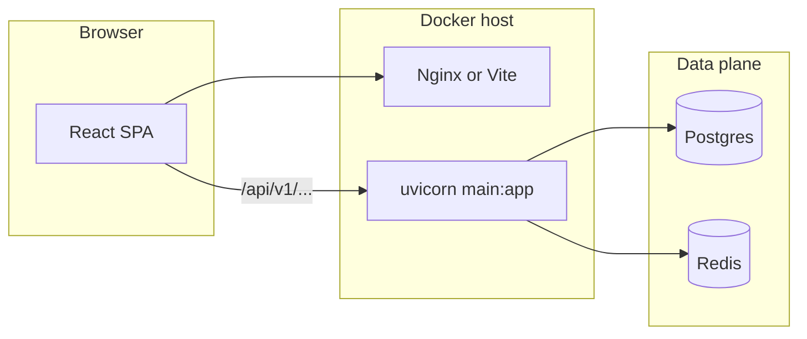

# Системный контур и рантайм

> Якоря: `src/main.py`, `src/api/v1/router.py`, `docker-compose.yml`, `frontend/src/api/client.ts`.

## Назначение

Описать, как поднимается backend, как монтируется API v1, какие есть периферийные HTTP-эндпоинты (`/health`, `/metrics`), и как SPA достучится до `/api`.

## Как это работает пошагово (один HTTP-запрос к API)

1. **Старт процесса:** `uvicorn src.main:app` создаёт `FastAPI` с `lifespan`. В `lifespan` до `yield` вызываются `register_*_event_handlers(get_event_bus())` — подписки на имена доменных событий; после остановки приложения — `close_redis()`.
2. **Вход запроса:** запрос попадает в `CORSMiddleware`, затем в `trace_id_middleware`: если нет заголовка `X-Trace-Id`, генерируется UUID, кладётся в `request.state.trace_id`, тот же id возвращается клиенту в ответе.
3. **Метрики:** `prometheus_http_duration_middleware` замеряет время; для путей `/metrics`, `/health`, `/health/replica` замер **не** пишется (ранний `call_next`).
4. **Маршрутизация:** если путь под префиксом v1 (например `/api/v1/...`), срабатывает соответствующая функция в подроутере из `src/api/v1/router.py`. Если путь ровно `/health`, `/health/s3`, `/health/replica`, `/metrics` — обрабатываются хендлеры на **корневом** `app` в `main.py`, минуя `api_router`.
5. **Исключения:** необработанное исключение → `global_exception_handler` (500, опционально `trace_id`). `HTTPException` → единый JSON с `detail`, `code`, опционально `trace_id`. Ошибки валидации Pydantic → 422 с безопасным списком `errors` (поле `ctx` выбрасывается из сериализации).
6. **SPA:** браузер бьёт в тот же хост с префиксом `/api` (см. `frontend/src/api/client.ts`); в docker-compose фронт и API — разные контейнеры, на хосте разные порты, поэтому в проде обычно обратный прокси склеивает маршруты; в dev — прокси Vite.

## Точки входа backend

| Компонент | Файл | Роль |
|-----------|------|------|
| ASGI-приложение | `src/main.py` | `FastAPI(...)`, middleware, exception handlers, mount роутера. |
| Агрегатор v1 | `src/api/v1/router.py` | `api_router` + `include_router` для всех подроутеров. |
| Конфигурация | `src/core/config.py` | `Settings`: `api_v1_prefix` (по умолчанию `/api/v1`), БД, Redis, JWT, лимиты. |

## Lifespan и cross-cutting при старте

В `src/main.py` функция `lifespan`:

- Регистрирует обработчики доменного event bus: lead, erp, loyalty, tasks, marketing attribution (`register_*_event_handlers` из `src/application/events/`).
- При shutdown вызывает `close_redis()` из `src/infrastructure/database/redis_client.py`.

**Статус:** реализовано (код явный).

## Middleware

1. **CORS** — `CORSMiddleware`, origins из `settings.cors_origins_list` (`src/main.py`).
2. **trace_id** — заголовок `X-Trace-Id` в `request.state` и в ответе (`trace_id_middleware`).
3. **Prometheus latency** — `prometheus_http_duration_middleware`: гистограмма `http_request_duration_seconds` с шаблоном пути; пропуск `/metrics`, `/health`, `/health/replica`.

## Ошибки и контракт ответа

- Глобальный `Exception` → 500, JSON `detail` + опционально `trace_id` (без утечки stack в клиент).
- `HTTPException` → унификация в `{detail, code, trace_id?}` (`http_exception_handler`).
- `RequestValidationError` → 422, `code: VALIDATION_ERROR`, `errors` без не-JSON-serиализуемого `ctx`.

## Маршрутизация API

- `app.include_router(api_router, prefix=settings.api_v1_prefix)`.
- Если `api_v1_prefix != "/api/v1"`, дублируется mount на префикс `/api/v1` для совместимости с клиентами и тестами.

Клиент SPA использует префикс **`/api`** и пути вида `/api/v1/...` (см. `frontend/src/api/client.ts`, `API_BASE = "/api"`).

## Эндпоинты вне префикса v1 (на корне приложения)

| Путь | Назначение |
|------|------------|
| `GET /health` | Быстрая проверка процесса. |
| `GET /health/s3` | Проверка S3-совместимого хранилища (`MedicalFilesStorage`). |
| `GET /health/replica` | Проверка reporting DSN, lag, gauge `db_replica_lag_observed_seconds`; при ошибке 503 и поле `error` (см. UNRESOLVED U-001). |
| `GET /metrics` | Prometheus scrape (`render_prometheus_metrics`). |

OpenAPI: в production `docs_url`/`redoc_url` отключены (`settings.app_env == "production"`).

## Docker Compose (локальный полный стек)

Файл `docker-compose.yml`:

| Сервис | Назначение |
|--------|------------|
| `db` | PostgreSQL 16, порт хоста 5442→5432. |
| `redis` | Redis 7, порт 6380→6379. |
| `migrations` | Одноразовый job: `alembic upgrade head`. |
| `backend` | `uvicorn src.main:app :8000`, порт хоста 8010. |
| `celery` | `celery -A src.infrastructure.messaging.celery_app worker`. |
| `celery-beat` | `celery ... beat`. |
| `frontend` | Образ фронта, порт 3010→80. |
| `e2e` (profile) | Playwright в контейнере. |

Переменные: `DATABASE_URL`, `REDIS_URL`, `CELERY_BROKER_URL` (Redis DB 1), `CELERY_RESULT_BACKEND` (Redis DB 2), секреты из `.env`.

**Статус:** описано по файлу compose; поведение на конкретном хосте не проверялось в этом документе.

## Связь SPA ↔ API

- `frontend/src/api/client.ts`: базовый путь `/api`, Bearer из `localStorage` (ключи `API_STORAGE_KEYS`), заголовок исходящего request id, разбор ошибок и редирект при 401 для пациентской сессии (см. комментарии в файле).
- Dev: прокси Vite на backend — `frontend` комментарий ссылается на `vite.config.ts` (не дублируем здесь).

## Статус раздела

| Аспект | Статус |
|--------|--------|
| Сборка API из роутеров | Реализовано |
| Trace + metrics middleware | Реализовано |
| Health / metrics | Реализовано |
| Compose топология | Реализовано (по yaml) |

### Enterprise-аудит (честная оценка)

- **Критические риски:** один процесс API + in-process bus при нескольких репликах без внешней согласованности событий — см. [INDEX.md](./INDEX.md), [ENTERPRISE_SAAS_RUBRIC.md](./ENTERPRISE_SAAS_RUBRIC.md).
- **Средние риски:** `/health` не доказывает готовность всех зависимостей (частично компенсируется `/health/replica`, `/health/s3`); детали ошибок replica — [UNRESOLVED U-001](./UNRESOLVED_AND_CONFUSION_LOG.md).
- **Формально / недоделано:** compose описывает локальный стек, не прод SLO.
- **Рекомендуемые доработки:** readiness vs liveness разделение при необходимости оркестратора.

### Соответствие фактам (проверка)

- Middleware и mount — по `src/main.py`; compose — по `docker-compose.yml`. Рантайм-прогон не выполнялся в рамках аудита документа.

### Углубление (PRINCIPLE — фундаментальный обзор)

- **Сильные логические риски:** двойной mount `api_router` при `api_v1_prefix != /api/v1` удваивает поверхность маршрутов; при ошибке конфигурации клиенты могут полагаться на «не тот» префикс.
- **Что усилить:** явное разделение liveness/readiness, если оркестратор убивает поды по `/health` при деградации зависимостей.
- **С нуля:** распределённая трассировка (OTel) — вне текущего `X-Trace-Id`.
- **БД:** не относится напрямую; косвенно — реплика в `/health/replica`.
- **Полный разбор:** [FUNDAMENTAL_CODE_REVIEW_PRINCIPLE.md](./FUNDAMENTAL_CODE_REVIEW_PRINCIPLE.md) (§2.2, §4).
