# Мастер-план масштабирования проекта под чистый SaaS (LEAD)

> **Роль документа:** единый **наглядный** план: «один деплой — платформа — Основатель — Владельцы бизнесов — гибкие тарифы — оплата — провижининг — модули — наблюдаемость», с **трёхслойной** логикой (продукт / безопасность / техдолг) и без потери ранее зафиксированных деталей.  
> **Связь с заделом:** [TARGET_PLATFORM_MULTITENANCY_REFERENCE.md](./TARGET_PLATFORM_MULTITENANCY_REFERENCE.md), [../adr/README.md](../adr/README.md) (ADR-007…011), [LEAD_ACCEPTANCE_CRITIQUE_AND_GAPS.md](./LEAD_ACCEPTANCE_CRITIQUE_AND_GAPS.md), [FUNDAMENTAL_CODE_REVIEW_PRINCIPLE.md](./FUNDAMENTAL_CODE_REVIEW_PRINCIPLE.md), [ENTERPRISE_SAAS_RUBRIC.md](./ENTERPRISE_SAAS_RUBRIC.md), [./arch_plan/PHASE_FULL_CLOSURE_BACKLOG.md](./arch_plan/PHASE_FULL_CLOSURE_BACKLOG.md), [SAAS_STRENGTHENING_MASTER_PLAN.md](./SAAS_STRENGTHENING_MASTER_PLAN.md) (ревью плана; пункты **встроены** в §5–§11, §15, §19, §23–§30; цикл 4 — **§9** ревью), [../artifacts/PRINCIPLE_SAAS_PLAN_CODE_DEEP_ANALYSIS_2026-04-03.md](../artifacts/PRINCIPLE_SAAS_PLAN_CODE_DEEP_ANALYSIS_2026-04-03.md), [09_backup_restore_bcp.md](./09_backup_restore_bcp.md), [../operations/DR_RUNBOOK.md](../operations/DR_RUNBOOK.md), [modules/data_migration_import_connectors.md](./modules/data_migration_import_connectors.md), [modules/platform_subscription_billing.md](./modules/platform_subscription_billing.md), [ENTITLEMENT_ROUTER_INVENTORY.md](./ENTITLEMENT_ROUTER_INVENTORY.md), [PLATFORM_SIGNUP_PRIVACY_AND_RETENTION.md](./PLATFORM_SIGNUP_PRIVACY_AND_RETENTION.md), [PLATFORM_BILLING_ERROR_CATALOG.md](./PLATFORM_BILLING_ERROR_CATALOG.md), [API_VERSIONING_POLICY.md](./API_VERSIONING_POLICY.md), [../operations/RELEASE_CHECKLIST.md](../operations/RELEASE_CHECKLIST.md), [../operations/SLO_CRITICAL_PATHS.md](../operations/SLO_CRITICAL_PATHS.md), [LEAD_RF_PACKAGES_AND_PRICING_FIRST_LAUNCH.md](./LEAD_RF_PACKAGES_AND_PRICING_FIRST_LAUNCH.md).  
> **Версия:** 2026-04-10 (**LEAD:** **§2e** — трассировка PRINCIPLE корпус циклы 1–2; **§25–§30** — см. ниже; **§31** — огибающая масштаба и @ARCH; **карта §15** — mermaid **вкл. опц. Фазу 4**). **QA_ARCH (масштаб, @ARCH/@DEV):** [отчёт 2026-04-10](./ENTERPRISE_SAAS_SCALE_ENVELOPE.md). **QA_ARCH цикл 4 (2026-04-09):** [ревью §9](./SAAS_STRENGTHENING_MASTER_PLAN.md#qa-arch-saas-master-sec9). **PRINCIPLE корпус:** [обзор](../artifacts/PRINCIPLE_SAAS_MASTER_PLAN_AND_LINKED_CORPUS_REVIEW_2026-04-05.md) (**§10** — цикл 2). **2026-04-08:** цикл 3 → **§2d**. **Ранее:** 2026-04-04…09.  
> **Блок §25–§30:** enterprise-импорт/экспорт (**§25**), фундамент магазина (**§26**, поздняя опция), антиспам (**§27**), security/DevTools (**§28**), бренд **«МойКлиент»** / **MyClient** (**§29**), монолит vs сервисы 10k+ (**§30**). **§31** — численная огибающая и ответственность @ARCH. Якоря: [#saas-sec-15](#saas-sec-15), [#saas-sec-25](#saas-sec-25) … [#saas-sec-30](#saas-sec-30), [#saas-sec-31](#saas-sec-31); навигация — [INDEX.md](./INDEX.md).

---

## Карта документа

| Раздел | Содержание |
|--------|------------|
| §1 | Роли: Основатель, Владелец, со-владелец, персонал, клиент; изоляция |
| §2 | Желаемое vs факт + **§2b** PRINCIPLE + **§2c** QA_ARCH цикл 2 + **§2d** QA_ARCH цикл 3 + **§2e** PRINCIPLE корпус (циклы 1–2) + **§2a** QA_ARCH, U-*, модульные файлы |
| §3–4 | Гибкие тарифы, стартовый каталог опций (₽) |
| §5–6 | Лендинг, регистрация; оплата и провижининг (PRINCIPLE) |
| §7–8 | Кабинет Основателя; глобальный конструктор |
| §9–11 | 2FA и секреты; кассы/скидки; Prometheus/Grafana/алерты |
| §12–14 | Отказ от «коробки»; базовый пакет модулей; vertical |
| §15 | Дорожная карта: **mermaid** (фазы 0–3, **1e**, **`optional_late_Commerce`**), **§15a** P0 security, **§15c** P0 commerce, **§15b** DoD; якорь [→ §15](#saas-sec-15) |
| §16–22 | ADR-шаги (вкл. §16.6), **§17.1** PRINCIPLE/outbox, риски, go/no-go, рубрика, ADR-005/006 |
| §23 | Чек-лист целостности (промпт + план + QA_ARCH, циклы 2–4) |
| §24 | Моно-пакет: чат + PWA + omni + Битрикс24 + AI + RAG (дорожная карта) |
| §25 | Enterprise-импорт из CRM → наша БД, cleaner, экспорт; **§25.3** батчи/транзакции (PRINCIPLE) |
| §26 | Фундамент магазина/продаж и 1С-совместимость (опция, Фаза **4**) |
| §27 | Антиспам: авторизация и чаты админки |
| §28 | DevTools / анти-взлом: метрики и алерты |
| §29 | Универсальный бренд и нейтральная терминология (МойКлиент / MyClient) |
| §30 | Монолит в Docker vs мультисервисы (масштаб 10k+ бизнесов) |
| §31 | Огибающая масштаба Enterprise SaaS: организации, точки, персонал, клиенты; @ARCH, envelope-документ |

---

## 1. Иерархия ролей и «абсолютная» мультитенантность

**Термины (LEAD, победитель номенклатуры):**

| Роль | Описание |
|------|----------|
| **Основатель SaaS** | Единственный владелец **платформы** (vendor): биллинг подписок, глобальный каталог опций и тарифов, кассы для приёма оплаты от Владельцев, дашборды MRR/churn, алерты стабильности. **Не** смешивается с данными клиник. Доступ — отдельный контур (см. §7–9). |
| **Владелец бизнеса** | Один «главный» на организацию (`Organization`): полномочия на админку, роли, персонал, цены, кассы **своего** бизнеса, данные своих клиник. |
| **Со-владелец** | Назначается Владельцем; **те же** полномочия уровня организации (явно моделируется в RBAC; аудит «кто сделал» обязателен). |
| **Персонал** | Сотрудники клиники: видимость по RBAC; изоляция от данных других сотрудников там, где политика требует (чаты, чувствительные разделы). |
| **Клиент / пациент** | Конечный пользователь PWA/каналов: только свои данные и свои диалоги в рамках политики клиники. |

**Победитель решения (LEAD) — со-владельцы и биллинг (QA_ARCH M3):** верхняя граница числа со-владельцев (например **5**, параметр продукта); **отзыв** роли с немедленным инвалидацией сессий; **единственный «billing contact»** на организацию (кто получает счета и подтверждает платёжные события) — не обязан совпадать с каждым со-владельцем, но должен быть ровно один активный контур на `Organization` (спека + UI).

**Усиление (QA_ARCH цикл 2):** до Фазы **1b** (экраны Основателя / Владельца) — черновик **RBAC + UI** (кто назначает со-владельца, как сменить billing contact, инвалидация сессий при отзыве): либо раздел в спеке админки, либо короткий `docs/architecture/…` по согласованию ARCH; **LEAD** принимает отсутствие противоречий с §3–§4 до кода.

**Победитель решения (LEAD + QA_ARCH C5) — Основатель и bus factor:** помимо secret manager — **break-glass**: процедура восстановления доступа при потере 2FA/секрета (офлайн-коды, второй носитель, контролируемый сброс через OPS с аудитом); **резервный криптографический материал** вне основного `.env`; документированная **смена идентичности Основателя** (передача платформы) без потери данных тенантов. Ответственность: **LEAD + OPS + SEC**.

**Усиление (QA_ARCH цикл 2):** одна **исполняемая** процедура для OPS — отдельный файл в `docs/operations` (например `FOUNDER_ACCESS_BREAKGLASS.md`) **или** явный раздел/якорь в [DR_RUNBOOK.md](../operations/DR_RUNBOOK.md) с шагами, ролями и аудитом; ссылка из [INDEX.md](./INDEX.md) (operations / SaaS). Пока документ **не** опубликован — ворота **§19 п.18** считаются **не закрытыми** для прод-эксплуатации платформенного контура (честность C5 ≠ только абзац в §1).

**Актуализация (QA_ARCH цикл 3, LEAD):** файл [FOUNDER_ACCESS_BREAKGLASS.md](../operations/FOUNDER_ACCESS_BREAKGLASS.md) в репозитории **закрывает артефакт** C5 на уровне «есть процедура»; **полная** эксплуатационная готовность — ещё **учение OPS** (прогон по чеклисту, ответственный, периодичность) и подтверждение, что ссылка из INDEX/RELEASE актуальна (§19 п.18).

**Победитель решения по изоляции:**

1. **Между платформой и любым бизнесом:** запросы админки клиники **никогда** не должны иметь возможности «случайно» прочитать строки Основателя или другой организации. Это комбинация **политики приложения** (все запросы с `organization_id` / `clinic_id` из JWT) и **fork ADR-007**: предпочтительно **RLS** в PostgreSQL по контексту сессии либо эквивалентная жёсткая проверка в репозиториях + **негативные тесты** на каждый критичный путь. Отдельная **platform-схема или набор таблиц** с доступом только из `/platform/*` — рассматривается ARCH; смешивание ORM-моделей platform и tenant без барьера **запрещено** в дизайне.
2. **Внутри организации Владельца:** категории **персонал** и **клиенты** разделены по сущностям и RBAC; **чаты** — строго по каналу/участнику и правам; нет «общего пула» сообщений без фильтра.
3. **Основатель ↔ БД:** прямых «мостов» из кода админки клиники к строкам учёта Основателя быть не должно; сервис платформы — отдельные зависимости и префиксы API.

**Связь с U-005:** семантика `/owner/*` в коде сегодня **не** равна «владелец сети» в смысле этого документа — выравнивание API и имён — **Фаза 1 (дизайн) / Фаза 3 (продукт)**; не расширять `/owner/*` без закрытия U-005 (см. §17).

---

## 2. Желаемое vs факт по репозиторию (расширенная таблица)

| Элемент целевой модели | Сейчас в коде/деплое (кратко) | Закрываем документом / эпиком |
|------------------------|------------------------------|--------------------------------|
| Основатель SaaS и контур `/platform/*` | Нет platform-operator / JWT Основателя; есть **узкий** HTTP-префикс `/api/v1/platform/billing/*` (webhook B, ADR-011 MVP) — **не** эквивалент ADR-007 | **ADR-007** + спека §7; миграции platform-пользователя; не путать billing-spine с «platform готов» |
| Владелец, self-service регистрация бизнеса | Нет полного потока signup → оплата → провижининг | **§5–§6**, **§15** (фазы **1a–1d** + **1e** lifecycle); state machine `pending_payment` |
| Гибкий каталог опций и тарифов | `EDITION` env, не пер-тенантный конструктор | Таблицы каталога опций, планов, связей org↔entitlements; рефактор `is_box_edition()` |
| Изоляция данных между бизнесами и от платформы | Опора на `clinic_id`; platform не выделен | **ADR-007** fork RLS vs policy + тесты; §1 |
| Лендинг продажи Владельцам | Одна SPA под админку/приложение | Отдельный **маркетинговый** периметр или секции + SEO (эпик фронта) |
| 2FA для Основателя / Владельца / админов | Не выделено как продуктовый слой | Эпик auth: TOTP (Google Authenticator), опционально SMS/Telegram |
| Кассы Основателя для подписки | Платежи в продукте — в основном пациент→клиника | **ADR-011**, [modules/platform_subscription_billing.md](./modules/platform_subscription_billing.md), §6, §16.6; отдельный контур «подписка организации» + кассы/провайдеры в **Фазе 1b** |
| Скидки на уровне платформы | Есть заделы под скидки в бизнес-логике клиники | Унифицированная модель скидок **платформы** (сквозные / только тарифы) |
| Grafana/Prometheus в docker-compose корня | Профиль **`observability`** в корневом `docker-compose.yml` + конфиги `deploy/prometheus/`, `deploy/alertmanager/` (фаза **1d**); дашборды JSON по-прежнему в `deploy/grafana/dashboards/` | Прод: VPN/auth, Telegram/webhook в Alertmanager, пороги алертов под OPS — [05_PHASE_1D_OBSERVABILITY.md](./arch_plan/05_PHASE_1D_OBSERVABILITY.md), [07_metrics_observability.md](./07_metrics_observability.md) |
| Пейджер-алерты (TG / webhook) | Алерты описаны файлами правил; доставка — OPS | Эпик: Alertmanager → Telegram / произвольный HTTP; метрики «здоровье тенантов» |
| Бэкапы / DR | Документы + runbook | **ADR-008**, **U-009** |
| Надёжность цепочек при масштабе API | In-process EventBus | **ADR-009**, **U-007** |
| Импорт из CRM | ADR + модульный документ | **ADR-010**, **U-010** |

**Вывод LEAD:** целевая логика соответствует зрелому SaaS; реализация пока **монолит клиники** + env «коробка». Позиция «мы уже полный мультиаренд с Основателем» до закрытия **§15 (фазы 1a–1c) и §19 (ворота)** — **нечестна**.

### 2b. Стартовая точка: целевое vs факт кода (PRINCIPLE — обязательная честность)

Источник синхронизации: [PRINCIPLE_SAAS_PLAN_CODE_DEEP_ANALYSIS_2026-04-03.md](../artifacts/PRINCIPLE_SAAS_PLAN_CODE_DEEP_ANALYSIS_2026-04-03.md). Ниже — **не** план работ, а **снимок зазора**; при каждом крупном релизе SaaS строки перепроверять grep’ом / кодом. Ответственность за актуальность таблицы: **ARCH + LEAD** — **ежеквартальный** пересмотр или перед каждым major SaaS-релизом; **DEV** подтверждает факт кода в PR по запросу.

| Слой | Утверждение плана / ADR | Факт в коде (якоря) | Зазор | Критичность | Закрытие (победитель) |
|------|-------------------------|----------------------|-------|-------------|------------------------|
| **A** | `/platform/*`, platform-operator, self-service org | Есть `platform_billing` (`/api/v1/platform/billing/...`) — только контур **B** (webhook + таблицы intent/payment); **нет** platform-admin, нет self-service цепочки signup→оплата→полный провижининг §6 | Platform по ADR-007 **не начат** (кроме spine биллинга) | **P0** честного SaaS | §16.1, Фаза **1a**, ADR-007 + код; ADR-011 MVP ≠ закрытие A |
| **A** | JWT realm Основатель vs тенант | Один контур JWT клиники; `AdminSessionResponse` — задел под сеть, **не** issuer платформы | Две области доверия не разведены | **P0** дизайн | §19 п.3, спека до миграций |
| **A** | Entitlements в БД | `EDITION` env, `is_box_edition()` | Нет каталога org↔entitlements | **P0** | Фаза **1c**, §12 |
| **B** | Опции §4 = гейты API | CRM/retention — `EDITION`; **tasks, marketing** — без edition-gate в роутерах (инвентарь §12.2) | Частичная модульность | **P1→P0** при 1c | §12.1–12.2, DoD **§15b** 1c |
| **C** | Базовый «чат» в §13.1 | Код omni крупный | Путаница «минимум» vs весь модуль | **P1** продукт | §13.1 уточнение ниже |
| **C** | Два платёжных контура | Пациент→клиника есть; webhook B + БД intent/payment + идемпотентность + провижининг **Org+Clinic** (без первого Владельца / entitlements / retry-DLQ) | Контур B: **MVP spine**, не §16.6 целиком | **P0** коммерции до платного self-service | Довести §16.6, DoD **§15b 1b**, OpenAPI B |
| **D** | Биллинг SaaS как поток работ | Было расхождение «P0 в §13.2» vs только security в §15a | Два параллельных P0 | **устранено** | **§15c** + §13.2 |
| **E** | Outbox, CI, BCP | EventBus in-process; CI частично disabled | Согласовано с ADR-008/009, U-007/008 | **P0** надёжности | Фаза **2**, §19 |
| **F** | `industry_profile` | Поля нет в `Organization` | Ожидаемо до Фазы 3+ | **P2** до старта vertical | §14 чеклист |

**Связь с U-005 (PRINCIPLE §8):** в **Фазе 1a** как минимум **черновик** спеки/OpenAPI для `/owner/*` и целевой семантики «сеть клиник» vs текущий `get_current_admin` — владелец **ARCH**, согласование **LEAD + Product**; не расширять `/owner/*` без закрытия U-005 (§17).

### 2c. Честность контуров A/B и «бумажной» готовности (QA_ARCH, второй цикл + уточнения цикла 3)

Источник замечаний: [SAAS_STRENGTHENING_MASTER_PLAN.md](../architecture/SAAS_STRENGTHENING_MASTER_PLAN.md) §6; актуализация после кода B — §8 и **§2d**.

1. **U-006 / C1:** наличие ADR-011 и спеки контура **B** **не** равно закрытию риска. **Контур B** (подписка платформы) — ворота DoD **§15b 1b** и §19 п.8 только при **коде** (отдельный путь, секрет) и **автотестах** значимых веток webhook **B**. **Контур A** (пациент→клиника): допускается поэтапное усиление; фиксация в репозитории [PLATFORM_BILLING_ERROR_CATALOG.md](./PLATFORM_BILLING_ERROR_CATALOG.md) и автотесты идемпотентности **не** заменяют контур **B**. Запрещено сообщать «два webhook разведены», если разведение есть **только** в документах. **Актуализация (QA_ARCH цикл 3, 2026-04-07):** разведение A/B **в коде** для B есть (`/api/v1/platform/billing/webhooks/yookassa`, отдельный секрет); **не** считать C1/U-006 **полностью** закрытыми без расширенного покрытия веток провайдера, OpenAPI B и полного провижининга §6 (см. ADR-011 статус «MVP spine»).

2. **C2:** retry / dead-letter / reconcile для платформенного intent — до появления кода и метрик приёмка по **спеке** не снимает риск; при аудите §19 п.11 проверять согласованность с ADR-009 (синхрон vs outbox).

3. **C3:** §5 и чеклист privacy п.7 задают требования; **без** реализации rate limit / антибота и метрик злоупотреблений (§7.1) публичный лендинг **не** считается готовым.

4. **C4:** файл [PLATFORM_SIGNUP_PRIVACY_AND_RETENTION.md](./PLATFORM_SIGNUP_PRIVACY_AND_RETENTION.md) с **пустыми** пунктами чеклиста **не** удовлетворяет §19 п.13 — нужны заполненные строки (или явные ссылки на тикеты с датой и ответственным) и согласование LEAD.

5. **Инвентарь §12.2:** таблица без закрытых строк «уточнить Product» (или без решения LEAD в том же PR) **не** считается принятой для §19 п.17.

### 2d. Третий цикл QA_ARCH (2026-04-07): встраивание выводов §8 в план (LEAD)

Источник: [SAAS_STRENGTHENING_MASTER_PLAN.md](../architecture/SAAS_STRENGTHENING_MASTER_PLAN.md) §8. Ниже — **сводка решений победитель** для трассировки в эпиках; детали рисков — в ревью.

| # | Тема (QA_ARCH §8) | Фиксация в плане / действие |
|---|-------------------|-----------------------------|
| **1** | **§18 vs факт миграций B** | Уже внесённые таблицы platform billing + публичный webhook — **необратимый** след; допустимо как **MVP spine** только при **явной записи** решения **ARCH + LEAD** (тикет или **ADR риска** с датой пересмотра). Иначе при аудите приоритет у дословного §18 для **дальнейших** миграций platform — см. **§18** ниже. |
| **2** | **ADR-007 не согласован полностью** | Platform/tenant в **одной** БД без RLS fork; провижининг пишет в `Organization` / `Clinic` — **техдолг**, не оправдание «platform изолирован». Закрытие — Фаза **1a** + ADR-007. |
| **3** | **C1 остаток** | В коде: путь B, секрет, идемпотентность double `succeeded`. До полного U-006 / DoD **§15b 1b**: **OpenAPI** webhook B; матрица веток YooKassa для B (отмена, refund и т.д. — список SEC/Product); **rate limit / WAF** на публичном webhook B в prod — **§6, §10**. |
| **4** | **C2 остаток** | Сейчас провижининг **синхронный** в транзакции HTTP — снижает часть риска; **нет** retry, DLQ, reconcile UI, метрик «stuck paid» — **§16.6** шаги 3–4; связка **§17.1** + ADR-009 до платного self-service при **replicas ≥ 2**. |
| **5** | **C3, C4** | Без изменений по сути цикла 2: публичный лендинг и реклама — **§5, §19 п.13**. |
| **6** | **C5** | Runbook break-glass **есть**; эксплуатационная зрелость — учение OPS (**§1**). |
| **7** | **M7** | Черновик offboarding/export: [TENANT_OFFBOARDING_AND_EXPORT.md](../operations/TENANT_OFFBOARDING_AND_EXPORT.md) — **DoD §15b 1e** по документу ближе к закрытию; автоматизация экспорта — продуктовый бэклог. |
| **8** | **Пробел провижининга (код MVP)** | Нет первого **AdminUser** / приглашения Владельца, нет **`organization_entitlements`** из снимка тарифа — **§6** (целевой провижининг), эпик после MVP. |
| **9** | **Бэклог (кратко)** | OpenAPI B + тесты веток; §16.6 шаги 3–4; решение **§17.1**; rate limit B; тикет «go на MVP spine» или ADR риска — владелец **LEAD**. |

**Запрет формулировок (LEAD):** не заявлять «Фаза **1b** закрыта», «**U-006** полностью закрыт», «**§16.6** выполнена», пока не закрыт §2d п.3–4, 8–9 и DoD **§15b 1b** в полном смысле — см. **§17**, **§19 п.8 и п.14**.

### 2e. PRINCIPLE корпус: перекрёстная трассировка циклов 1–2 (LEAD)

Источник: [PRINCIPLE_SAAS_MASTER_PLAN_AND_LINKED_CORPUS_REVIEW_2026-04-05.md](../artifacts/PRINCIPLE_SAAS_MASTER_PLAN_AND_LINKED_CORPUS_REVIEW_2026-04-05.md). Ниже — **что из отчёта уже закрыто текстом плана / артефактом в репо** и **что остаётся обязательством** до кода или доп. документа.

**Цикл 1 — рекомендации §7 и упущения §4 (перепроверка LEAD):**

| PRINCIPLE | Было в отчёте | Фиксация в мастер-плане | Статус |
|-----------|---------------|-------------------------|--------|
| §7 п.1 Entitlement inventory | Deliverable до 1c | **§12.2**, **§19 п.17**, файл [ENTITLEMENT_ROUTER_INVENTORY.md](./ENTITLEMENT_ROUTER_INVENTORY.md) | Артефакт в репо; ворота — **приёмка** строк («уточнить Product») |
| §7 п.2 `replicas > 1` | Outbox или запрет | **§17.1**, **§19 п.11**; триггер QA_ARCH цикл 3 | **Исполнение:** запись в runbook OPS + соблюдение при деплое |
| §7 п.3 Возвраты / chargeback B | **[ADR-012](../adr/ADR-012-platform-subscription-refund-chargeback-org-lifecycle.md)** + [platform_subscription_billing.md](./modules/platform_subscription_billing.md) §12 | **§6** (UTC + lifecycle), **§16.6** шаг **0** | **Политика закрыта** ADR-012 (2026-04-05); **реализация** state machine / отзыв entitlements — бэклог **1b+** и §16.6 |
| §7 п.4 UTC + payload | Модуль биллинга | **§6**, [platform_subscription_billing.md](./modules/platform_subscription_billing.md) — дописать явно | **DoD документа** до платного потока |
| §7 п.5 Синхронизация PRINCIPLE-2026-04-03 | Ссылки на ADR-011 | Вне мастер-плана; ответственность **ARCH** | Бэклог артефакта |
| §7 п.6 FUNDAMENTAL U-* | Косметика | [FUNDAMENTAL_CODE_REVIEW_PRINCIPLE.md](./FUNDAMENTAL_CODE_REVIEW_PRINCIPLE.md) | Вне мастер-плана |
| §4.5 Privacy «файла нет» | C4 | **§19 п.13**, файл [PLATFORM_SIGNUP_PRIVACY_AND_RETENTION.md](./PLATFORM_SIGNUP_PRIVACY_AND_RETENTION.md) | **Устарело** как «нет файла»; риск **C4 по содержанию** чеклиста сохраняется |
| §4.6 Vertical + API | Ссылка в §15/§19 | **§14** чеклист, **§19** п.2/5 | Актуально при смене vertical |

**Цикл 2 — §10.5 усиления (встроены в разделы ниже):**

| §10.5 | Тема | Якорь в плане |
|-------|------|----------------|
| **1** | Границы транзакции / батчи импорта | **§25.3** |
| **2** | Возвраты + края ручного reconcile (в т.ч. после импорта) | **§16.6** шаг **0**, **§17** (запрет) |
| **3** | Реестр имён `security_*` / spam metrics | **§11**, **§28** |
| **4** | Глоссарий ошибок API и логов (пациент → клиент) | **§29** |
| **5** | Сценарий нагрузки до маркетинга «10k» | **§30** |
| **6** | Следующий проход PRINCIPLE | **§23** п.33–34 |

**Цикл 2 — новые классы рисков §10.4:** длинный commit импорта, staging vs prod, AI-assist импорта, Commerce до go, «документ ≠ защита» §27–§28, бренд vs API — отражены в **§25.0–25.1**, **§15b** (цикл 4 QA_ARCH), **§26**, **§27–§29**; LEAD: не снижать приёмку до «текст есть».

### 2a. Проверка QA_ARCH: полнота относительно корпуса документов

**Вердикт:** стратегический скелет дополнен **§1–11, §15b, §20, §24**; трассировка ниже **обязательна** при планировании.

| Источник | Что должно быть явно привязано к фазам | Куда в плане |
|----------|----------------------------------------|--------------|
| [UNRESOLVED_AND_CONFUSION_LOG.md](./UNRESOLVED_AND_CONFUSION_LOG.md) | U-001…U-010 | Таблица ниже + §17–§19 |
| [LEAD_ACCEPTANCE_CRITIQUE_AND_GAPS.md](./LEAD_ACCEPTANCE_CRITIQUE_AND_GAPS.md) | B-4…B-7 | **§15a** |
| [ENTERPRISE_SAAS_RUBRIC.md](./ENTERPRISE_SAAS_RUBRIC.md) | Красные флаги | **§20** |
| [FUNDAMENTAL_CODE_REVIEW_PRINCIPLE.md](./FUNDAMENTAL_CODE_REVIEW_PRINCIPLE.md) | Транзакции vs события | §15a, Фаза 2, §19 п.6 |
| [domains/booking_event_chain.md](./domains/booking_event_chain.md) | Ввод для outbox | §19 п.7 |
| [00_system_runtime.md](./00_system_runtime.md), [06_cache_redis_celery.md](./06_cache_redis_celery.md), [07_metrics_observability.md](./07_metrics_observability.md) | SaaS при росте | §9, §11, §15, Фаза 2 |
| [08_tests_matrix.md](./08_tests_matrix.md) | CI / доказательство качества | §15a, §19 п.8 |
| [CONVENTIONS_AND_TRACEABILITY.md](./CONVENTIONS_AND_TRACEABILITY.md) | Дрейф при `/platform/*` | §19 п.9 |
| [backend/*.md](./backend/api_layer.md), [frontend/*.md](./frontend/routing_and_shells.md) | Эпики | Таблица «модульные файлы» ниже |
| [docs/adr/README.md](../adr/README.md) | ADR-005/006 в коде; ADR-007…011 в `docs/adr/` | **§16**, **§21** |
| [SAAS_STRENGTHENING_MASTER_PLAN.md](../architecture/SAAS_STRENGTHENING_MASTER_PLAN.md) | C1–C5, M1–M7, DoD, 2FA; **§6** цикл 2; **§8** цикл 3; **§9** цикл 4 (§25–§30, карта §15, INDEX) | Встроено в §5–§11, §15, §19, §23, **§2c**, **§2d**, **§25–§30**, усиления DoD/ворот |
| [PRINCIPLE_SAAS_PLAN_CODE_DEEP_ANALYSIS_2026-04-03.md](../artifacts/PRINCIPLE_SAAS_PLAN_CODE_DEEP_ANALYSIS_2026-04-03.md) | Слои A–F план vs код | **§2b**, §12–§16, §14, §15c, §17–§19 |
| [PRINCIPLE_SAAS_MASTER_PLAN_AND_LINKED_CORPUS_REVIEW_2026-04-05.md](../artifacts/PRINCIPLE_SAAS_MASTER_PLAN_AND_LINKED_CORPUS_REVIEW_2026-04-05.md) | Сводная ответственность PRINCIPLE; цикл 2 — §10 | **§2e** (трассировка), усиления §6, §11, §16.6, §25.3, §28–§30, §23 |
| [ENTERPRISE_SAAS_SCALE_ENVELOPE.md](./ENTERPRISE_SAAS_SCALE_ENVELOPE.md); [ROLE_ARCH.md](../ROLE_ARCH.md); [ROLE_DEV.md](../ROLE_DEV.md) | Envelope 10k+ бизнесов; обязанности @ARCH; префлайт @DEV; не замена ИИ | **§31**, §23 п.35; **ШАГ 0A** в ROLE_ARCH; префлайт в ROLE_DEV |

**Журнал U-* → фаза / артефакт закрытия (001–010):**

| ID | Суть | Фаза плана | Закрытие |
|----|------|------------|----------|
| U-004 | Platform-operator, self-service | **§15 Фаза 1a** | ADR-007 + код |
| U-005 | `/owner/*` vs сеть | **1** дизайн / **3** продукт | Спека API + OpenAPI |
| U-006 | Webhook идемпотентность, тесты | **§15a** + **Фаза 1b** | **Документы:** [ADR-011](../adr/ADR-011-platform-subscription-webhook-provisioning.md), [platform_subscription_billing.md](./modules/platform_subscription_billing.md). **Код:** разведение **A и B** в коде/конфиге; автотесты **обоих** контуров (см. **§2c** — контур A не закрывает B). **Каталог ошибок A:** [PLATFORM_BILLING_ERROR_CATALOG.md](./PLATFORM_BILLING_ERROR_CATALOG.md) |
| U-007 | Outbox vs EventBus | **2** | ADR-009 |
| U-008 | CI | **2** | Workflow / внешний CI |
| U-009 | Backup/drill | **2** | ADR-008 + DR_RUNBOOK |
| U-010 | Импорт v1 | **3** / после 1 | ADR-010 |
| U-001 | `/health/replica` | **§15a** | Маскирование в prod |
| U-002 | Repo vs `AsyncSession` | **1–2** | Инвентаризация + guideline |
| U-003 | Celery очереди | **2** | Grep-аудит |

**Модульные файлы `docs/architecture/` — статус в контексте SaaS:**

| Файл | Роль для SaaS | Действие в плане |
|------|---------------|------------------|
| INDEX, MASTER, CONVENTIONS, UNRESOLVED | Навигация и правда | Обновлять при `/platform/*`, лендинге, ADR |
| 00_system_runtime | Деплой, middleware | Platform shell + **публичный** маркетинговый роутинг |
| backend/api_layer | Префиксы, гейты | `/platform/*` vs `/admin/*` vs `/public/*`; негативные тесты |
| backend/application_layer | Сервисы, bus | ADR-009, U-002, провижининг org |
| backend/domain_layer | Сущности | Organization lifecycle, тарифы, pending_payment |
| backend/infrastructure_layer | Пул БД, Celery | U-003, Фаза 2 |
| backend/core_crosscutting | Конфиг, edition | Entitlements + каталог; env как override |
| frontend/* | SPA | Лендинг, кабинет Основателя, B-4 до публичного SaaS |
| 06_cache_redis_celery | Redis | Сессии, очереди; не единственное хранилище pending-подписки |
| 07_metrics_observability | Метрики | Grafana/Prometheus эпик §11 |
| 08_tests_matrix | Качество | U-008 |

---

## 3. Гибкие тарифы: каталог, конструктор, права

**Победитель решения (LEAD):**

1. **Глобальный каталог опций** ведёт только **Основатель** (через «Конструктор тарифов»): ключ опции, отображаемое имя, описание, базовая цена (редактируемая), метаданные для гейтов в API. Новая опция после сохранения **автоматически** появляется в списках: ручное создание Владельца Основателем, самообслуживание на лендинге, индивидуальные тарифы.
2. **Глобальные тарифы** (пресеты) создаёт только Основатель: набор опций, **автосумма** по ценам опций, поле **скидки %** или **ручная итоговая цена** (UI показывает и сумму по опциям, и итог после скидки). **По умолчанию** в каталоге может не быть ни одного тарифа — Основатель наполняет позже.
3. **Абонементные периоды (QA_ARCH):** для одного и того же пресета (один `plan_slug` / один набор ключей) Основатель может задать **цену подписки помесячно и на год** (два явных периода оплаты), чтобы на лендинге/checkout был выбор «месяц / год», а не только суммирование цен опций. Инварианты и открытые вопросы (recurring, НДС) — [platform_subscription_billing.md](./modules/platform_subscription_billing.md) §4.3; трекинг — [PHASE_FULL_CLOSURE_BACKLOG.md](./arch_plan/PHASE_FULL_CLOSURE_BACKLOG.md) **1b-F4**; фаза — [03_PHASE_1B_COMMERCE_AND_UX.md](./arch_plan/03_PHASE_1B_COMMERCE_AND_UX.md) п.8.
4. **Владелец** не публикует тарифы для всех: может **выбрать** из глобальных и/или собрать **индивидуальный** набор опций в том же UI-конструкторе (как на лендинге), с ценами по правилам платформы (например не ниже минимума по опции — политика LEAD).
5. **Основатель** при ручном создании Владельца: выбор глобального тарифа **или** «индивидуальный тариф» с чекбоксами опций и **редактируемой ценой за каждую опцию** в модалке.
6. **Пресет для РФ (рекомендуемый в каталоге):** «**Чат + PWA + omnichannel + интеграция Битрикс24**» — состав и ключи см. **§24**; продаётся как готовый глобальный тариф из опции-бандла или набора ключей §4.

Связь с [LEAD_RF_PACKAGES_AND_PRICING_FIRST_LAUNCH.md](./LEAD_RF_PACKAGES_AND_PRICING_FIRST_LAUNCH.md): документ остаётся **ориентиром рынка РФ** и **черновыми пресетами**; при появлении конструктора пресеты можно один раз импортировать в каталог как «Клиника / Практика+ / Сеть».

---

## 4. Стартовый каталог опций и ориентиры ₽/мес (ниже типичного середняка рынка)

> **Live (2026-08):** публичный каталог list-цен — **USD** `$20 / $100 / $200` (миграция `20260433_catalog_usd_list_prices`, факт в [platform_subscription_billing.md](./modules/platform_subscription_billing.md)). Таблица ниже — **исторический ориентир РФ на этапе планирования**, не цены API.

Использовать как **начальные значения в сидере** (редактируются Основателем). Ключи согласовать с `require_entitlement` и §16.5.

| Ключ опции | Смысл | Ориентир надбавки ₽/мес к базе* |
|------------|--------|----------------------------------|
| `core.base` | Базовый пакет §13.1 (орг, клиника, RBAC, расписание, пациент, предоплата, касса база, мин. чат, лента, уведомления) | Входит в «пол базы»; не продаётся отдельно без политики |
| `omni.embed.bundle` | **Моно-пакет:** виджет/внутренний чат + PWA клиента + настройка каналов omni + **API key** для встраивания на сайт / в приложение + **Битрикс24** (webhook/Open Lines) + см. §24 (AI, RAG) | **+3 500 – 6 500** ₽/мес ориентир LEAD под РФ; финал в конструкторе |
| `ai.assistant.chat` | AI-ассистент в канале чата (вкл/выкл), **Sanitizer** контента, **Tokenizer**/лимиты стоимости — политики на организацию | Часть §24; может входить в `omni.embed.bundle` или продаваться надстройкой |
| `ai.rag.org_kb` | RAG по **корпусу организации** (прайсы, FAQ, политики): загрузка, индекс **строго per org**, изоляция от других тенантов | Отдельный эпик; см. §24.3 |
| `crm.pipeline` | Воронка / CRM | **+2 200 – 3 500** |
| `retention.bundle` | Удержание, сценарии | **+1 800 – 2 800** |
| `tasks.kanban` | Задачи / канбан | **+1 200 – 2 000** |
| `marketing.attribution` | Маркетинг / атрибуция | **+2 000 – 3 800** |
| `omni.extended` | Расширенный omnichannel (не минимальный чат) | **+2 500 – 4 500** |
| `network.multi_clinic` | Вторая и далее локация (за точку) | **+1 800 – 3 500** / точка |
| `import.crm_v1` | Импорт ADR-010 | **разово** или **+1 500 – 2 500** / мес при подписке |
| `import.enterprise_migrator` | Полноценный мигратор + cleaner + отчёты качества (§25); опционально позже AI-assist под отдельным ключом | **разово** или надбавка / мес по политике Основателя |
| `commerce.store_network` | Интернет-магазин, товары, продажи **по клиникам** + сводка по сети (**§26**); **поздняя опция** | Ориентир — в конструкторе после Фазы **4** |
| `erp.reporting_plus` | Расширенная отчётность (если выделите в продукте) | **+1 500 – 2 500** |

*«Ниже конкурентов» — ориентир LEAD; финал — в конструкторе Основателя.

---

## 5. Публичная главная (маркетинг) и регистрация Владельца

**Состав страницы (победитель решения):**

- Описание платформы для **Владельцев бизнеса** (не для пациента): запись, админка, **внутренний чат с клиентом** и **PWA для клиента** как ключевые преимущества (тексты — продукт + LEAD).
- Блок **тарифов**: список глобальных тарифов с ценами и пояснениями; кнопка **«Выбрать тариф»** → страница регистрации.
- Регистрация: логин (или email как идентификатор — уточнить в спеке auth), телефон, почта, **ниша бизнеса** (`industry_profile` в перспективе §14), выбор тарифа **или** индивидуальный конструктор (как у Основателя по опциям, без создания глобальных пресетов).
- Скриншоты — заглушки/плейсхолдеры до контента.
- **Документация для Владельцев**: отдельный раздел или ссылка на `/docs` публичные: что делает система, преимущества, onboarding.

**Победитель решения (LEAD + QA_ARCH C3) — угрозы публичного signup:** rate limiting на **IP и email** для регистрации и повторной отправки кодов/писем; **капча** (или эквивалент) по политике при аномалиях; мониторинг **спам-регистраций** и дашборд сигналов в кабинете Основателя (см. §7.1). Ответственность: **DEV + SEC + OPS**.

**Усиление (QA_ARCH цикл 2):** документы и чеклист privacy (п.7) **не** снимают C3 без **кода** и **наблюдаемости**; до реализации — публичный signup остаётся в статусе «спека» (см. **§2c**).

**Победитель решения (LEAD + QA_ARCH C4) — PII и РФ до публикации лендинга:** явное **согласие** на обработку персональных данных и **цель** обработки (заявка на подписку); **срок хранения** записей `pending_payment` и неактивных заявок; **доступ субъекта** (запрос/удаление до активации организации) — [PLATFORM_SIGNUP_PRIVACY_AND_RETENTION.md](./PLATFORM_SIGNUP_PRIVACY_AND_RETENTION.md) (скелет + чеклист; заполнение до прод-рекламы) и **ворота §19**. Юридическая вычитка — вне scope кода, но **эпик** обязателен.

**Победитель решения (QA_ARCH) — i18n и юридические страницы:** минимум **RU** для старта РФ; структура под **EN** без ломки URL; страницы «Политика конфиденциальности», «Условия» — плейсхолдеры с обязательным заполнением до рекламы платного лендинга.

---

## 6. Оплата подписки и провижининг организации (решение PRINCIPLE — «зелёный свет»)

**Запрос продукта:** после выбора тарифа опции «вступают в силу» только после **фактической оплаты** через кассу Основателя; до этого данные «в ожидании».

**Победитель решения (PRINCIPLE, согласовано с LEAD):** **не** использовать **только** volatile cache (Redis) как единственный источник истины для pending-подписки.

- В **БД платформенного контура** хранить заявку: `signup_intent` / `organization_provision_request` со статусом `pending_payment`, ссылкой на выбранный тариф/набор опций, **идемпотентным ключом** платежа, сроком истечения (TTL).
- **Время и хранение (PRINCIPLE цикл 1, LEAD):** все временные поля платформенного контура (`expires_at`, TTL, метки webhook) — в **UTC** в БД и в контракте API; в UI — явное отображение TZ или только UTC; политика **retention** и **маскирование** телефона/email в JSONB payload — в [platform_subscription_billing.md](./modules/platform_subscription_billing.md) (не откладывать до «после прод» без тикета).
- Redis допустим для сессии мастера оплаты и ускорения UI.
- **Провижининг** `Organization`, первого Владельца/админки, entitlements — **только** после подтверждённого события оплаты (webhook провайдера / verified callback), с **идемпотентностью** (повтор webhook не создаёт вторую организацию).
- **Жизненный цикл платежа после `succeeded` (PRINCIPLE цикл 1–2, LEAD):** отмена, **возврат**, **chargeback**, спор провайдера — нормативно зафиксированы в **[ADR-012](../adr/ADR-012-platform-subscription-refund-chargeback-org-lifecycle.md)**; операционная детализация и матрица статусов провайдера — [platform_subscription_billing.md](./modules/platform_subscription_billing.md) §12. Связь события провайдера → статус подписки / **отзыв entitlements** / прошедшие оплаченные периоды должна исключать «деньги вернули — доступ и опции активны» и **двойной отзыв**. Согласовать с ручным **reconcile** (**§16.6**, **§7**) и с **enterprise-импортом** (**§25.3**, **§10.5** цикла 2 в [PRINCIPLE-обзоре](../artifacts/PRINCIPLE_SAAS_MASTER_PLAN_AND_LINKED_CORPUS_REVIEW_2026-04-05.md)).

**Победитель решения (LEAD + QA_ARCH C1 + U-006) — два контура webhook:**  
1) **Подписка платформы** (Владелец → Основатель): отдельный **URL-префикс** и **секрет провайдера**, не смешивать с существующим webhook пациент→клиника (YooKassa и т.д.).  
2) **Пациентские платежи** — текущий контур; общий **паттерн** идемпотентности (ключ события, уникальные ограничения БД, тесты **всех** значимых веток статусов) — для **обоих** контуров.  
Закрытие: **спека OpenAPI/webhook + тесты**; ADR и модульная спека: [ADR-011](../adr/ADR-011-platform-subscription-webhook-provisioning.md), [platform_subscription_billing.md](./modules/platform_subscription_billing.md) (история формулировок — [SAAS_STRENGTHENING_MASTER_PLAN.md](../architecture/SAAS_STRENGTHENING_MASTER_PLAN.md)).

**Усиление (QA_ARCH цикл 2):** первый PR контура **B** обязан включать **OpenAPI** (или эквивалент) пути webhook и автотесты веток из согласованного списка SEC/DEV — не только строки в [PLATFORM_BILLING_ERROR_CATALOG.md](./PLATFORM_BILLING_ERROR_CATALOG.md) §2. Контур **A** и каталог ошибок **A** — отдельная линия; прогресс по **A** не закрывает **§15b 1b**.

**Победитель решения (LEAD + QA_ARCH C2) — оплата успешна, провижининг провалился:** очередь **retry** провижининга с backoff и лимитом попыток; состояние **dead-letter** с алертом Основателю; **ручной reconcile** в кабинете Основателя (повтор провижининга / отметка «закрыто вручную» с аудитом); гарантия **отсутствия второго списания** при повторной доставке webhook (идемпотентность по `provider_payment_id` / аналогу). Связать с outbox (ADR-009) для критичных шагов.

**Факт реализации MVP контура B (LEAD + QA_ARCH цикл 3):** в коде — webhook YooKassa B (`/api/v1/platform/billing/webhooks/yookassa`), отдельный секрет, таблицы intent/payment, проверка статуса у провайдера, идемпотентность, создание **Organization + Clinic**, метрика `platform_billing_webhook_total`. **Не** реализовано относительно §6 и ADR-011 целевого текста: первый **Владелец / AdminUser** и приглашение, запись **`organization_entitlements`** из снимка тарифа, **retry / DLQ / reconcile UI / метрики «stuck paid»**. Публичный endpoint B в **prod** — только с **rate limiting** и/или **WAF** по политике SEC (см. **§10**).

Это согласуется с U-006 и снижает риск при репликации API и рестартах; полное закрытие C2 — **§2d** п.4, **§16.6** шаги 3–4.

---

## 7. Кабинет Основателя (продуктовые экраны)

### 7.1 Дашборды

Метрики (минимум): число активных Владельцев (организаций), новые за период, **отписки/churn**, доля годовых подписок, **рост MRR** % за месяц и за год, выручка текущего месяца, **выручка с учётом разнесения годовых** (MRR-логика), число **не продливших** в срок. По клику на виджет — **модальное окно почти на полный экран** с детализацией (списки, фильтры, экспорт в перспективе). Дополнительно полезно: ошибки оплат, висящие `pending_payment`, топ отраслей (ниша), **очередь reconcile** провижининга (C2), сигналы **злоупотребления signup** (C3).

**Про «SLA саппорта» (QA_ARCH):** не выводить как продуктовую метрику до появления **runbook инцидентов**, ролей on-call и договорённостей с поддержкой; до тех пор — только внутренний OPS-трекер или убрать с дашборда v1.

### 7.2 Страница «Владельцы»

Список карточек; клик — детальная карточка. **«Добавить Владельца»** — модалка: выбор глобального тарифа **или** индивидуальный конструктор (опции + цены); создание **логина** и **генерация токена/пароля** (политика выдачи — SEC); отправка приглашения (email/SMS — эпик).

**Победитель решения (LEAD + QA_ARCH M2) — модель учётных данных приглашения:** приоритет **одноразовая magic-link / invite token** с коротким TTL и обязательной сменой пароля при первом входе; **не** отправлять долгоживущий refresh token в email. Отдельные **API keys** для интеграций (§24) — только из защищённого UI с повторным подтверждением и возможностью **отзыва/ротации**; хранение только **hash** или префикс + секрет в vault-стиле.

**Усиление (QA_ARCH цикл 2):** в канал **email/SMS** допускается только **одноразовая ссылка или короткоживущий invite token** (и при необходимости безопасный **код подтверждения** по политике SEC). **Запрещено** в письме/СМС: пароль от постоянной учётки, долгоживущий refresh/access token, полный секрет API key. Зафиксировать состав полей приглашения в PR первого invite-flow (или в спеке UI) — **DEV + SEC**.

---

## 8. Глобальный конструктор тарифов (UI Основателя)

- Список всех **опций** с автозаполнением из §4 (редактирование имён, полей, цен).
- Кнопки: **добавить опцию**, **добавить тариф** (мультивыбор опций, автосумма, скидка %, ручная цена, отображение «сумма до скидки»).
- Для **тарифа-пресета** (§3 п.3): поля **цены за месяц** и **цены за год** подписки (или эквивалент в UI), плюс отображение на лендинге; не заменяет цены опций à la carte.
- Синхронизация: новая опция **сразу** доступна везде (см. §3).

---

## 9. Аутентификация Основателя, секреты, 2FA

**Логин и токен «как Docker Hub» (образно):** отдельный поток входа для Основателя, долгоживущие сессии с refresh — по политике SEC.

**Про `.env` (LEAD + SEC, победитель решения):**

- Хранение **пароля/секрета Основателя только в `.env` на проде — недостаточно и рискованно**: `.env` на диске, бэкапы, доступы к хосту. Допустимо для **локального и первого** ручного bootstrap.
- **Production:** секреты в **secret manager** (облако / Vault), ротация, разделение конфигурации; bootstrap через одноразовый invite или OIDC по мере зрелости.

**2FA (настраиваемая + усиление QA_ARCH):** TOTP (**Google Authenticator** по умолчанию для Основателя), опционально **SMS** и **Telegram**. **Победитель решения:** для **Основателя** в production — **обязательный** TOTP после bootstrap-периода (дата фиксируется в §19). Для **Владельца бизнеса** — **обязательный** TOTP или эквивалент для доступа к биллингу и выдаче API keys **до** включения публичного платного лендинга; для остальных админов клиники — по классу риска (политика в спеке RBAC). Политика — в воротах §19.

---

## 10. Кассы Основателя и скидки платформы

- **Кассы:** конфигурация платёжных методов для приёма **подписки** от Владельцев (отдельно от YooKassa пациента→клиника); **отдельный** webhook endpoint и секрет — см. §6 (C1); смена статуса заявки §6.
- **Публичный webhook контура B (QA_ARCH цикл 3):** до приёма **интернет-трафика** на prod — **rate limiting** (IP/ключ), по возможности **WAF**/анти-DDoS на уровне edge; мониторинг аномалий. Секрет в заголовке **не** заменяет лимиты: иначе поверхность для перебора и шумовые POST.
- **Скидки:** сквозные промокоды и/или скидки **только на тарифы**; модель данных и пересчёт цены в БД — зеркалировать подход скидок бизнес-логики клиники где уместно (единый паттерн «применить скидку к корзине подписки»).
- **Усиление (PRINCIPLE цикл 1, P1):** до первого промокода платформы в **prod** — короткая спека расчёта (НДС, годовая vs помесячная, границы округления), иначе риск расхождения с клиническим контуром и споров с Владельцами.

---

## 11. Наблюдаемость: Prometheus, Grafana, алерты

- **Docker:** добавить сервисы **Prometheus** и **Grafana** (profile или отдельный compose), подключить существующие дашборды/правила из `deploy/grafana`, `deploy/prometheus` где применимо.
- **Пейджер-стиль:** Alertmanager (или аналог) → **Telegram** и **настраиваемый HTTP webhook** для внешних систем.

**Победитель решения (LEAD + QA_ARCH M1):** метрики с высокой cardinality (`organization_id` на каждом ряду) **не** включать в дефолтные scrapes без лимитов: использовать **агрегаты** (гистограммы по квантилям без сырого id), **сэмплирование**, отдельные **low-cardinality** дашборды для алертов; лимит числа уникальных лейблов — параметр ARCH; тест на взрыв cardinality в staging.

**Усиление (QA_ARCH цикл 2):** политика cardinality и SLO по публичным путям — перекрёстно в [SLO_CRITICAL_PATHS.md](../operations/SLO_CRITICAL_PATHS.md) и [07_metrics_observability.md](./07_metrics_observability.md) (отсылка на §11 M1); **DoD §15b 1d** включает **проверку на staging**, что новые метрики/алерты **не** раздувают кардинальность сверх порога ARCH (чеклист или автоматический контроль — по договорённости QA_ARCH + DEV).

**Победитель решения (LEAD + QA_ARCH M5):** в production **Grafana за SSO/BasicAuth за VPN** или reverse-proxy с отдельной ролью; **не** публиковать дашборды с PII/идентификаторами тенантов в открытую сеть; кто видит тенантные разрезы — только **Основатель** и доверенный OPS (матрица доступа в `docs/operations` или runbook).

**Усиление (QA_ARCH цикл 2):** одна явная отсылка из [RELEASE_CHECKLIST.md](../operations/RELEASE_CHECKLIST.md) и при необходимости из [DR_RUNBOOK.md](../operations/DR_RUNBOOK.md) на §11 M5 (сеть и доступ к Grafana) — чтобы OPS не искал формулировку только в мастер-плане.

**Победитель решения (LEAD + QA_ARCH M6):** политика алертов — **severity** (P1–P3), **дедупликация** и **группировка** (Alertmanager `group_wait` / `group_interval`), **runbook_url** на каждый критичный алерт; ротация on-call или явное «пока только TG Основателя» как временная мера с датой пересмотра.

**Усиление (QA_ARCH цикл 2):** новые и пересмотренные правила в `deploy/prometheus` (и аналогах) — по **единому шаблону** с полем `runbook_url` (или эквивалент) на актуальный раздел `docs/operations` / architecture; временное исключение — только с датой пересмотра и записью в тикете (**OPS + DEV**).

**Реестр имён метрик (PRINCIPLE цикл 2, LEAD + ARCH + SEC):** перед внедрением **§28** (`security_*`), **§27** (`spam_blocked_total` и аналоги) и любых новых platform billing метрик — вести **один** реестр имён и допустимых лейблов в [07_metrics_observability.md](./07_metrics_observability.md) (или короткий `docs/architecture/` файл по согласованию ARCH) с отсылкой из **§11 M1**; **запрещено** плодить варианты имён без записи — иначе деградация алертов и риск cardinality.

Алерт «падение инфраструктуры» и **обезличенные** сигналы по здоровью пула тенантов (без высокой cardinality) остаются обязательными; детализация по организации — только в согласованных дашбордах (M1).

---

## 12. Отказ от «коробки» как продукта (техпереход)

**Победитель решения:** SaaS в маркетинге; `EDITION=box|basic` — временно для совместимости.

- **Фаза A:** `organization_entitlements` / каталог опций в БД.
- **Фаза B:** гейты по entitlement, env — override dev/stage.
- **Фаза C:** убрать «коробку» из маркетинга.

Ответственность: **ARCH**, **DEV**, **QA_ARCH** (матрица «нет маршрута без опции»).

### 12.1 Частичная модульность сегодня (PRINCIPLE слой B — факт, не желаемое)

**Победитель формулировки (LEAD):** на дату фиксации PRINCIPLE в коде **CRM** и **retention** завязаны на `EDITION` / enterprise-проверки; **задачи (Kanban)** и **маркетинг/атрибуция** — **без** того же класса gate в роутерах. Это **не** противоречие плану §3/§4, если явно признано: **до Фазы 1c** модульность выражена **через env и выборочные зависимости**, а не через единый `require_entitlement`.

**Риск ответственности:** после ввода `organization_entitlements` оставить tasks/marketing «всегда включены» — **расхождение с каталогом** и утечка выручки/ценности. **Запрещено** закрывать Фазу **1c** без §12.2.

### 12.2 Обязательный артефакт: инвентарь роутеров ↔ entitlement (PRINCIPLE §9 п.4)

**Победитель решения:** до **первой** миграции, вводящей гейты по каталогу (Фаза **1c**), в репозитории должен существовать документ **`docs/architecture/ENTITLEMENT_ROUTER_INVENTORY.md`** (имя фиксировано; перенос только через LEAD + CONVENTIONS) со:

- полным списком `src/api/v1/routers/*.py` (или актуального префикса API);
- колонками: **роутер**, **текущий gate** (`is_box_edition`, RBAC, нет), **целевой ключ §4 / §16.5**, **владелец исправления**, **статус**;
- явными строками для **admin_tasks**, **admin_marketing**, **admin_marketing_attribution** и любых модулей, названных опциональными в §4.

**Владелец составления:** **DEV** (grep + первичная таблица) + **ARCH** (согласование ключей) + **LEAD** (приёмка строк с «нет gate»). **Срок:** до статуса «go» на миграции 1c в смысле §19 (дополняется п.17 ниже).

**Проверка:** DoD **§15b** для **1c** не выполняется без **merge** инвентаря и отсутствия не согласованных с LEAD пустых gate для опций из §4.

**Усиление (QA_ARCH цикл 2):** приёмка **ARCH + LEAD** (§19 п.17) **запрещена**, пока в [ENTITLEMENT_ROUTER_INVENTORY.md](./ENTITLEMENT_ROUTER_INVENTORY.md) остаются строки «уточнить Product» / незаполненный целевой ключ **без** явного решения LEAD в том же файле (столбец статус/примечание) или **ссылки на закрытый тикет** с датой. Сводная группа «остальные admin_*» должна быть **проверена** на соответствие §4 / §13.1 перед «go» на 1c (не оставлять скрытые опции без строки).

---

## 13. Базовый пакет модулей (обязательный) и опции

### 13.1 Базовый пакет — решение победитель

| Модуль | Смысл | Ориентир в коде |
|--------|--------|-----------------|
| Организация и клиника | Границы | `Organization`, `Clinic` |
| Пользователи и RBAC | Доступ | `AdminUser`, RBAC |
| Услуги и ресурсы | Каталог | services, profiles |
| Календарь и запись | Ядро | booking |
| Пациент / клиент | Учёт, PWA | patient, app |
| Оплата / предоплата | Пациент→клиника | payments, YooKassa |
| Кассы / деньги (база) | Учёт | ERP/cashbox |
| Чат клиента | Минимум | patient chat / omni по зрелости |
| Лента / коллаб | Внутри клиники | staff feed |
| Уведомления | Минимум | email/SMS |

**Победитель решения (LEAD + PRINCIPLE слой C):** в базовом пакете **«чат клиента»** — это **минимальный канал** связи с пациентом (запись/уведомления/узкий patient chat по зрелости кода), **а не** полный объём модуля omnichannel и всех интеграций ADR omni. Полноценный omni — опции **`omni.extended`**, **`omni.embed.bundle`** (§4, §24). Путаница в гейтах и маркетинге — **запрещена**: в каталоге и `require_entitlement` явно разделять «base chat minimum» vs «extended omni».

**Опционально:** Kanban, маркетинг/атрибуция — отдельные опции каталога §4.

**Пакеты и цены РФ (пресеты):** [LEAD_RF_PACKAGES_AND_PRICING_FIRST_LAUNCH.md](./LEAD_RF_PACKAGES_AND_PRICING_FIRST_LAUNCH.md).

### 13.2 Биллинг SaaS (подписка организации)

1. Провайдер на стороне платформы (YooKassa/др.) для **подписки Владельца**.
2. Webhook → entitlements + завершение провижининга §6.
3. UI конструктора на лендинге и у Основателя §3, §8.

**Уточнение (LEAD + PRINCIPLE слой D):** P0 **коммерции** (подписка платформы, webhook B, каталог оплат) и P0 **безопасности** (§15a) — **разные параллельные потоки**; оба — **ворота релиза** платного self-service. Детализация коммерции — **§15c**; пересечение по U-006 допустимо, но **не** смешивать ответственность «только SEC» vs «только Product/DEV» в одном тикете без явного разделения.

---

## 14. Универсальный SaaS (vertical)

**Победитель стратегии:** эволюционно; `industry_profile` на `Organization`; короткий горизонт — брендинг и скрытие стомато-специфики; средний — feature flags; длинный — `industry_dental` модуль. См. [05_data_migrations_multitenancy.md](./05_data_migrations_multitenancy.md).

**Победитель решения (LEAD + PRINCIPLE слой F) — чеклист до первого изменения vertical в API/UX:**

| # | Обязательство | Владелец |
|---|----------------|----------|
| 1 | **Не ломать** существующие контракты dental API и публичные URL без версии/миграции клиентов | ARCH + DEV |
| 2 | Связать `industry_profile` с **i18n** (копирайт, скрытие полей) — не только колонка в БД | Product + frontend |
| 3 | Feature flags: дефолт `industry_dental` до явного переключения тенанта | DEV |
| 4 | Негативный тест: generic-профиль **не** открывает стомато-специфичные поля там, где политика «скрыть» | QA_ARCH |

---

## 15. Наглядная дорожная карта (фазы)

```mermaid
flowchart LR
  subgraph p0 [Phase_0_Docs]
    D0[TARGET_ADR_LEAD_GAP]
  end
  subgraph p1a [Phase_1a_Platform_Core]
    A1[Founder_auth_2FA_spec]
    A2[Platform_DB_RLS]
    A3[Signup_intent_pending_DB]
  end
  subgraph p1b [Phase_1b_Commerce_UI]
    B1[Catalog_options_tariffs]
    B2[Founder_console_dashboards_owners]
    B3[Public_landing_signup]
    B4[Payment_webhook_provision]
  end
  subgraph p1c [Phase_1c_Entitlements]
    C1[Replace_box_gates]
    C2[Menu_by_entitlement]
  end
  subgraph p2 [Phase_2_Reliability]
    R1[ADR008_BCP]
    R2[ADR009_outbox]
    R3[CI_U008]
  end
  subgraph p1d [Phase_1d_Observability]
    O1[Prometheus_Grafana_compose]
    O2[Alertmanager_TG_webhook]
  end
  subgraph p1e [Phase_1e_Lifecycle_Embed]
    E1[Offboarding_export_tenant]
    E2[Embed_chat_Bitrix_AI_RAG]
  end
  subgraph p3 [Phase_3_Plus]
    P3[Vertical_import_enterprise]
  end
  subgraph p4 [optional_late_Commerce]
    Q1[Commerce_bounded_context]
    Q2[Store_sales_per_clinic]
    Q3[1C_compat_read_models]
  end
  p0 --> p1a --> p1b --> p1c
  p1b --> p1e
  p1c --> p1e
  p1a --> p2
  p1b --> p2
  p1c --> p2
  p1e --> p2
  p1a --> p1d
  p2 --> p3
  p3 --> p4
```

*Узел **optional_late_Commerce** — **не** обязательная фаза после 3: поздний опциональный модуль (магазин/продажи, §26); стрелка `p3 → p4` — порядок приоритета при реализации, а не требование для всех деплоев. Фундамент `organization_id` / `clinic_id` и границы Commerce закладываются раньше по тексту §26 без обязательного UI (см. QA_ARCH §9.2 **N3**).*

**Фаза 0:** как ранее (документы, ADR-007…011, runbook, gap scan, рубрика).

**Фаза 1a — Ядро платформы и изоляция:** модель Основателя, секреты production, спека 2FA, platform-таблицы / RLS fork, запись `pending_payment` в БД, отдельные префиксы API.

**Фаза 1b — Коммерция и UX:** каталог опций и тарифов, кабинет Основателя (дашборды, владельцы), маркетинговая главная, регистрация, оплата, провижининг по событию оплаты; **исполнение ADR-011** (webhook контура B, таблицы intent/payment, retry/reconcile, метрики — см. §16.6). **Уточнение (LEAD, QA_ARCH цикл 3):** в репозитории есть **вертикальный срез** (MVP spine): webhook B + БД + идемпотентность + Org+Clinic — это **часть** B4 на диаграмме, **не** полная Фаза **1b** и **не** полное закрытие ADR-011 по таблице §16.6 — см. **§2d**.

**Фаза 1c — Entitlements в продукте:** замена `is_box_edition` на каталог; меню админки по купленным опциям.

**Фаза 1d — Наблюдаемость:** Prometheus/Grafana в compose, алерты TG/webhook.

**Фаза 1e — Жизненный цикл арендатора и моно-продукт (QA_ARCH M7 + LEAD §24):** **offboarding** (приостановка, удаление/архивация по политике, отзыв API keys); **экспорт** данных организации (machine-readable, сроки, объём); параллельно — **встраиваемый чат + Битрикс24 + AI + дорожная карта RAG** (см. §24). Связь с осью 2 рубрики [ENTERPRISE_SAAS_RUBRIC.md](./ENTERPRISE_SAAS_RUBRIC.md). *Диаграмма фаз выше включает **1e**; расхождение «1e/1f» из первого цикла QA_ARCH снято — при появлении **1f** в других документах синхронизировать с этим планом.*

**Фаза 2:** ADR-008, ADR-009, CI (U-008).

**Фаза 3+:** universal vertical (§29), **enterprise-импорт/экспорт** (§25), углубление Enterprise, интеграции; безопасность и антиспам (§27–§28) усиливаются **параллельно** по рубрике, не «после всего».

**Фаза 4 (опционально, поздняя):** модуль **«магазин / товары / продажи»** и схема, совместимая с выгрузками **1С** (**§26**) — только после стабилизации ядра записи, CRM и биллинга; в коде и ER-диаграммах закладываются **границы** `organization_id` / `clinic_id` и место под bounded context **Commerce**, без обязательной реализации UI в ранних фазах.

### 15a. Параллельный поток P0: безопасность и доверие (QA_ARCH)

| ID / пункт | Суть | Владелец |
|------------|------|----------|
| U-001 / B-7 | `/health/replica` в prod | DEV |
| U-006 / B-6 | Webhook: **пациентские** + **платформенная подписка** (§6 C1) | DEV + QA_ARCH |
| B-4 / ось 9 | XSS / токены | ARCH + DEV |
| U-008 / B-5 | CI | OPS + DEV |

Синхронизация с [STREAM_PRODUCTION_READINESS.md](./arch_plan/STREAM_PRODUCTION_READINESS.md) (матрица **PRC**) и [PHASE_FULL_CLOSURE_BACKLOG.md](./arch_plan/PHASE_FULL_CLOSURE_BACKLOG.md) по KPI.

### 15c. Параллельный поток P0: коммерция и провижининг (PRINCIPLE слой D)

**Победитель решения (LEAD):** устраняет логическое противоречие «§13.2 декларирует P0 коммерции, §15a перечисляет только безопасность». Ниже — **отдельный** обязательный поток с владельцами; пересечения с U-006 отмечены явно.

| ID / тема | Суть | Владелец | Фаза / ворота |
|-----------|------|----------|----------------|
| **C1 / U-006** | Разведение webhook **A** (пациент) и **B** (подписка платформы), секреты, идемпотентность | DEV + OPS + QA_ARCH | **1b**, §15a, §19 п.8 |
| **ADR-011** | Документ и модуль — контракт контура B | ARCH + LEAD | §16.6, §19 п.11, п.14 |
| **Каталог + касса** | Тарифы, опции, приём оплаты Владельца, UI лендинга/Основателя | Product + DEV | **1b** |
| **Провижининг** | `paid` → org + владелец + entitlements + C2 retry/reconcile | DEV | **1b**, §6, §19 п.11 |
| **OpenAPI B** | Публичный контракт пути webhook после первого PR | DEV | §18, [platform_subscription_billing.md](./modules/platform_subscription_billing.md) §11 |

**Ответственность за интеграцию:** один **epic-owner** со стороны продукта (LEAD или делегат Product) на сквозной поток «выбор тарифа → оплата → доступ»; **SEC** подключается к подписи webhook и секретам; **OPS** — к URL и прод-конфигу провайдера.

### 15b. Критерии готовности фаз 1a–1e (DoD, QA_ARCH)

Измеримые ворота (уточняются в тикетах; пороги — LEAD + QA_ARCH):

| Фаза | Минимум доказательства |
|------|-------------------------|
| **1a** | Негативные тесты **cross-tenant** на выборку критичных сущностей (N≥1 на домен); спека JWT Основатель vs тенант |
| **1b** | Два webhook-контура **разведены** в **коде и конфиге**: отдельные URL/префиксы (или явная версия в пути — [API_VERSIONING_POLICY.md](./API_VERSIONING_POLICY.md) §3) и **разные секреты**; **OpenAPI** (или эквивалент) для webhook **B** после первого PR; автотесты идемпотентности и **согласованного списка веток статусов** для **контура B** (не исчерпываются тестами только контура **A**). См. **§2c**, §6. |
| **1c** | Матрица «маршрут ↔ entitlement»; CI или скрипт проверки отсутствия «дыр»; **[ENTITLEMENT_ROUTER_INVENTORY.md](./ENTITLEMENT_ROUTER_INVENTORY.md)** принят ARCH+LEAD **без** незакрытых «уточнить Product» (§12.2). При релизе с гейтами — сверка с [RELEASE_CHECKLIST.md](../operations/RELEASE_CHECKLIST.md) (пункт про приёмку инвентаря). |
| **1d** | Grafana недоступна из публичной сети без auth; хотя бы **1** end-to-end алерт в staging; **проверка cardinality** новых метрик/правил на staging по §11 M1 (нет «взрыва» лейблов). |
| **1e** | Черновик процедуры **экспорта + offboarding** — отдельный файл в `docs/operations` (рекомендуемое имя: `TENANT_OFFBOARDING_AND_EXPORT.md`) **или** эквивалентный раздел с якорём в [DR_RUNBOOK.md](../operations/DR_RUNBOOK.md); ссылка из INDEX/RELEASE по согласованию OPS; **§24** ключи в каталоге и гейты в API для embed-пакета |
| **4 (опция, поздняя)** | Перед **первой** миграцией Commerce: запись **ARCH + LEAD** (ADR или раздел домена) о bounded context, `organization_id`/`clinic_id`, связи выгрузок 1С с конвейером **§25**; entitlement **`commerce.store_network`** — см. **§26**; без «тихих» таблиц магазина вне согласованного go |

**Production Launch (L3):** критерии уровня **L3** (продакшн-запуск с честными внешними заявлениями) сведены в матрицу **PRC** в [STREAM_PRODUCTION_READINESS.md](./arch_plan/STREAM_PRODUCTION_READINESS.md). Закрытие таблицы **§15b** по фазам (**L2**) **не** подменяет L3 без строк **PRC-A…H** в статусе `satisfied` (и явных **waiver** для **PRC-I***, где применимо) — см. раздел «Уровни честности» в том файле.

**Усиление (QA_ARCH цикл 4):** **§27–§28** не имеют отдельного прямоугольника на mermaid — это **сквозные** требования к **§5** (C3), **§15a**, **§11** (M1, M6). Документ сам по себе **не** закрывает риск: нужны код, метрики с **низкой cardinality**, негативные тесты rate limit / классификации запросов и приёмка SEC. Для публичного лендинга и продакшен-чатов — явные тикеты и ворота в **§19** по согласованию LEAD.

---

## 16. Детальный план по артефактам

### 16.1 ADR-007 Platform / super-admin / self-service

| Шаг | Действие | Владелец |
|-----|----------|----------|
| 1 | Fork RLS vs policy + граница platform/tenant | ARCH + LEAD |
| 2 | Спека `/platform/...` vs `/admin/...` vs публичные маршруты | ARCH |
| 3 | Миграции: platform user, org lifecycle, signup_intent | DEV |
| 4 | Негативные тесты cross-tenant | QA_ARCH |

**Факт кода и ответственность за честность (LEAD + PRINCIPLE):** шаги **1–4** в таблице выше — **целевые**; **нет** platform-operator JWT, RLS fork platform/tenant и полного набора platform-audit / suspend/export как в ADR-007. Реализован **только** узкий префикс **`/api/v1/platform/billing/*`** (webhook контура B, таблицы intent/payment) — см. ADR-011 «MVP spine»; это **не** заменяет ADR-007. Утверждать «platform SaaS готов» до закрытия шагов и ворот §19 — **запрещено**; статус — в [ARCHITECTURE_SAAS_MASTER_OVERVIEW.md](./ARCHITECTURE_SAAS_MASTER_OVERVIEW.md) и §2b.

### 16.2 ADR-008 Backup / BCP

| Шаг | Действие | Владелец |
|-----|----------|----------|
| 1 | Managed Postgres или docker-док | OPS |
| 2 | DR_RUNBOOK после drill | OPS |
| 3 | Алерт backup stale | OPS + DEV |

### 16.3 ADR-009 Outbox

| Шаг | Действие | Владелец |
|-----|----------|----------|
| 0 | [booking_event_chain.md](./domains/booking_event_chain.md) + подписчики | ARCH |
| 1 | Таблица + миграция | DEV |
| 2 | Домен payment/booking на outbox | DEV |
| 3 | Метрики lag | DEV |

**PRINCIPLE (слой E):** вывод отчёта «приоритет outbox обоснован in-process EventBus» **согласован** с Фазой **2** и **§17.1**; отдельного противоречия план ↔ ADR-009 нет — риск только в **отсутствии drill** BCP и **откладывании** outbox при уже включённых N репликах.

### 16.4 ADR-010 Импорт

| Шаг | Действие | Владелец |
|-----|----------|----------|
| 1 | U-010 коннектор | Product |
| 2 | Staging + idempotent load | DEV |

**Победитель решения (LEAD + PRINCIPLE §8):** наличие коннектора импорта v1 **не** отменяет ключ entitlement **`import.crm_v1`** (§4) и **не** даёт права на импорт без записи в `organization_entitlements` / политики тарифа. «Купил коннектор в интеграции» ≠ «модуль включён в продукте» — разводить в биллинге и RBAC явно.

**Связь с §25:** по мере зрелости ADR-010 расширяется спецификацией **enterprise-мигратора** (профили источников, cleaner, экспорт); отдельный ADR или версия ADR-010 — по решению **ARCH** после продуктового скоупа.

### 16.5 Модульность и ключи

| Модуль | Ключ (пример) | Примечание |
|--------|---------------|------------|
| База | `core.base` | §13.1 |
| Задачи | `tasks.kanban` | опция |
| Маркетинг | `marketing.attribution` | опция |
| CRM | `crm.pipeline` | опция / пресет |
| Retention | `retention.bundle` | опция / пресет |
| Embed / Битрикс / моно | `omni.embed.bundle` | §24 |
| AI в чате | `ai.assistant.chat` | §24.2 |
| RAG корпус | `ai.rag.org_kb` | §24.3 |

**Факт кода:** CRM и retention завязаны на `EDITION`; задачи и маркетинг — нет. **Инвентаризация** роутеров перед миграцией + единый `require_entitlement`.

### 16.6 Спека / ADR: платёж платформы и сведение с провижинингом (QA_ARCH C1–C2)

**Победитель решения:** [ADR-011](../adr/ADR-011-platform-subscription-webhook-provisioning.md) + [ADR-012](../adr/ADR-012-platform-subscription-refund-chargeback-org-lifecycle.md) + детальная спека [platform_subscription_billing.md](./modules/platform_subscription_billing.md) (контракт webhook, состояния `signup_intent`, ошибки→retry→reconcile, возврат/chargeback §12, тесты U-006). Закрывается до объявления **платного** self-service без ручного провижининга.

**Шаг 0 (PRINCIPLE цикл 1–2, LEAD):** **политика** **возвраты, отмены, chargeback, споры** контура B — **[ADR-012](../adr/ADR-012-platform-subscription-refund-chargeback-org-lifecycle.md)** (Accepted). Влияние на **org / entitlements**, идемпотентность отзыва и reconcile vs **§25** — как в ADR-012 и в [platform_subscription_billing.md](./modules/platform_subscription_billing.md) §12. **Реализация в коде** (миграции, автоматический отзыв entitlements, метрики, тесты) остаётся обязательством до «полного» §16.6.

| Шаг | Действие | Владелец |
|-----|----------|----------|
| 1 | Развести URL/секрет webhook B от пациентского контура A | DEV + OPS |
| 2 | Таблицы intent/payment, UNIQUE `(provider, provider_payment_id)`, машина состояний | DEV |
| 3 | Retry провижининга, dead-letter, UI reconcile (§7) | DEV + Product |
| 4 | Автотесты всех значимых веток webhook B + метрики «stuck paid» | QA_ARCH + DEV |

**Статус шагов (LEAD, QA_ARCH цикл 3 + PRINCIPLE):** шаги **1–2** — **выполнены** в объёме MVP spine (разведение A/B, таблицы, UNIQUE, happy path + идемпотентность). Шаги **3–4** — **не выполнены** в полном продуктовом смысле. **Шаг 0:** **документ (политика)** — **закрыт** [ADR-012](../adr/ADR-012-platform-subscription-refund-chargeback-org-lifecycle.md); **код** (state machine отзыва, тесты refund→entitlements, метрики) — **не выполнен**. Без реализации шага 0 в коде и без шагов **3–4** **§16.6** и **C2** для платного self-service **не** считаются закрытыми.

**Усиление (QA_ARCH цикл 2):** до появления кода контура **B** метрики и UI reconcile (C2) остаются **целевыми**; при приёмке Фазы **1b** проверять не только тесты, но и **наличие** метрик/алертов по согласованному списку (см. [platform_subscription_billing.md](./modules/platform_subscription_billing.md) §10, [SLO_CRITICAL_PATHS.md](../operations/SLO_CRITICAL_PATHS.md) §4) и связку с §19 п.11.

---

## 17. Риски и что не делать

- Не обещать полный SaaS с Основателем и саморегистрацией до **§15 Фазы 1b–1c**.
- Не распиливать монолит на микросервисы до ADR-009 и метрик ([TARGET](./TARGET_PLATFORM_MULTITENANCY_REFERENCE.md) §6).
- Не делать универсальный импорт до ADR-010 v1.
- Не путать шаблон DR_RUNBOOK с доказанным restore (U-009).
- Не игнорировать U-002 / U-003.
- Не расширять `/owner/*` без U-005.
- **Новое:** не хранить долгоживущие секреты Основателя только в `.env` на проде (§9).
- **Новое:** не провижинить организацию только из Redis без записи в БД §6.
- **Новое:** не публиковать **публичный** embed/API key чата без rate limit, ротации и аудита (§24).
- **Новое:** не смешивать **корпус RAG** организации A с B — только изолированный индекс per `organization_id` (§24.3).
- **PRINCIPLE:** не масштабировать API горизонтально **с публичным приёмом webhook B или критичным signup** без решения §17.1 (outbox / запрет / одна реплика).
- **PRINCIPLE + LEAD (§30):** не распиливать **модульный монолит** на микросервисы «ради моды» до исчерпания вертикального масштаба, метрик узких мест и кадра SRE — детализация в **§30**.
- **QA_ARCH (цикл 2):** не сообщать заинтересованным сторонам, что **U-006 / C1 закрыты**, если в репозитории есть только ADR-011 и прогресс по контуру **A** — без **кода и тестов контура B** (см. **§2c**).
- **QA_ARCH (цикл 3):** не сообщать, что **DoD §15b 1b** и **§16.6** закрыты целиком, если контур B — только **MVP spine** (нет OpenAPI B, не все ветки webhook, нет retry/DLQ/reconcile, провижининг без первого Владельца и `organization_entitlements`) — см. ADR-011 шапка и [ревью](./SAAS_STRENGTHENING_MASTER_PLAN.md) §8.
- **PRINCIPLE (цикл 2):** не выпускать **reconcile** платформы и массовый **commit импорта** без общих правил **идемпотентности** и аудита — иначе дубли org/entitlements при двойном клике или повторном запуске (**§16.6** шаг 0, **§25.3**).

---

## 17.1 Outbox vs публичный self-service и мультиреплика API (PRINCIPLE §8)

**Проблема:** in-process `EventBus` и раздельные транзакции HTTP vs обработчиков ([FUNDAMENTAL_CODE_REVIEW_PRINCIPLE.md](./FUNDAMENTAL_CODE_REVIEW_PRINCIPLE.md) §2.1–2.2) делают поведение **зависимым от реплики** и дают класс «commit есть — побочный эффект потерян».

**Победитель решения (LEAD + ARCH + OPS) — один из трёх путей до публичного платного потока (signup + webhook B) при целевом `replicas(API) ≥ 2`:**

1. **Минимальный outbox** (или эквивалент надёжной очереди с идемпотентным consumer) для **hot-path**: платёж/статус → провижининг org, а также для цепочек **платёж пациента → бронь → downstream**, если они остаются критичными при масштабе — в согласовании с ADR-009 и §19 п.11; **или**
2. **Операционный запрет:** webhook B и/или публичный signup принимаются только инстансом с **одной** выделенной репликой (sticky ingress + documented SPOF) **до** внедрения п.1 — с датой пересмотра в runbook OPS; **или**
3. **ADR риска** с перечислением принятых потерь (явное «не делаем multi-replica для публичного контура до даты X»).

**Владелец решения:** **ARCH** предлагает вариант, **LEAD** утверждает, **OPS** фиксирует в `docs/operations`. Повторная оценка при включении нового публичного денежного пути.

**Усиление (QA_ARCH цикл 3):** появление **публичного** webhook контура B без outbox при целевом **`replicas(API) ≥ 2`** — **триггер** для немедленного выбора одного из путей §17.1 (outbox / одна реплика / ADR риска) и записи в runbook; иначе класс риска «деньги подтверждены — провижининг не доехал до нужной реплики».

---

## 18. Следующий шаг: планирование до «go» по миграциям

**Базовое правило:** пока нет явного «go» после ревью **ADR-007**, согласования полноты **ADR-011** / **§16.6** (или **ADR риска** с компенсациями) и ворот §19 — **не** начинать **новые** необратимые миграции **платформенного** контура (расширение схемы platform, новые публичные денежные пути без записи решения).

**Исключение (LEAD + QA_ARCH цикл 3):** миграции и endpoint **контура B** (ADR-011 **MVP spine**), уже внесённые в репозиторий, допускаются как **вертикальный срез Фазы 1b** только если зафиксировано одно из: (а) тикет/epic с подписью **ARCH + LEAD** «go на MVP spine до полного ADR-007» и датой пересмотра; (б) **ADR риска** с перечислением принятых зазоров (§2d п.1–2). Без записи при аудите действует **дословная** осторожность §18 для любых **следующих** шагов.

Параллельно — спеки UI Основателя, лендинга, модели тарифов, 2FA; после первого PR webhook B — **OpenAPI** (или эквивалент) по [platform_subscription_billing.md](./modules/platform_subscription_billing.md) §11 (**§2d** п.3).

**Обязательно до go:** зафиксировать выбранный вариант **§17.1**, если в staging/prod планируется **более одной** реплики API.

**Онбординг (не ворота):** по решению команды — одна ссылка из корневого `README.md` на [INDEX.md](./INDEX.md) и/или [RELEASE_CHECKLIST.md](../operations/RELEASE_CHECKLIST.md) для DEV/OPS (QA_ARCH §6.5).

---

## 19. Ворота перед первой миграцией и публичным лендингом (go / no-go)

### 19.0 Матрица Production Launch (L3)

Полный перечень критериев **L3**, статусы, waiver и порядок закрытия — [STREAM_PRODUCTION_READINESS.md](./arch_plan/STREAM_PRODUCTION_READINESS.md). Ворота **§19** ниже остаются источником **базовых и дополнительных** пунктов; **PRC** сшивает их с файлами `STREAM_*.md` в `arch_plan/` и с **PHASE_FULL_CLOSURE** без второй «истины» в тексте МП.

**Базовые (1–5):**

1. Fork RLS vs policy в ADR-007 (или interim).
2. Список **entitlement keys** и опций каталога согласован с **§4**, **§13.1**, **§16.5** и **§24** (embed/Битрикс/AI/RAG).
3. JWT: **Основатель** vs **Владелец/админ клиники** (issuer, claims, сроки).
4. LEAD crash-review (TARGET + рубрика).
5. Миграция данных для существующих установок.

**Дополнительно:**

6. §20 красные флаги или ADR риска.
7. Политика CI (U-008).
8. **U-006:** контракт и политика **документально** заданы [ADR-011](../adr/ADR-011-platform-subscription-webhook-provisioning.md) и [platform_subscription_billing.md](./modules/platform_subscription_billing.md). **В коде и конфиге:** разведение webhook **A** и **B** (разные пути и секреты), идемпотентность **обоих** контуров, автотесты **значимых веток обоих** (DoD **§15b 1b**). *Документы без кода B ворота **не** закрывают; прогресс по A **не** подменяет B — см. **§2c**.* **Частично (MVP spine, QA_ARCH цикл 3):** разведение B, секрет, идемпотентность happy path и тест double `succeeded` — **не** равны полному закрытию п.8; нужны OpenAPI B, расширенная матрица веток и согласование с SEC — **§2d** п.3.
9. INDEX + CONVENTIONS при новых префиксах.
10. **Новое:** политика 2FA для Основателя (минимум TOTP optional/required).
11. **Связка ADR-011 ↔ ADR-009:** для шагов провижининга после `paid` явно зафиксировать в **ADR-011** или в [platform_subscription_billing.md](./modules/platform_subscription_billing.md), что выполняется **синхронно в транзакции**, а что — через **outbox**/очередь; без противоречия с C2 (retry, dead-letter).
12. **Новое:** схема секретов production для Основателя (не только `.env`).
13. [PLATFORM_SIGNUP_PRIVACY_AND_RETENTION.md](./PLATFORM_SIGNUP_PRIVACY_AND_RETENTION.md): чеклист §2 **заполнен по смыслу** (нет «вечных» ☐ без тикета/даты), тексты и сроки согласованы с LEAD; **наличие файла с пустой таблицей ворота не закрывает** (QA_ARCH C4, **§2c**).
14. **§16.6 / платный self-service:** **ADR-011** в статусе **Accepted** допускается с уточнением **MVP spine** в шапке ADR — **не** освобождает от исполнения **всех** шагов таблицы §16.6. **Полное** объявление оплаты без ручного провижининга — только когда шаги **1–4** §16.6 закрыты в коде/тестах/метриках (в т.ч. провижининг §6: владелец + entitlements, C2). Иначе — **ADR риска** с явным списком того, что остаётся ручным/временным.
15. Политика **cardinality** и доступа к Grafana (§11 M1, M5) задокументирована OPS+ARCH.
16. **DoD §15b** для фаз, которые входят в релиз.
17. **Инвентарь entitlement ↔ роутер:** файл [ENTITLEMENT_ROUTER_INVENTORY.md](./ENTITLEMENT_ROUTER_INVENTORY.md) существует, заполнен, принят **ARCH + LEAD** (§12.2) — **до** merge миграций/кода Фазы **1c**; **без** незакрытых «уточнить Product» без решения LEAD (§12.2 усиление).

18. **C5 / OPS:** процедура break-glass и смены идентичности Основателя (§1) **опубликована** в `docs/operations` или DR_RUNBOOK с якорём и **ссылкой из** [INDEX.md](./INDEX.md); OPS подтверждает доступность процедуры и (для prod) **план учений** по сценарию потери доступа — см. **§1** актуализация цикл 3.

**Пересечение PRINCIPLE (LEAD):** **возвраты, chargeback, отмена** подписки платформы (контур B) — норматив **[ADR-012](../adr/ADR-012-platform-subscription-refund-chargeback-org-lifecycle.md)** + модуль [platform_subscription_billing.md](./modules/platform_subscription_billing.md) §12; **ADR-011** — провижининг вперёд. До **реализации** политики в коде ворота **§19 п.11 и п.14** для объявления «полной» коммерции без ручного костыля остаются **неполными** — см. **§6**, **§16.6** шаг **0**.

---

## 20. Красные флаги рубрики → план

Источник: [ENTERPRISE_SAAS_RUBRIC.md](./ENTERPRISE_SAAS_RUBRIC.md) (оси **1–14**; доп. **13–14** — антиспам и security UX).

| # | Суть | Закрытие |
|---|------|----------|
| 1 | RLS / platform | Фаза **1a** + ADR-007 |
| 2 | EventBus / целостность при N репликах | Фаза **2**, ADR-009; **§17.1** до публичного денежного контура |
| 3 | Webhook | **§15a**, U-006, **ADR-011** (контур B) |
| 4 | Токены / XSS | **§15a**, B-4 |
| 5 | Health leak | **§15a**, U-001 |
| 6 | CI | Фаза **2**, U-008 |
| 7 | DR | ADR-008 + drill U-009 |
| 8 | Публичный вход / чаты без антиспама (ось **13**) | **§27**, **§5** C3, **§15a**, **§15b** (сквозное усиление) |
| 9 | Утечки в клиенте / нет сигналов вторжения (ось **14**) | **§28**, **§11** M1/M6, §19 (по согласованию LEAD) |

---

## 21. ADR-005 и ADR-006 (наследие в коде)

Как ранее: ретроспективные ADR по желанию; на блокирующую логику плана не влияет.

---

## 22. PRINCIPLE: зазоры плана и кода + провижининг

Артефакты: [PRINCIPLE_SAAS_PLAN_CODE_DEEP_ANALYSIS_2026-04-03.md](../artifacts/PRINCIPLE_SAAS_PLAN_CODE_DEEP_ANALYSIS_2026-04-03.md), [PRINCIPLE_SAAS_MASTER_PLAN_AND_LINKED_CORPUS_REVIEW_2026-04-05.md](../artifacts/PRINCIPLE_SAAS_MASTER_PLAN_AND_LINKED_CORPUS_REVIEW_2026-04-05.md) (**§10** — второй цикл PRINCIPLE, 2026-04-09: §25–§30, дельта к §8 цикла 1, импорт/Commerce/security UX). Дополнение: **провижининг** — только из подтверждённой оплаты и строки в БД §6; кэш — вспомогательный. Выводы PRINCIPLE **встроены** в **§2e**, §2b, §6, §10–§11, §12–§17.1, §15c, §14, §16.6 шаг 0, §25.3, §28–§30, §19 п.17, §23 п.33–34. **Второй цикл QA_ARCH** ([ревью](./SAAS_STRENGTHENING_MASTER_PLAN.md) §6) — в **§2c**; **третий цикл** — §8 того же ревью, синхронизация §2b/§16.1/§17/§22.

| Тема | Код сейчас | Действие |
|------|------------|----------|
| Platform / Основатель | Нет operator/JWT; есть **только** `platform_billing` API | §7, §16.1, ADR-007 |
| Webhook подписки платформы (контур B) | **MVP:** путь + секрет + таблицы + идемпотентность + Org+Clinic | §6, **ADR-011**, §16.6 (доделать шаги 3–4), U-006 |
| Лендинг | Нет отдельного контура | §5, фронт |
| Тарифы | env | §3–§4, каталог БД |
| Grafana/Prometheus в root compose | Нет | §11 эпик |
| Omnichannel | Крупный модуль | Опция `omni.extended` vs базовый минимум; **§24** embed |
| RAG / AI чат | Нет полноценного RAG | §24.3 эпик |

---

## 23. Чек-лист целостности (промпт LEAD + этот документ)

Пройдено при составлении 2026-04-04; **дополнено 2026-04-06** (второй цикл QA_ARCH); **2026-04-07** — третий цикл (факт MVP); **2026-04-08** — LEAD: пункты §8 внесены в **§2d** и связанные разделы; **2026-04-09** — четвёртый цикл QA_ARCH (**§9** ревью): §25–§30, карта **§15** (+ mermaid Фаза 4), якоря, INDEX, усиление **§15b**; **2026-04-10** — LEAD: интеграция **PRINCIPLE** корпуса циклы 1–2 (**§2e**, §6, §10–§11, §16.6 шаг 0, §25.3, §28–§30, §23 п.33–34); **2026-04-10** — QA_ARCH: **§31** (огибающая масштаба), отчёт [ENTERPRISE_SAAS_SCALE_ENVELOPE.md](./ENTERPRISE_SAAS_SCALE_ENVELOPE.md), усиление [ROLE_ARCH.md](../ROLE_ARCH.md) / [ROLE_DEV.md](../ROLE_DEV.md), §23 п.35; повторять перед каждым крупным релизом платформы.

| # | Требование из промпта / плана | Где зафиксировано |
|---|--------------------------------|-------------------|
| 1 | Основатель единственный, изоляция от данных бизнесов | §1, §2, §16.1 |
| 2 | Логин/токен; `.env` bootstrap + предупреждение prod | §9 |
| 3 | 2FA Google / SMS / TG | §9, §19 п.10 |
| 4 | Дашборды + модалки детализации | §7.1 |
| 5 | Владельцы: список, карточки, добавление, индивидуальный тариф, логин/токен | §7.2, §3 |
| 6 | Лендинг: регистрация, ниша, тарифы, свой конструктор без глобальных пресетов | §5, §3 |
| 7 | Глобальный конструктор опций/тарифов у Основателя | §8, §3 |
| 8 | Grafana/Prometheus в Docker | §11 |
| 9 | Кассы Основателя | §10 |
| 10 | Скидки платформы | §10 |
| 11 | Алерты TG / API | §11 |
| 12 | Главная продажи + документация + CTA | §5 |
| 13 | Оплата до активации; PRINCIPLE про БД vs кэш | §6 |
| 14 | Владелец / со-владелец / персонал / клиенты / RBAC чаты | §1 |
| 15 | Меню по купленным опциям | §15 Фаза 1c |
| 16 | Сохранены U-*, QA_ARCH, ADR-шаги (вкл. **011**), риски, рубрика | §2a, §16–§22 |
| 17 | Нет логического противоречия: глобальные тарифы только Основатель; Владелец — выбор + свой набор | §3 |
| 18 | QA_ARCH C1–C5 встроены | §5, §6, §9, §16.6, §19 |
| 19 | QA_ARCH M1–M7 встроены | §1, §7, §11, §15, §19 |
| 20 | DoD фаз §15b | §15b |
| 21 | Моно-пакет чат+PWA+omni+Битрикс+AI+RAG | §24 |
| 22 | PRINCIPLE: таблица **§2b**, поток **§15c**, **§17.1**, инвентарь **§12.2** — честность план↔код | §2b, §12, §15c, §17.1, §19 п.17 |
| 23 | QA_ARCH второй цикл: **§2c**, U-006 A≠B, privacy не «пустой файл», C5 runbook §19 п.18, DoD 1b/1d/1e, алерты `runbook_url` | §2c, §6, §11, §12.2, §15b, §17, §19 |
| 24 | QA_ARCH третий цикл: честность **MVP spine** контура B vs DoD **§15b 1b** / §16.6; ADR-011 статус; §17 п. про цикл 3 | [ревью](./SAAS_STRENGTHENING_MASTER_PLAN.md) §8, §2b–§2c, §16.1, §22 |
| 25 | Третий цикл **по пунктам** в плане: §2d, §18 исключение, §19 п.8/14 уточнения, rate limit B, §17.1 триггер | **§2d**, §6, §10, §15, §16.6, §17.1, §18, §19 |
| 26 | Enterprise-импорт, cleaner, экспорт; AI-assist только опционально (§25) | §25, §16.4, §4 `import.*` |
| 27 | Фундамент магазина: `clinic_id`, сеть, 1С-подобная схема — поздняя Фаза **4** (**§26**) | §15, §4 `commerce.*`, §26 |
| 28 | Антиспам auth + чаты (§27) | §5, §7, §27 |
| 29 | Security-метрики, алерты, снижение утечек в DevTools (§28) | §11, §28, §19 |
| 30 | Бренд МойКлиент / MyClient, нейтральная терминология (§29) | §14, §29, фронт i18n |
| 31 | Стратегия монолита 10k+ тенантов (§30) | §17, §30, TARGET |
| 32 | Четвёртый цикл QA_ARCH: навигация §15 (mermaid **Фаза 4**), §27–§28 как сквозные (не «галочка»), §15b строка **Фаза 4**, синхронизация [OVERVIEW](./ARCHITECTURE_SAAS_MASTER_OVERVIEW.md) §1c | [ревью §9](./SAAS_STRENGTHENING_MASTER_PLAN.md#qa-arch-saas-master-sec9), §15b, [INDEX.md](./INDEX.md) |
| 33 | PRINCIPLE корпус: **§2e** трассировка циклов 1–2; UTC + возвраты/chargeback **§6**; шаг **0** **§16.6**; реестр метрик **§11**; API/логи **§29**; нагрузка «10k» **§30**; импорт **§25.3** | [PRINCIPLE-обзор](../artifacts/PRINCIPLE_SAAS_MASTER_PLAN_AND_LINKED_CORPUS_REVIEW_2026-04-05.md) §7, §10 |
| 34 | Следующий PRINCIPLE-проход (LEAD): после **полного** DoD **§15b 1b** контура B **или** после первого PR **batch-import** / **security middleware** с тестами — что наступит раньше | [PRINCIPLE-обзор](../artifacts/PRINCIPLE_SAAS_MASTER_PLAN_AND_LINKED_CORPUS_REVIEW_2026-04-05.md) §10.5 п.6, §10.7 |
| 35 | Масштаб 10k+ бизнесов: envelope, @ARCH **ШАГ 0A**, усиление @DEV; отчёт QA_ARCH | **§31**, [ENTERPRISE_SAAS_SCALE_ENVELOPE.md](./ENTERPRISE_SAAS_SCALE_ENVELOPE.md), [ROLE_ARCH.md](../ROLE_ARCH.md), [ROLE_DEV.md](../ROLE_DEV.md) |

**Если при ревью найдено противоречие** — фиксировать **решение победитель** в этом файле и при необходимости в ADR.

---

## 24. Моно-пакет: внутренний чат + PWA + omnichannel + Битрикс24 + AI + RAG

**Продуктовая цель (LEAD):** дать Владельцу **минимальный платный вход** в экосистему: «купил — получил **чат для сайта**, **PWA для клиента**, настроенный **omnichannel**, **API key** для встраивания и **приоритетную интеграцию с Битрикс24**» — без обязательной покупки полной клиники. Акцент рынка РФ: Битрикс24 как первый класс интеграций; другие CRM/сайты — через те же **webhook** и **REST** паттерны.

### 24.1 Состав и UX

- **Виджет / скрипт** для сайта Владельца и документация «как вставить».
- **API key** (и при необходимости отдельный **секрет webhook**) в админке Владельца: копирование, **ротация**, отзыв; показ **только при создании** полного ключа (как у провайдеров).
- **PWA клиента** — в рамках того же entitlement или явно включённого подключения к пакету (политика каталога §4).
- **Omnichannel:** настройка каналов в продукте; маршрутизация входящих в единую ленту оператора.
- **Битрикс24:** исходящие и входящие сообщения через поддерживаемый контур (**Open Lines / CRM webhook / REST** — выбор конкретного метода **ARCH + Product** с референсом на официальную модель Битрикс24); **подпись** входящих webhook, идемпотентность, rate limits.
- **Другие системы:** обобщённый **inbound webhook** + исходящий API с теми же гарантиями безопасности.

### 24.2 AI-ассистент в чате

- **Вкл/выкл** на уровне организации и при необходимости на уровне канала.
- **Sanitizer:** фильтрация/маскирование PII и запрещённого контента **до** отправки в модель и **после** ответа (политика SEC + продукт).
- **Tokenizer** (в смысле **учёта и лимитов**): учёт токенов/стоимости, потолки на организацию, отключение при превышении (защита маржи и злоупотреблений).
- Без **RAG** (§24.3) ассистент опирается только на системный промпт и ограниченный контекст сессии — это **явно** коммуницировать в UI и на лендинге.

### 24.3 RAG по корпусу организации (пробел → эпик)

**Текущее состояние:** «настоящий» RAG (индексирование прайсов, внутренней документации, регламентов) **не** заявлен как готовый; это **отдельный эпик** в Фазе **1e / 2** в зависимости от нагрузки на команду.

**Победитель решения (LEAD + ARCH):**

1. **Загрузка корпуса:** файлы/Markdown/структурированные прайсы через защищённый UI; вирус-скан и лимиты размера.
2. **Индекс строго per `organization_id`** (и при необходимости per `clinic_id`); **никакого** смешения эмбеддингов между тенантами; негативные тесты на утечку retrieval.
3. **Доступ ассистента** только к корпусу своей организации; аудит запросов к RAG для расследований.
4. **Версионирование** документов и инвалидация индекса при обновлении прайса.
5. Связь с **AI governance** (хранение промптов, логи без PII в открытом виде) — SEC.

Ответственность: **ARCH** — выбор vector store и пайплайна; **DEV** — реализация; **QA_ARCH** — тесты изоляции и нагрузки.

### 24.4 Безопасность и гейты

Все маршруты embed/widget и внешние webhook — **rate limiting**, защита от **replay**, мониторинг аномалий; ключи и секреты — в соответствии с §9 и §7.2 (M2). Каталог опций §4; гейты API — §16.5.

---

## 25. Enterprise-импорт из сторонних CRM и экспорт данных (LEAD + ARCH)

**Продуктовая цель:** дать Владельцу **надёжный** перенос данных из **любой** зрелой CRM/учётной системы (не только 1С и Битрикс24): AmoCRM, МойСклад, самописные БД, CSV/API — через **профили коннекторов** и согласованные контракты полей.

### 25.0 Слои конвейера (как строить)

1. **Ingest:** загрузка файлов / выборка API / CDC (по зрелости); логирование версии профиля и checksum входа.
2. **Validate (жёсткие фильтры):** схема **allowlist** колонок и типов; отказ строки с кодом причины; квоты на объём и скорость (антидудос).
3. **Clean (детерминированный cleaner):** нормализация телефонов, дат, ФИО, адресов; правила дедупликации по ключам; **без** недетерминированных «угадываний» в v1.
4. **Match / merge:** сопоставление с существующими сущностями в нашей БД (пациент/клиент, сделка и т.д.) — политика «создать / обновить / отложить в карантин».
5. **Staging:** изолированная область **per org**; **dry-run** и отчёт «что изменится» до commit.
6. **Commit:** идемпотентные транзакции; откат по батчам; аудит кто запустил импорт.
7. **Export:** выгрузка в machine-readable формате (связь с offboarding §2d, §15b 1e); те же границы tenant.

### 25.1 Победитель: AI vs логика (LEAD + PRINCIPLE)

**Победитель v1 (обязательный путь):** **крепкая логическая структура** — правила, профили маппинга, санитайзер **общего контура** с §24.2 (маскирование PII, запрещённый контент), учёт лимитов как у **Tokenizer** (стоимость/объём обработки) **для любых** платных надстроек, не только LLM.

**Опционально позже (entitlement):** **AI API** для подсказок маппинга полей или классификации «грязных» строк — **только** при: явном согласии Владельца, прогоне через **тот же Sanitizer**, запрете сырого PII в промпт без политики SEC, лимитах токенов/стоимости и отключаемом флаге на организацию. **Нельзя** делать AI обязательным для базового импорта: иначе взлом поверхность и непредсказуемая стоимость.

### 25.2 Интеграция в дорожную карту

- **Фаза 3+:** расширение [ADR-010](../adr/ADR-010-external-crm-import-scope.md) и [modules/data_migration_import_connectors.md](./modules/data_migration_import_connectors.md); первый **enterprise-профиль** + UI мастера + отчёты качества.
- Ключи §4: `import.crm_v1` (база), `import.enterprise_migrator` (расширенный конвейер) — разводить в биллинге и RBAC.

### 25.3 Границы транзакции и батчи (PRINCIPLE цикл 2, LEAD + ARCH)

**До первого PR** enterprise-конвейера (**§25.0** п.6) зафиксировать в спеке/ADR: **максимальный размер батча** commit, **идемпотентный batch-id**, поведение при таймауте и **откат по чанкам**; для тяжёлых загрузок — **очередь + чанки**, а не один монолитный транзакционный `commit` на весь файл. Цель — исключить блокировки БД, таймауты HTTP/вокера и класс «частично применено без явного состояния» (**§10.4** PRINCIPLE).

---

## 26. Фундамент «магазин / товары / продажи» (опция, реализация в конце)

**Победитель решения (LEAD):** модуль **не** блокирует ранние фазы SaaS, но **фундамент** закладывается так, чтобы не ломать мультитенантность и будущую интеграцию с **1С**.

**Принципы данных:**

- Все операции продаж, остатков и заказов — привязка **`organization_id` + `clinic_id`** (или явный склад/точка внутри клиники). **Нет** смешения строк заказов между клиниками без явного RBAC и аудита.
- **Сеть клиник:** сводная статистика продаж — только через **агрегирующие витрины** (read models / отчёты), не через «общую кучу» транзакционных строк.
- **Схема «ближе к 1С» (целевой ориентир):** справочник номенклатуры, единицы, склады/точки, документы движения (приход/расход/перемещение) — проектируются как **отдельный bounded context** «Commerce» в ADR к Фазе **4**; до этого — **заглушки** интерфейсов и **резерв** имён таблиц/модулей в документации домена, без массового рефакторинга ядра записи.
- Entitlement: **`commerce.store_network`** (§4); включение только когда готов продуктовый скоуп и SEC-обзор.

**Связь с импортом §25:** выгрузки из 1С в будущем должны попадать в **тот же** enterprise-конвейер (validate/clean/staging), с отдельным профилем номенклатуры и документов.

**Связь с §29:** в UI магазина — нейтральные формулировки («товар», «заказ», «точка продаж»), без привязки к одной нише.

---

## 27. Антиспам: авторизация и чаты админки (LEAD + SEC)

**Область:** публичный и рабочий **логин** (включая self-service §5), **чат персонала**, **чат клиента** / omni, внутренние комментарии где есть свободный ввод.

**Победитель решения (многоуровнево):**

1. **Rate limit** по IP, учётке, организации; прогрессивные задержки и блокировки по политике SEC.
2. **Капча / эквивалент** на чувствительных шагах (регистрация, восстановление, всплеск сообщений) — согласовано с §5 C3.
3. **Контентные эвристики:** лимиты длины/ссылок/вложений; списки запрещённых паттернов; для публичных каналов — опционально внешний антиспам-провайдер по договорённости.
4. **Раздельные политики:** внутренний staff-chat может быть строже по вложениям; клиентский канал — по скорости и дубликатам.
5. **Наблюдаемость:** метрики `spam_blocked_total`, дашборд сигналов для Основателя (§7.1) и алерты при аномалиях.

Ответственность: **SEC** (политика), **DEV** (реализация), **QA_ARCH** (негативные сценарии).

---

## 28. DevTools, анонимизация ошибок и попытки взлома (LEAD + SEC + OPS)

**Цель:** снизить риск утечки структуры системы и учётных данных через ответы API и консоль браузера; фиксировать **атакующее** поведение для реагирования.

**Победитель решения:**

1. **Ответы API в prod:** стабильные **коды ошибок** без стеков и внутренних путей; детали — только по роли и режиму debug (см. [PLATFORM_BILLING_ERROR_CATALOG.md](./PLATFORM_BILLING_ERROR_CATALOG.md) как образец дисциплины).
2. **Логи и DevTools:** не отдавать секреты, полные токены, SQL; маскирование идентификаторов в клиентских логах по политике SEC.
3. **Сигналы вторжения:** многократные 401/403, обход типовых путей, аномальные параметры, превышение rate limit — классифицировать как **security events**.
4. **Метрики (low-cardinality):** например `security_auth_failure_total`, `security_suspicious_request_total` с лейблами `reason` / `path_class`, **без** сырого `organization_id` в алертах по §11 M1.
5. **Алерты:** пороги на всплески + `runbook_url` (§11 M6); интеграция с OPS и при необходимости блокировка на WAF/reverse-proxy.
6. **Имена метрик:** новые `security_*` и родственные сигналы — только через **реестр §11** (PRINCIPLE цикл 2); не добавлять сырой `organization_id` в лейблы алертов.

---

## 29. Универсальный бренд и нейтральная терминология (LEAD + Product)

**Проблема:** в коде и копирайте фигурирует «стоматология / dental / clinic» как **единственный** смысл — это сужает рынок (салоны, коворкинги, розница, услуги).

**Победитель номенклатуры (LEAD):**

| Слой | Решение |
|------|---------|
| **Публичное имя (РФ UI)** | **«МойКлиент»** — коротко для шапки и маркетинга; юридическое полное наименование продукта/ЮЛ — вне архитектурного документа, согласовать с юристом (товарные знаки, ФЗ о рекламе). |
| **Код / репозиторий / API slug** | Рабочее кодовое имя **`MyClient`** (латиница); префиксы конфигов и ENV без кириллицы. |
| **Доменные сущности** | **Сохраняем** существующие связи и **`clinic_id`** как технический якорь мультитенантности, если полный рефакторинг дорог; **новый** смысл в UI: «точка», «локация», «филиал», «объект» — через **i18n** и `industry_profile` (§14). Пациент → **клиент** в нейтральных экранах. |
| **Публичные URL и версии API** | Не ломать контракты без версии; нейтральные названия — в новых маршрутах и документации, постепенная замена в копирайте. |
| **Стабильные коды ошибок API и серверные логи (PRINCIPLE цикл 2)** | Тот же глоссарий «пациент → **клиент**», нейтральные формулировки в **machine-readable** ответах и в **логах**, согласованные с [PLATFORM_BILLING_ERROR_CATALOG.md](./PLATFORM_BILLING_ERROR_CATALOG.md) как образцом; иначе поддержка и интеграторы видят расхождение с маркетингом «МойКлиент». |

**План этапами:** (1) глоссарий RU/EN для продукта и поддержки; (2) ключи i18n и дефолтные строки без «только стоматология»; (3) скрытие стомато-специфики там, где `industry_profile != dental`; (4) рефакторинг только там, где окупается (см. чеклист §14); (5) **PRINCIPLE:** выровнять каталог/стабильные коды ошибок API и текстовые поля логов с глоссарием — **DEV + Product**, приёмка **QA_ARCH** на выборочных путях.

---

## 30. Монолит в Docker vs мультисервисы (LEAD + PRINCIPLE + ARCH)

**Вопрос:** оставаться ли на **монолите** в одном (или нескольких) контейнерах API или переходить к **микросервисам** для обновлений и «конструктора опций».

**Победитель решения (LEAD + PRINCIPLE):**

- **До доказанных узких мест и зрелости SRE** — **модульный монолит** (чёткие пакеты/модули в коде, один деплой артефакта API) **плюс** вынос только **тяжёлых асинхронных** воркеров (Celery уже в контуре), **outbox** (ADR-009), **кэш**, **read-replicas** БД по мере нагрузки. Конструктор опций Основателя — **данные и API в том же** монолите на первых тысячах тенантов; отдельный сервис «каталога» оправдан, когда метрики latency/релизного цикла это докажут.
- **10 000 активных бизнесов** при правильной **изоляции tenant**, индексах PostgreSQL, лимитах соединений, горизонтальном **масштабировании реплик stateless API** и очередях — **достижимо на монолите**; типичный риск раньше времени — распределённые транзакции и операционный ад без выигрыша.
- **Извлекать сервисы** имеет смысл точечно: **платёжный webhook-worker**, **batch-import** (§25), **рендер отчётов**, когда команда готова к **отдельному SLO**, контрактам и мониторингу — см. [TARGET_PLATFORM_MULTITENANCY_REFERENCE.md](./TARGET_PLATFORM_MULTITENANCY_REFERENCE.md) и §17.1.

**Честность маркетинга (PRINCIPLE цикл 2, LEAD):** до публичных формулировок уровня «**10k+** организаций / RPS» — один **документ сценария нагрузки** в `docs/architecture/` или `docs/operations` (порядок: N активных организаций, M RPS на критичные пути, что меряем, какие допущения); иначе заявление **слабее** по дисциплине, чем остальной план. Ссылку при желании дать из [INDEX.md](./INDEX.md).

**Открытые вопросы (не блокер плана):** целевой регион хостинга (латентность), жёсткие требования compliance на изоляцию процессов — могут сдвинуть срок выноса **billing** или **import** в отдельный деплой; фиксировать в ADR при появлении требований.

---

## 31. Огибающая масштаба Enterprise SaaS и ответственность @ARCH (QA_ARCH + LEAD)

**Цель раздела:** связать маркетинговый ориентир **«до 10 000 бизнесов»** с **проектными допущениями**, чтобы @ARCH не проектировал «как для одной клиники», а @DEV получал явные ограничения по спискам, отчётам и конкуренции.

**Рабочий ориентир порядков величины (до утверждения @LEAD — черновик для расчётов):**

| Величина | Ориентир | Вопрос к продукту (уточнить в envelope-документе) |
|----------|----------|---------------------------------------------------|
| Активных организаций | до **10 000** | — |
| Точек (клиник/салонов) на организацию | до **10** | Итого до **~10⁵** точек |
| Персонал | до **40** на точку **или** на организацию | От ответа зависит оценка RBAC, чатов, сессий |
| Клиентов в БД | **5 000–10 000+** на организацию **или** на точку | От ответа зависит индексация, поиск, импорт |

**Победитель решения (LEAD + ARCH):** один **короткий документ envelope** (рекомендуемое имя: `docs/architecture/ENTERPRISE_SAAS_SCALE_ENVELOPE.md` или раздел с якорём в [TARGET_PLATFORM_MULTITENANCY_REFERENCE.md](./TARGET_PLATFORM_MULTITENANCY_REFERENCE.md)) с: (1) утверждёнными числами и сценарием нагрузки (согласовано с §30 «честность маркетинга»); (2) целевыми RPS на критичные пути или ссылкой на учение в staging; (3) ответственным и датой пересмотра.

**Обязанности @ARCH (см. также [ROLE_ARCH.md](../ROLE_ARCH.md) «ШАГ 0A»):**

- Проектировать индексы, пагинацию, витрины и фоновые конвейеры исходя из envelope; при спорном экране — явная строка в **DEV_PROMPTS** (лимиты, keyset, отсутствие full scan).
- Не утверждать новые публичные денежные или провижининг-пути при `replicas(API) ≥ 2` без записи по **§17.1** (outbox / одна реплика / ADR риска).
- Импорт и массовые операции — **§25.3** (батчи, идемпотентность, откат по чанкам).

**Связь с @DEV и @QA_ARCH:** дисциплина префлайта и типовые ошибки — [ENTERPRISE_SAAS_SCALE_ENVELOPE.md](./ENTERPRISE_SAAS_SCALE_ENVELOPE.md); @QA_ARCH при аудите списков и отчётов проверяет соответствие envelope и отсутствие «тихого» масштабирования кардинальности метрик.

---

## Связанные документы

- [LEAD_SAAS_SWITCH_PLAN_MODE_PHASE_0.md](./LEAD_SAAS_SWITCH_PLAN_MODE_PHASE_0.md) — **Switch Plan Mode** для первого узла §15 (`Phase_0_Docs` / D0) и [playbook](./LEAD_SAAS_PHASE_EXECUTION_PLAYBOOK.md)  
- [INDEX.md](./INDEX.md)  
- [UNRESOLVED_AND_CONFUSION_LOG.md](./UNRESOLVED_AND_CONFUSION_LOG.md)  
- [CONVENTIONS_AND_TRACEABILITY.md](./CONVENTIONS_AND_TRACEABILITY.md)  
- [../product_state/ARCHITECTURE_FROM_CODE.md](../product_state/ARCHITECTURE_FROM_CODE.md)  
- [../artifacts/PRINCIPLE_SAAS_PLAN_CODE_DEEP_ANALYSIS_2026-04-03.md](../artifacts/PRINCIPLE_SAAS_PLAN_CODE_DEEP_ANALYSIS_2026-04-03.md)  
- [../artifacts/PRINCIPLE_SAAS_MASTER_PLAN_AND_LINKED_CORPUS_REVIEW_2026-04-05.md](../artifacts/PRINCIPLE_SAAS_MASTER_PLAN_AND_LINKED_CORPUS_REVIEW_2026-04-05.md)  
- [LEAD_RF_PACKAGES_AND_PRICING_FIRST_LAUNCH.md](./LEAD_RF_PACKAGES_AND_PRICING_FIRST_LAUNCH.md)  
- [SAAS_STRENGTHENING_MASTER_PLAN.md](./SAAS_STRENGTHENING_MASTER_PLAN.md)  
- [ENTERPRISE_SAAS_SCALE_ENVELOPE.md](./ENTERPRISE_SAAS_SCALE_ENVELOPE.md)  
- [../operations/RELEASE_CHECKLIST.md](../operations/RELEASE_CHECKLIST.md)  
- [../operations/SLO_CRITICAL_PATHS.md](../operations/SLO_CRITICAL_PATHS.md)  
- [PLATFORM_SIGNUP_PRIVACY_AND_RETENTION.md](./PLATFORM_SIGNUP_PRIVACY_AND_RETENTION.md)  
- [PLATFORM_BILLING_ERROR_CATALOG.md](./PLATFORM_BILLING_ERROR_CATALOG.md)  
- [API_VERSIONING_POLICY.md](./API_VERSIONING_POLICY.md)
