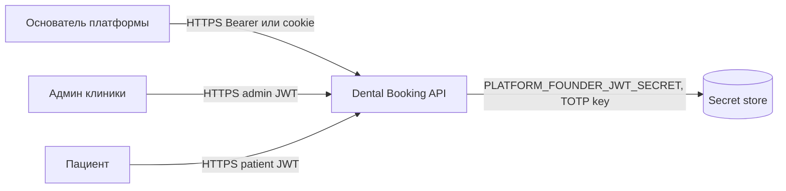
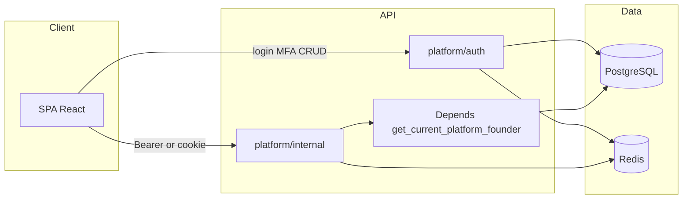
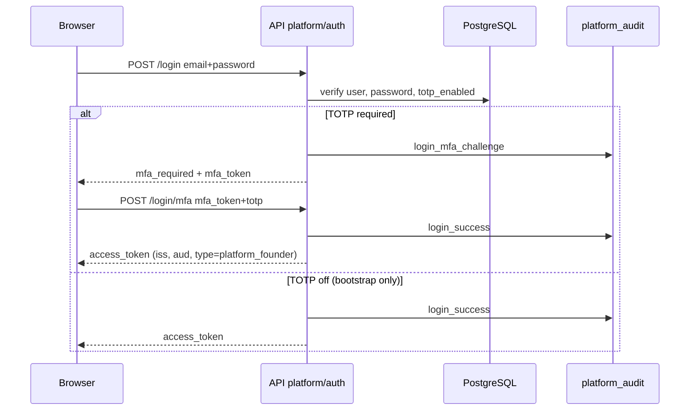
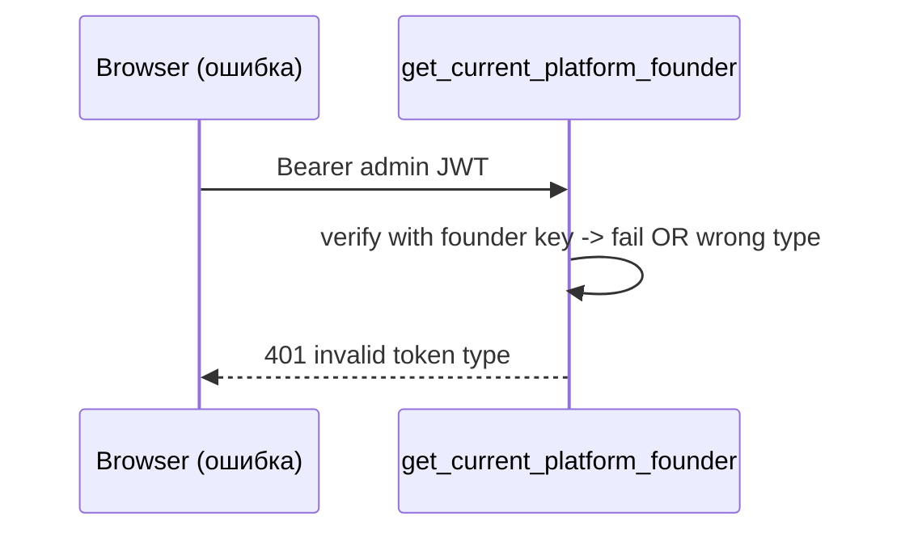
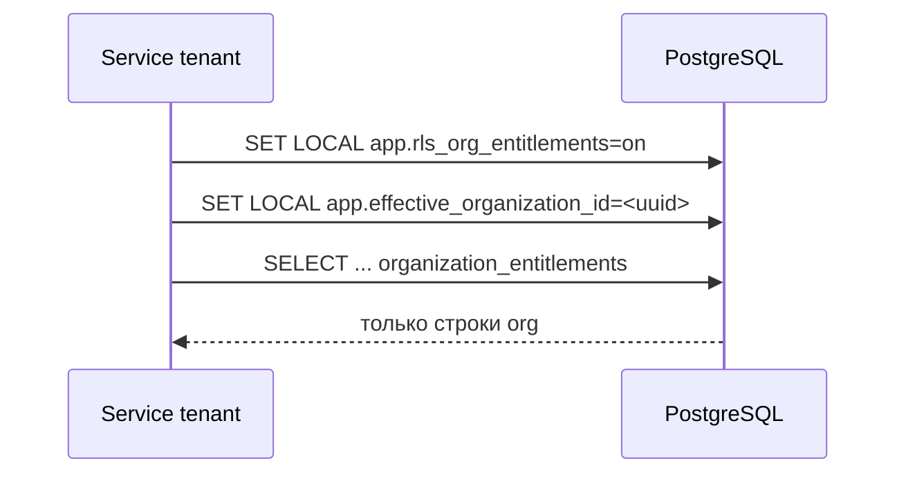

# Архитектурное моделирование потока 1a (Platform Core): срезы E1–E6, полный FE+BE контур

> **Роль:** @ARCH (моделирование до кода и критерии приёмки).  
> **Источник срезов:** [STREAM_1A_PLATFORM_EPICS.md](../arch_plan/STREAM_1A_PLATFORM_EPICS.md).  
> **Фаза МП:** [02_PHASE_1A_PLATFORM_CORE.md](../arch_plan/02_PHASE_1A_PLATFORM_CORE.md).  
> **Граница API (факт/черновик):** [specs/PLATFORM_ADMIN_API_BOUNDARY_DRAFT.md](../specs/PLATFORM_ADMIN_API_BOUNDARY_DRAFT.md).  
> **Изоляция данных:** [ADR-007](../../adr/ADR-007-platform-multitenancy-super-admin.md).  
> **PRC (L3):** [STREAM_PRODUCTION_READINESS.md](../arch_plan/STREAM_PRODUCTION_READINESS.md) — блок **A**.  
> **Playbook:** [LEAD_SAAS_PHASE_EXECUTION_PLAYBOOK.md](../LEAD_SAAS_PHASE_EXECUTION_PLAYBOOK.md).

**Цель документа:** зафиксировать **максимально полную** целевую архитектуру по каждому эпик-срезу 1a так, чтобы @DEV мог реализовывать бэкенд и фронтенд без двусмысленностей, а @QA_ARCH — проверять по явным артефактам. Документ описывает **целевое** состояние для **реального запуска** контура Основателя и платформенных API; пересечение с биллингом/публичным checkout остаётся в потоке **1b**, но границы JWT и audit здесь заданы так, чтобы 1b не ломал 1a.

---

## 0. Обзор: что считаем «полноценным продуктом» для контура 1a

| Контур | В продукте «реальный запуск» |
|--------|------------------------------|
| **Идентичность** | Основатель входит по паролю + при политике prod — **обязательный TOTP**; отдельный JWT-реалм от админа клиники и пациента; после **E6** — явные **`iss` / `aud`** (или эквивалент: отдельный issuer string + проверка audience). |
| **API** | Префикс `/api/v1/platform/*`: auth, internal операции, единый стиль ошибок (`code`, `message`, `trace_id`); OpenAPI с **привязкой схем ошибок** к операциям. |
| **FE** | Выделенная зона SPA (отдельный base path, например `/platform/*`): **логин → MFA → рабочие экраны**; токен **не** в общем хранилище с админкой клиники; прод-предпочтение: **httpOnly Secure cookie** + CSRF-политика (см. §3.2). |
| **Данные** | `platform_founder_users`, audit-события; опционально RLS **defence-in-depth** на согласованных таблицах (см. ADR-007 amendment); любой cross-tenant доступ — с негативными тестами. |
| **OPS** | `PLATFORM_FOUNDER_JWT_SECRET` (и ключи TOTP) **не только** `.env` на проде — secret manager + runbook (PRC-A3 пересекается; здесь фиксируем требования к контуру Основателя). |

**Вне scope 1a (но стыкуется):** публичный лендинг, YooKassa B, полный маркетинговый периметр — **STREAM_1B** / **STREAM_FRONTEND_SAAS**; настоящий документ задаёт **неприкосновенность** границы JWT и audit при развитии 1b.

---

## 1. C4: контекст и контейнеры

### 1.1 Контекст (Level 1)

### 1.2 Контейнеры (Level 2)

| Контейнер | Назначение |
|-----------|------------|
| **Browser SPA** | Маркетинг + **зона `/platform/*`**: только маршруты Основателя; отдельный bundle/chunk опционально. |
| **API monolith** | Роутеры `platform_founder_auth`, `platform_internal_*`, зависимости `get_current_platform_founder`, `log_platform_audit`. |
| **PostgreSQL** | `platform_founder_users`, таблицы audit (если введены), tenant-таблицы с опциональным RLS. |
| **Redis** | Rate limit для `/platform/auth/*`, метрики. |

---

## 2. Матрица JWT: текущее состояние → целевое (E6)

### 2.1 Текущая модель (после E2–E3)

| Параметр | Админ клиники | Пациент | Основатель (access) | Основатель (MFA pre-token) |
|----------|---------------|---------|---------------------|----------------------------|
| Claim `type` | `admin` | `patient` / `role` | `platform_founder` | `platform_founder_mfa` |
| Ключ подписи | `JWT_SECRET_KEY` | `JWT_SECRET_KEY` | `PLATFORM_FOUNDER_JWT_SECRET` (prod обязателен) | тот же |
| `sub` | `AdminUser.id` | `Patient.id` | `platform_founder_users.id` | то же |
| TTL | `jwt_access_token_expire_minutes_admin` | patient TTL | `jwt_access_token_expire_minutes_platform_founder` | `jwt_platform_founder_mfa_expire_minutes` |

Детали и маршруты — [PLATFORM_ADMIN_API_BOUNDARY_DRAFT.md](../specs/PLATFORM_ADMIN_API_BOUNDARY_DRAFT.md).

### 2.2 Целевая модель (E6 — PRC-A1)

**Требование МП §19 п.3:** исключить ситуацию, когда «любой подписанный JWT одного ключа даёт доступ к платформе».

| Изменение | Описание |
|-----------|----------|
| **`iss`** | Фиксированная строка, например `https://api.<product>/platform` или `dental-booking-platform`; при verify — строгое равенство. |
| **`aud`** | Список или одно значение: например `platform-internal`; отклонять токены без `aud` после cutover. |
| **Миграция** | Фаза **dual-read**: принимать старые токены без `iss`/`aud` при `PLATFORM_JWT_LEGACY_ALLOW=true` (только staging / ограниченное окно prod); затем выключить. |
| **Админский JWT** | Никогда не валидировать ключом Основателя; наоборот — на `get_current_admin` отклонять `type=platform_founder` (уже есть паттерн 401). |

**Артефакт @DEV:** таблица «тип токена → ключ verify → обязательные claims → HTTP при нарушении» в коде/доке + pytest на каждую ячейку отказа.

---

## 3. Моделирование по срезам

Ниже для **каждого** среза: цель, бэкенд, фронтенд, данные, безопасность, наблюдаемость, тесты, критерии приёмки QA_ARCH.

---

### 3.1 Срез **1a-E1** — Спека JWT и границы маршрутов

| Аспект | Моделирование |
|--------|----------------|
| **Цель** | Единый документ истины: что такое «контур Основателя», что такое «тенант», запрет смешения **Depends**. |
| **Backend** | Список префиксов: `/api/v1/platform/auth/*` (публичные auth), `/api/v1/platform/internal/*` (Bearer founder), исключения (webhook B — не Bearer). Таблица соответствия **router → dependency**. |
| **Frontend** | Карта маршрутов SPA: какие URL относятся к «зоне Основателя»; запрет переиспользования layout админки клиники без явного UX-разделения. |
| **Данные** | Нет миграций в срезе; только согласование имён сущностей (`platform_founder_users`). |
| **Безопасность** | Явное правило: код админки **не** импортирует репозитории platform-таблиц без слоя «platform service» и ревью. |
| **Observability** | Не блокирует E1. |
| **Тесты** | Документ-тест: чеклист в PR «новый `/platform` маршрут → указан в PLATFORM_ADMIN_API_BOUNDARY». |
| **QA_ARCH / DoD** | [PLATFORM_ADMIN_API_BOUNDARY_DRAFT.md](../specs/PLATFORM_ADMIN_API_BOUNDARY_DRAFT.md) обновлён; LEAD подтвердил; нет противоречия с **U-005** (`/owner/*`). |

---

### 3.2 Срез **1a-E2** — Platform user в БД, логин, выдача access JWT

| Аспект | Моделирование |
|--------|----------------|
| **Цель** | `sub` всегда резолвится в `platform_founder_users`; отключённый контур при пустом секрете в prod (**503**). |
| **Backend** | Эндпоинты: `POST .../platform/auth/login` → пароль → (ветка MFA в E3) → `create_platform_founder_access_token`. Зависимость `get_current_platform_founder`: verify + загрузка строки БД + `is_active` + rate limit. |
| **Frontend (полный продукт)** | **Страница логина** `/platform/login`: email, password; обработка `mfa_required` (E3); после успеха — сохранение сессии. **Целевое прод-хранилище:** httpOnly **Secure** cookie `platform_founder_session` (или двойной cookie pattern) + **SameSite=Lax/Strict** + защита от CSRF для state-changing `POST` (SameSite + custom header `X-Requested-With` или CSRF token). **Интерим:** localStorage с явным **ADR риска** на окно миграции (как сейчас в `frontend/src/marketing/pages/PlatformFounderProvisionQueuePage.tsx`) — допустимо только до даты, зафиксированной LEAD. |
| **Данные** | Таблица `platform_founder_users`: `id`, email, password hash, `is_active`, timestamps; bootstrap script документирован в OPS. |
| **Безопасность** | Rate limit per IP / email; не логировать пароль; одинаковые ответы на «нет пользователя» и «неверный пароль» (уже в духе admin login). |
| **Observability** | Метрики: `platform_founder_auth_total{result=...}`; без email в labels. |
| **Тесты** | Интеграционные: активный пользователь → 200 + JWT; неверный пароль → 401; `platform_founder` на `/admin/auth/session` → **401**; неактивный пользователь → **403**. |
| **@QA_ARCH** | [IMPLEMENTATION_REPORT_1A_E2_PLATFORM_FOUNDER_2026-04-06.md](../../artifacts/IMPLEMENTATION_REPORT_1A_E2_PLATFORM_FOUNDER_2026-04-06.md), [QA_REPORT_1a_E2_platform_user.md](../../artifacts/QA_REPORT_1a_E2_platform_user.md); grep-аудит контуров. |

---

### 3.3 Срез **1a-E3** — 2FA TOTP, политика bootstrap, break-glass

| Аспект | Моделирование |
|--------|----------------|
| **Цель** | После верного пароля при включённом TOTP: ответ **`mfa_required`** + краткоживущий **`platform_founder_mfa` token**; затем `POST .../login/mfa` → access JWT. Политика prod: флаг `PLATFORM_FOUNDER_TOTP_REQUIRED` (или аналог) — при **true** невозможен выдача access без TOTP. |
| **Backend** | Эндпоинты: `totp/enroll`, `totp/confirm`, `login`, `login/mfa` (см. `src/api/v1/routers/platform_founder_auth.py`); шифрование секрета TOTP — `src/infrastructure/crypto/platform_founder_totp_crypto.py`. Audit: `platform_founder_login_mfa_challenge`, `platform_founder_login_success`. |
| **Frontend (полный продукт)** | **Шаг 1:** форма логина. **Шаг 2:** экран ввода 6-значного кода + «trust this device» опционально (если продуктово). **Шаг 3 (enroll):** QR + verify — только для первичной настройки; вынести в отдельный маршрут `/platform/security/totp` с повторной аутентификацией. |
| **Данные** | Колонки TOTP в `platform_founder_users` (encrypted secret, confirmed flag). |
| **Безопасность** | [FOUNDER_ACCESS_BREAKGLASS.md](../../operations/FOUNDER_ACCESS_BREAKGLASS.md) синхронизирован с фактическим потоком; rate limit на `/login/mfa`. |
| **Observability** | Счётчики успех/неудача MFA **без** раскрытия причины в логах для внешнего злоумышленника. |
| **Тесты** | Интеграционные: enroll → confirm → login → mfa → token; неверный TOTP → 401; истёкший mfa_token → 401. |
| **QA_ARCH** | [QA_REPORT_1a_E3_founder_2fa.md](../../artifacts/QA_REPORT_1a_E3_founder_2fa.md); PRC-A2 — политика **обязательности** в prod подписывает LEAD отдельно. |

---

### 3.4 Срез **1a-E4** — Audit на критичных `/platform/*`

| Аспект | Моделирование |
|--------|----------------|
| **Цель** | Для каждого **чувствительного** действия: кто (founder id), что (action), на какой ресурс (type/id), когда; **без** email/телефона/тела запроса в structured log. |
| **Backend** | Функция `log_platform_audit` — единая точка; перечень **обязательных** action для: логин, MFA, выпуск owner-invite, ротации секретов, ручной retry провижининга (если есть). Опция v2: append-only таблица `platform_audit_log` для расследований (с индексом по времени и `actor_founder_id`). |
| **Frontend** | Не логировать PII в `console` в prod; не отправлять токены в аналитику. |
| **Данные** | При введении таблицы — миграция + политика retention (OPS). |
| **Безопасность** | Запрет логировать query params с токенами. |
| **Observability** | Лог-канал `platform_audit` + дашборд «ошибки логина Основателя» отдельно от audit. |
| **Тесты** | Тест: после действия в логе есть `action` и `actor_founder_id`; нет ключей `email`, `password`. |
| **QA_ARCH** | [QA_REPORT_1a_E4_platform_audit.md](../../artifacts/QA_REPORT_1a_E4_platform_audit.md); выборочная выгрузка лога на staging. |

---

### 3.5 Срез **1a-E5** — Изоляция tenant / RLS defence-in-depth

| Аспект | Моделирование |
|--------|----------------|
| **Цель** | ADR-007: пока основной контур — application layer, **RLS** на согласованных таблицах как второй рубеж; обязательные **негативные** тесты cross-tenant на критичных путях. |
| **Backend** | Для таблиц с RLS: перед запросом из контекста тенанта — `SET LOCAL app.rls_*` + `app.effective_organization_id` (паттерн как в миграции `organization_entitlements`). Репозитории platform-уровня **не** выставляют tenant GUC при чтении платформенных таблиц. Документ: какие use-case **включают** RLS в сессии. |
| **Frontend** | Не применимо напрямую; косвенно — не показывать `organization_id` чужого тенанта в UI. |
| **Данные** | Расширение RLS — только по эпику с performance review (см. backlog STREAM_1A). |
| **Безопасность** | Минимум один доменный тест: пользователь/org A не читает entitlements B. |
| **Observability** | Метрика `rls_violation_attempt_total` опционально (низкая cardinality). |
| **Тесты** | Pytest с включённым GUC `app.rls_org_entitlements=on` — см. [QA_REPORT_1a_E5_rls.md](../../artifacts/QA_REPORT_1a_E5_rls.md). |
| **QA_ARCH** | Отчёт + список таблиц под RLS; явно указано, что **остальной** tenant-data всё ещё на app-layer (честность §2b). |

---

### 3.6 Срез **1a-E6** — Ужесточение JWT: `iss` / `aud`, отдельный issuer

| Аспект | Моделирование |
|--------|----------------|
| **Цель** | PRC-A1: cross-realm негативы формализованы; токен админа/пациента **никогда** не проходит verify контуром Основателя; токен Основателя отклоняется без ожидаемых `iss`/`aud`. |
| **Backend** | При **mint**: добавить `iss`, `aud`. При **verify** в `parse_platform_founder_access_token`: проверить алгоритм, exp, `type=platform_founder`, **`iss`**, **`aud`**; отдельные коды ошибок: `invalid_token_issuer`, `invalid_token_audience` (стабильные строки для клиента). MFA-токен — отдельный `aud` (например `platform-mfa-step`). |
| **Frontend** | Обработка новых кодов ошибок; при dual-phase — обновление без простоя (короткий TTL access JWT облегчает cutover). |
| **Данные** | Нет обязательных миграций; опционально хранить `jwt_issued_at_version` у пользователя для инвалидации (вне минимального E6). |
| **Безопасность** | Тест: валидная подпись, неверный `aud` → 401. |
| **Observability** | Метрика `platform_founder_jwt_reject_total{reason=issuer|audience|expired}`. |
| **Тесты** | Матрица: негативы для `iss`/`aud`/чужой ключ/чужой `type`; позитив полный путь логин→internal. |
| **QA_ARCH** | `docs/artifacts/QA_REPORT_1a_E6_jwt_hardening.md` + обновление [PLATFORM_ADMIN_API_BOUNDARY_DRAFT.md](../specs/PLATFORM_ADMIN_API_BOUNDARY_DRAFT.md); строка **1a-F4** в [PHASE_FULL_CLOSURE_BACKLOG.md](../arch_plan/PHASE_FULL_CLOSURE_BACKLOG.md) → **done**. |

---

## 4. Сквозные сценарии (sequence)

### 4.1 Логин Основателя с MFA

### 4.2 Отказ: админский JWT на `platform/internal`

### 4.3 RLS-сессия на чтение entitlements тенанта

---

## 5. Фронтенд: целевая структура маршрутов (рекомендация ARCH)

| Маршрут | Назначение | Auth |
|---------|------------|------|
| `/platform/login` | Вход | Публичный |
| `/platform/login/mfa` | Ввод TOTP | После `mfa_token` (в памяти / sessionStorage кратковременно — минимизировать) |
| `/platform/security/totp` | Enroll TOTP | Bearer access |
| `/platform/provision-queue` | Очередь провижининга (уже есть) | Bearer / cookie |
| `/platform/internal/health` (проверка) | Диагностика токена | Bearer |

**Интеграция с API:** единый `apiClient` для `/platform` с интерцептором: подстановка Bearer из cookie (если cookie-based) или из memory; **не** смешивать с `adminToken`.

---

## 6. Сводный чеклист готовности к продакшну (контур 1a)

- [ ] **E1:** граница задокументирована, LEAD ок.
- [ ] **E2:** prod с `PLATFORM_FOUNDER_JWT_SECRET`; логин работает; негативы JWT cross-realm.
- [ ] **E3:** TOTP обязателен по политике prod (LEAD); break-glass исполним.
- [ ] **E4:** audit на всех критичных действиях; без PII в полях.
- [ ] **E5:** RLS/негативы согласованы с ADR-007; нет ложного заявления «весь tenant под RLS».
- [ ] **E6:** `iss`/`aud`; матрица тестов; PRC-A1 → `satisfied` в [STREAM_PRODUCTION_READINESS.md](../arch_plan/STREAM_PRODUCTION_READINESS.md).
- [ ] **FE:** сессия не в долгосрочном localStorage без waiver; CSRF учтён для cookie-схемы.
- [ ] **OPS:** секреты в secret manager; ротация задокументирована (связка PRC-A3).

---

## 7. Открытые вопросы к @LEAD

1. **Срок отказа от localStorage** для founder token в пользу httpOnly cookie — дата или waiver.
2. **Обязательность TOTP** с первого дня prod или grace period — фиксируется в политике (PRC-A2).
3. Нужен ли **отдельный поддомен** `platform.<app>` для SPA-зоны (упрощение CORS и cookie scope).

---

## 8. Трассировка на артефакты

| Срез | Ожидаемый QA_REPORT |
|------|---------------------|
| E2 | см. ретроспективу E2 / обновлённый отчёт |
| E3 | [QA_REPORT_1a_E3_founder_2fa.md](../../artifacts/QA_REPORT_1a_E3_founder_2fa.md) |
| E4 | [QA_REPORT_1a_E4_platform_audit.md](../../artifacts/QA_REPORT_1a_E4_platform_audit.md) |
| E5 | [QA_REPORT_1a_E5_rls.md](../../artifacts/QA_REPORT_1a_E5_rls.md) |
| E6 | `QA_REPORT_1a_E6_jwt_hardening.md` (создать при закрытии) |

---

**Версия:** 2026-04-07 · **Автор роли:** @ARCH · **Статус:** Accepted for implementation planning (подлежит подписи LEAD при расхождении с продуктом).
