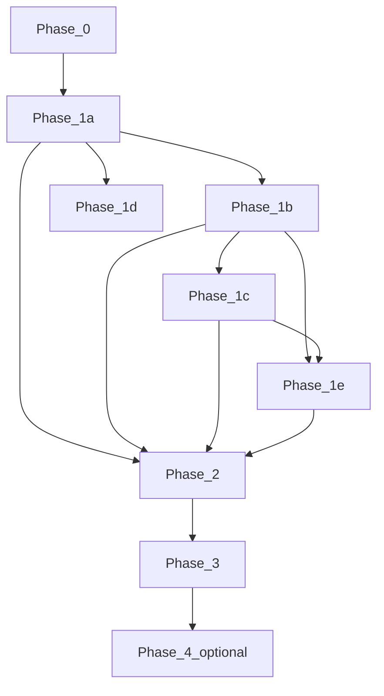

# Слои, зависимости и ворота (обзор для @ARCH / @DEV)

Источник: [SAAS_STRENGTHENING_MASTER_PLAN.md](../SAAS_STRENGTHENING_MASTER_PLAN.md).

## 1. Три оси МП (как думать о работе)

| Ось | Смысл | Где в плане |
|-----|--------|-------------|
| **Продукт** | Основатель, Владелец, тарифы, лендинг, провижининг, entitlements, embed | §1, §3–§8, §12–§13, §24 |
| **Безопасность и доверие** | Изоляция tenant/platform, 2FA, webhook A/B, XSS/токены, health, антиспам, security-метрики | §1, §9–§10, §15a, §27–§28, §19 |
| **Надёжность и техдолг** | Outbox, BCP, CI, cardinality, монолит vs сервисы | §2b (A–F), §16–§18, §30, Фаза 2 |

**Правило для @DEV:** задача почти никогда не «одна ось»; в PR фиксировать, какая ось затронута и какие ворота не регрессированы.

## 2. Архитектурные слои исполнения (порядок проектирования)

Ниже — **логический** порядок: сначала границы и доверие, потом деньги и данные, потом UX.

1. **Границы контуров** — platform vs tenant; JWT issuer Основатель vs админ клиники (МП §1, §19 п.3); API-префиксы ([CONVENTIONS_AND_TRACEABILITY.md](../CONVENTIONS_AND_TRACEABILITY.md), [backend/api_layer.md](../backend/api_layer.md)).
2. **Данные платформы** — таблицы intent/payment, будущие platform-user, `organization_entitlements`, RLS fork vs policy+репозитории (ADR-007, МП §16.1).
3. **Коммерция B** — webhook, идемпотентность, полный провижининг, retry/DLQ (ADR-011, [platform_subscription_billing.md](../modules/platform_subscription_billing.md), МП §6, §16.6).
4. **Публичный периметр** — лендинг, signup, rate limit, privacy (МП §5, §19 п.13).
5. **Entitlements в продукте** — замена `EDITION`-only гейтов ([ENTITLEMENT_ROUTER_INVENTORY.md](../ENTITLEMENT_ROUTER_INVENTORY.md), МП §12).
6. **Наблюдаемость** — Prometheus/Grafana, алерты, cardinality (МП §11).
7. **Надёжность** — outbox, backup, CI (Фаза 2).
8. **Расширения** — vertical, импорт, опционально Commerce (Фазы 3–4).

## 3. Зависимости между фазами МП §15 (упрощённо)

- **1b** и **1d** могут **частично** вестись параллельно с **1a** после того, как зафиксированы префиксы и «не ломать prod» (согласование @ARCH + @OPS).
- **P0 безопасность (§15a)** и **P0 коммерция (§15c)** — **два параллельных** потока до платного self-service (МП §13.2).

## 4. Ворота «go» (МП §18–§19) — архитектурный минимум

Перед **новыми необратимыми миграциями** platform и публичным лендингом @ARCH обязан явно зафиксировать (документ/тикет):

| # | Тема | Действие @DEV / @ARCH |
|---|------|------------------------|
| 1 | ADR-007 fork | RLS vs policy + не смешивать ORM platform/tenant без барьера |
| 2 | §17.1 | При `replicas(API) ≥ 2` и публичном B/signup — outbox / одна реплика / ADR риска |
| 3 | U-006 | A и B разведены в коде; DoD 1b не закрывать тестами только A |
| 4 | §16.6 | MVP spine ≠ полное закрытие; OpenAPI B, ветки webhook, retry/reconcile |
| 5 | §12.2 | Инвентарь роутеров без «уточнить Product» до merge 1c |
| 6 | Privacy | [PLATFORM_SIGNUP_PRIVACY_AND_RETENTION.md](../PLATFORM_SIGNUP_PRIVACY_AND_RETENTION.md) заполнен по смыслу |
| 7 | C5 | [FOUNDER_ACCESS_BREAKGLASS.md](../../operations/FOUNDER_ACCESS_BREAKGLASS.md) опубликован, ссылка из INDEX |

## 5. Envelope масштаба (@ARCH ШАГ 0A)

До утверждённого envelope-документа (МП **§31**; черновик: [ENTERPRISE_SAAS_SCALE_ENVELOPE.md](../ENTERPRISE_SAAS_SCALE_ENVELOPE.md) или раздел в [TARGET_PLATFORM_MULTITENANCY_REFERENCE.md](../TARGET_PLATFORM_MULTITENANCY_REFERENCE.md)) проектировать с допущением «ориентир §31»:

- списки с пагинацией/keyset;
- метрики без высокой cardinality на `organization_id` в алертах;
- импорт и провижининг — батчи и идемпотентность (§25.3, §16.6 шаг 0).

Отчёт @QA_ARCH (envelope §31): [ENTERPRISE_SAAS_SCALE_ENVELOPE.md](../ENTERPRISE_SAAS_SCALE_ENVELOPE.md).

## 6. Честность план ↔ код (МП §2b)

Таблица слоёв A–F в МП — **обязательная** перекрёстная проверка перед major SaaS-релизом; @DEV в PR по запросу подтверждает факт кода (grep/тесты).
