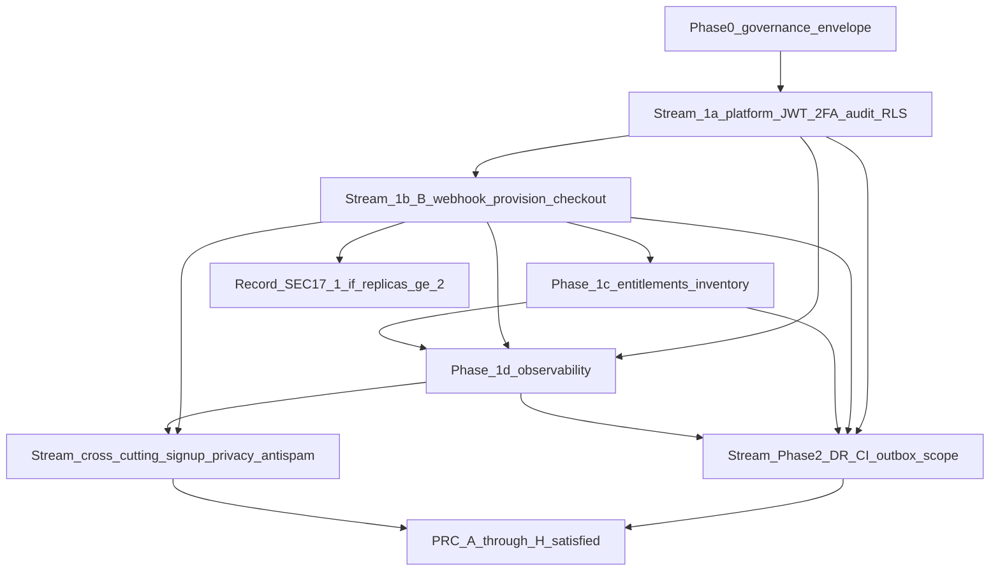

# Production Launch (L3) — матрица PRC и закрытие мастер-плана

> **МП:** [SAAS_STRENGTHENING_MASTER_PLAN.md](../SAAS_STRENGTHENING_MASTER_PLAN.md) — уровни честности **§2c–§2d**, ворота **§19**, **§17.1**, **§16.6**.  
> **Долг по фазам:** [PHASE_FULL_CLOSURE_BACKLOG.md](./PHASE_FULL_CLOSURE_BACKLOG.md).  
> **Ритуал срезов:** [LEAD_SAAS_PHASE_EXECUTION_PLAYBOOK.md](../LEAD_SAAS_PHASE_EXECUTION_PLAYBOOK.md).

## Уровни честности (LEAD)

| Уровень | Название | Смысл |
|---------|----------|--------|
| **L1** | MVP spine | Код/срез есть; МП **§17**, **§19 п.8/14**, **§2d** запрещают заявлять фазу или U-006 «закрытыми целиком». |
| **L2** | DoD **§15b** + закрытые строки **PHASE_FULL_CLOSURE** для заявленной фазы | Фазовые минимумы; **не** автоматически L3. |
| **L3** | **Production Launch** | Все **PRC** блоков A–H → `satisfied` с артефактом; блок I → `satisfied` или **`waived`** с подписью LEAD (+ SEC где нужно) и датой пересмотра; финальный проход LEAD + QA_ARCH + ARCH без противоречия **§2b**. |

**Определение закрытия процесса для продакшн:** см. раздел [«Условие полного закрытия»](#условие-полного-закрытия-для-production-launch) ниже.

---

## Запрещённые формулировки до L3 (МП)

Дословно нельзя заявлять (см. **§17**, **§2d**, **§19 п.8/14**):

- «**Фаза 1b закрыта**», «**U-006 полностью закрыт**», «**§16.6 выполнена**», пока не закрыты **§2d** п.3–4, 8–9 и DoD **§15b 1b** в полном смысле.
- «**Два webhook разведены**», если разведение есть **только** в документах (**§2c** C1).
- «**C1 / U-006 закрыты**» без расширенного покрытия веток провайдера B, OpenAPI B и полного провижининга **§6** (**§2d** п.3).
- Наличие файла privacy **без** заполненного по смыслу чеклиста — ворота **не** закрыты (**§19 п.13**, **§2c** C4).

---

## Минимальный порядок закрытия (DAG)

Логическая последовательность без отмены параллельных OPS/SEC задач:

---

## Матрица PRC — трекинг

**Колонки:** `Статус` — `open` | `in_progress` | `satisfied` | `waived`.  
**Waiver:** дата, LEAD (+ SEC при необходимости), ссылка на тикет; иначе `—`.

### Блок A — Идентичность, платформа, изоляция

| ID | Критерий | МП | Stream / срез | PHASE_FULL_CLOSURE | Статус | Артефакт | Waiver |
|----|----------|-----|---------------|-------------------|--------|----------|--------|
| **PRC-A1** | Раздельные реалмы JWT; нет взаимной подмены Bearer; `iss`/`aud` или отдельный issuer | §1, §19 п.3, ADR-007 | [STREAM_1A_PLATFORM_EPICS.md](./STREAM_1A_PLATFORM_EPICS.md) **1a-E6** | **1a-F4** | satisfied | [QA_REPORT_1a_E6_jwt_hardening](../../artifacts/QA_REPORT_1a_E6_jwt_hardening.md); [STREAM_1A_PLATFORM_EPICS.md](./STREAM_1A_PLATFORM_EPICS.md) | — |
| **PRC-A2** | 2FA Основателя по политике prod; break-glass исполним OPS | §9, §19 п.10 | **1a-E3** | **1a-F2** | satisfied | [QA_REPORT_1a_E3_founder_2fa](../../artifacts/QA_REPORT_1a_E3_founder_2fa.md); [FOUNDER_ACCESS_BREAKGLASS.md](../../operations/FOUNDER_ACCESS_BREAKGLASS.md); **`PLATFORM_FOUNDER_TOTP_REQUIRED`** + gating `/platform/internal/*`; [ARCH_MODEL_STREAM_1A_PLATFORM_E1_E6_FULL_STACK.md](../arch_model/ARCH_MODEL_STREAM_1A_PLATFORM_E1_E6_FULL_STACK.md) (prod: выставить флаг после enroll — OPS) | — |
| **PRC-A3** | Секреты Основателя и контура B не только `.env` на проде | §9, §12 | OPS + SEC | — | in_progress | Runbook [PLATFORM_AND_TENANT_SECRETS_RUNBOOK.md](../../operations/PLATFORM_AND_TENANT_SECRETS_RUNBOOK.md) (раздел **«Закрытие PRC-A3»**); код: `runtime_secrets.py` + fail-closed `assert_required_security_secrets_in_production`; **satisfied** — только после чеклиста ASM в prod + тикет OPS (строка в колонке Артефакт) | — |
| **PRC-A4** | Изоляция tenant/platform; негативные тесты; RLS/политика по ADR-007 | §1, §15b 1a, ADR-007 | **1a-E5** + app-layer | **1a-F5** | satisfied | [QA_REPORT_1a_E5_rls](../../artifacts/QA_REPORT_1a_E5_rls.md); [STREAM_1A_PLATFORM_EPICS.md](./STREAM_1A_PLATFORM_EPICS.md); расширение RLS на прочие таблицы — бэклог вне стрима 1a | — |
| **PRC-A5** | Audit `/platform/*` без лишней PII | §1 C5, ADR-007 | **1a-E4** | **1a-F3** | satisfied | [QA_REPORT_1a_E4_platform_audit](../../artifacts/QA_REPORT_1a_E4_platform_audit.md) | — |

### Блок B — Коммерция контура B

| ID | Критерий | МП | Stream / срез | PHASE_FULL_CLOSURE | Статус | Артефакт | Waiver |
|----|----------|-----|---------------|-------------------|--------|----------|--------|
| **PRC-B1** | Webhook A и B разведены в коде и конфиге | §6 C1, §15b 1b, U-006 | **1b-E2**, код B | — | satisfied | Пути и секреты в репозитории; тесты разведения | — |
| **PRC-B2** | OpenAPI B + согласованная матрица веток YooKassa | §2d п.3, §16.6 | [STREAM_1B](./STREAM_1B_COMMERCE_EPICS.md) **1b-E3b** | **1b-F2** | satisfied | [QA_REPORT_1b_E3b_webhook_contract](../../artifacts/QA_REPORT_1b_E3b_webhook_contract.md); [platform_yookassa_webhook_b_branches.yaml](../contracts/platform_yookassa_webhook_b_branches.yaml); [SEC_PRODUCT_CONTOUR_B_REGISTRY.md](../../artifacts/SEC_PRODUCT_CONTOUR_B_REGISTRY.md); OpenAPI `src/api/v1/routers/platform_billing.py` | — |
| **PRC-B3** | Провижининг §6 полный: владелец, entitlements | §6, §2d п.8 | **1b-E2** | **1b-F1** | satisfied | [QA_REPORT_1b_E2_provision](../../artifacts/QA_REPORT_1b_E2_provision.md) | — |
| **PRC-B4** | C2: retry, DLQ/stuck, метрики, reconcile UI или ADR риска | §6 C2, §16.6 | **1b-E4**, **1b-E5** | **1b-F2**, **1b-F6** | satisfied | [platform_subscription_billing.md](../modules/platform_subscription_billing.md) §7, §10; OPS [PLATFORM_BILLING_PROVISION_RECONCILE.md](../../operations/PLATFORM_BILLING_PROVISION_RECONCILE.md); `deploy/prometheus/dental_booking_alerts.yml` (stuck/DLQ → runbook); pytest `tests/api/test_platform_billing.py`, `tests/api/test_platform_internal.py` (retry, manual-close); UI `/platform/provision-queue` (Retry + **Закрыть вручную**) — **staging QA_ARCH** по чеклисту [RELEASE_CHECKLIST.md](../../operations/RELEASE_CHECKLIST.md) | — |
| **PRC-B5** | Возвраты/chargeback в коде (ADR-012) | §6, §16.6 шаг 0, §19 | платформа биллинга | — | satisfied | `apply_platform_yookassa_notification`: `refunded` + chargeback-алиасы; `tests/api/test_platform_billing.py` (`test_platform_billing_refund_*`, `test_platform_billing_chargeback_revokes_entitlements`); модуль [platform_subscription_billing.md](../modules/platform_subscription_billing.md) §12, §12.1 | — |
| **PRC-B6** | Checkout + каталог + гейт суммы + `billing_period` | §3, модуль | **1b-E1** | **1b-F4**, **1b-F5** | satisfied | [QA_REPORT_1b_E1_checkout](../../artifacts/QA_REPORT_1b_E1_checkout.md) | — |
| **PRC-B7** | Rate limit / WAF на webhook B в prod | §10, **1b-E6** | **1b-E6** | — | in_progress | App + тест XFF: `platform_billing.py`, `tests/api/test_platform_billing.py`; edge WAF — OPS + [PRC_STAGING_EVIDENCE_CHECKLIST.md](../../operations/PRC_STAGING_EVIDENCE_CHECKLIST.md) § PRC-B7; алерт **PlatformBillingWebhookRateLimitedBurst** | — |

### Блок C — Публичная поверхность

| ID | Критерий | МП | Stream / срез | PHASE_FULL_CLOSURE | Статус | Артефакт | Waiver |
|----|----------|-----|---------------|-------------------|--------|----------|--------|
| **PRC-C1** | Rate limit / капча на signup/checkout | §5, §2c п.3, §27 | [STREAM_CROSS_CUTTING_GO_LIVE.md](./STREAM_CROSS_CUTTING_GO_LIVE.md) | **1b-F3** | in_progress | Код + pytest: checkout/catalog/embed/webhook B — [PUBLIC_PERIMETER_RATE_LIMIT_MATRIX.md](../../review/PUBLIC_PERIMETER_RATE_LIMIT_MATRIX.md); staging — [PRC_STAGING_EVIDENCE_CHECKLIST.md](../../operations/PRC_STAGING_EVIDENCE_CHECKLIST.md); хвост: капча checkout **10-Q8** | — |
| **PRC-C2** | Privacy чеклист заполнен по смыслу | §19 п.13 | см. cross-cutting | **1b-F3** | in_progress | [PLATFORM_SIGNUP_PRIVACY_AND_RETENTION.md](../PLATFORM_SIGNUP_PRIVACY_AND_RETENTION.md); Celery `platform_billing.expire_stale_signup_intents`; метрика **M-B9** `platform_signup_intent_ttl_expired_total`; [10_CROSS_CUTTING_SECURITY_ANTISPAM_BRAND_SCALE.md](./10_CROSS_CUTTING_SECURITY_ANTISPAM_BRAND_SCALE.md) | — |
| **PRC-C3** | Стабильные коды ошибок; prod без стеков в клиенте | §28 | API / **1c-Q4** | — | in_progress | [PLATFORM_BILLING_ERROR_CATALOG.md](../PLATFORM_BILLING_ERROR_CATALOG.md); OpenAPI responses | — |

### Блок D — Entitlements

| ID | Критерий | МП | Stream / срез | PHASE_FULL_CLOSURE | Статус | Артефакт | Waiver |
|----|----------|-----|---------------|-------------------|--------|----------|--------|
| **PRC-D1** | ENTITLEMENT_ROUTER_INVENTORY без «уточнить Product» | §12.2, §19 п.17 | **1c-E1** | — | satisfied | [ENTITLEMENT_ROUTER_INVENTORY.md](../ENTITLEMENT_ROUTER_INVENTORY.md) (CI + grep 2026-04-06) | — |
| **PRC-D2** | Фаза 1c: меню и маршруты по entitlements | §15b 1c | **1c-E2** | — | satisfied | `scripts/check_admin_entitlement_routers.py`; workflows `build-and-test-entitlements.yml`, `release-gate.yml`; FE `adminEntitlementNav.ts`; **Phase 3 rollout (DEV):** `ENTITLEMENT_ENFORCEMENT_MODE`, `ENTITLEMENT_ENFORCEMENT_STRICT_ORG_IDS` — `src/application/services/organization_entitlement_access.py`; тесты `tests/application/test_organization_entitlement_access.py`; [RELEASE_CHECKLIST.md](../../operations/RELEASE_CHECKLIST.md) | — |

### Блок E — Надёжность, DR, CI, §17.1

| ID | Критерий | МП | Stream / срез | PHASE_FULL_CLOSURE | Статус | Артефакт | Waiver |
|----|----------|-----|---------------|-------------------|--------|----------|--------|
| **PRC-E1** | Запись §17.1 при replicas≥2 + публичный B/signup | §17.1 | [STREAM_PHASE2](./STREAM_PHASE2_RELIABILITY_EPICS.md) **2-E1** | **2-F7** | satisfied (repo 2026-04-08) | [API_REPLICAS_WEBHOOK_SIGNUP_DECISION.md](../../operations/API_REPLICAS_WEBHOOK_SIGNUP_DECISION.md) — outbox-путь зафиксирован в коде/доке; **runtime:** OPS/LEAD подписывают governance при первом `replicas≥2` (см. § «Закрытие PRC-E1 в репозитории») | OPS/LEAD строки таблицы при scale-out |
| **PRC-E2** | ADR-008 + drill U-009 | §19, U-009 | **2-E4** | **2-F2** | **partial** (2026-04-06) | [DR_RUNBOOK.md](../../operations/DR_RUNBOOK.md) §6.1 — дата учения зафиксирована; §1 RPO/RTO — OPS | — |
| **PRC-E3** | Outbox по согласованному scope | §19 п.11 | **2-E1**, **2-E2** | **2-F1** | satisfied | Код: `domain_outbox`, Celery `domain_outbox.dispatch_pending`; метрики `domain_outbox_*`; алерты в `dental_booking_alerts.yml` + [07_PHASE_2_RELIABILITY.md](./07_PHASE_2_RELIABILITY.md); pytest `tests/application/test_domain_outbox_platform_provision.py`; контур B провижининг через outbox — см. [platform_subscription_billing.md](../modules/platform_subscription_billing.md) §10 п.4 | — |
| **PRC-E4** | CI U-008 для релиза | §15a, §19 п.7 | **2-E3** | **2-F8** | **satisfied** (2026-04-06) | [`.github/workflows/release-gate.yml`](../../../.github/workflows/release-gate.yml) + политика LEAD [LEAD_CI_U008_E2E_SECURITY_POLICY_2026-04-06.md](../../artifacts/LEAD_CI_U008_E2E_SECURITY_POLICY_2026-04-06.md) (e2e/security — waiver до включения из `workflows_disabled`) | — |

### Блок F — Наблюдаемость

| ID | Критерий | МП | Stream / срез | PHASE_FULL_CLOSURE | Статус | Артефакт | Waiver |
|----|----------|-----|---------------|-------------------|--------|----------|--------|
| **PRC-F1** | Grafana не в открытой сети без auth | §11 M5 | Phase **1d**, OPS | **OBS-3** | in_progress | [RELEASE_CHECKLIST.md](../../operations/RELEASE_CHECKLIST.md) § M5 + [OBSERVABILITY_COMPOSE_SMOKE.md](../../operations/OBSERVABILITY_COMPOSE_SMOKE.md); prod: VPN/reverse-proxy + auth — **satisfied** после OPS-проверки | — |
| **PRC-F2** | Алерты: runbook_url, severity, дедуп | §11 M6 | deploy/prometheus | — | in_progress | `dental_booking_alerts.yml` — `runbook_url` на contour B, outbox, embed, patient auth и базовых ERP/HTTP/booking правилах (см. файл); staging smoke — RELEASE_CHECKLIST; дедуп/severity — по Alertmanager в среде | — |
| **PRC-F3** | Cardinality новых метрик (§11 M1) | §11 M1 | **1d** | — | in_progress | Лимит-ключи Redis без сырого email в метках; `platform_billing_webhook_total` по `result`; проверка staging / CI | — |

### Блок G — Масштаб

| ID | Критерий | МП | Stream / срез | PHASE_FULL_CLOSURE | Статус | Артефакт | Waiver |
|----|----------|-----|---------------|-------------------|--------|----------|--------|
| **PRC-G1** | Envelope §31 утверждён LEAD | §31, §30 | [STREAM_PHASE0_AND_GOVERNANCE.md](./STREAM_PHASE0_AND_GOVERNANCE.md) | **0-F1** | in_progress | [ENTERPRISE_SAAS_SCALE_ENVELOPE.md](../ENTERPRISE_SAAS_SCALE_ENVELOPE.md) — блок подписи LEAD; **satisfied** после даты/тикета | — |
| **PRC-G2** | SLO критичных путей | §11 | [SLO_CRITICAL_PATHS.md](../../operations/SLO_CRITICAL_PATHS.md) | — | in_progress | Документ §4 contour B + алерты Prometheus; калибровка staging | — |

### Блок H — Frontend

| ID | Критерий | МП | Stream / срез | PHASE_FULL_CLOSURE | Статус | Артефакт | Waiver |
|----|----------|-----|---------------|-------------------|--------|----------|--------|
| **PRC-H1** | Маркетинговый контур и CTA согласованы с API | §5–§8 | [STREAM_FRONTEND_SAAS_EPICS.md](./STREAM_FRONTEND_SAAS_EPICS.md) FE-E1 | **1b-F3** | in_progress | FE: `SignupPage.tsx`, `PlatformPricingSection.tsx` → `POST .../public/platform/signup/checkout`, `GET .../catalog/plans`; e2e smoke по [RELEASE_CHECKLIST](../../operations/RELEASE_CHECKLIST.md) — **satisfied** после прогона на staging | — |
| **PRC-H2** | UX MFA кабинета Основателя | §9 | FE-E2 | — | in_progress | [LEAD_PLATFORM_FOUNDER_MFA_UX_CHECKLIST.md](../../artifacts/LEAD_PLATFORM_FOUNDER_MFA_UX_CHECKLIST.md); FE `PlatformFounderLoginPage` — **satisfied** после QA по чеклисту | — |

### Блок I — Опционально для базового L3

| ID | Критерий | МП | Stream | Статус | Артефакт | Waiver |
|----|----------|-----|--------|--------|----------|--------|
| **PRC-I1** | Commerce §26, импорт §25, RAG §24.3 | §26, §25, §24 | [STREAM_1E_AND_PHASE3_PLUS](./STREAM_1E_AND_PHASE3_PLUS_EPICS.md), [STREAM_PRODUCT_RAG_24](./STREAM_PRODUCT_RAG_24_EPIC.md) | open | [LEAD_PRC_L3_SCOPE_WAIVERS_TEMPLATE.md](../../artifacts/LEAD_PRC_L3_SCOPE_WAIVERS_TEMPLATE.md) | Вне базового L3: **`waived`** + LEAD — шаблон; скопировать в колонку при подписи |
| **PRC-I2** | Бренд §29, i18n | §29 | [STREAM_CROSS_CUTTING_GO_LIVE.md](./STREAM_CROSS_CUTTING_GO_LIVE.md) | open | см. шаблон I1 | **`waived`** по LEAD — тот же шаблон |

*Примечание:* до формальной подписи LEAD по периметру релиза строки I остаются `open` или переходят в `waived` с заполненной колонкой **Waiver**.

---

## QA_ARCH: приёмка по матрице PRC

**Роль:** [ROLE_QA_ARCH.md](../../ROLE_QA_ARCH.md). **Процесс срезов:** [LEAD_SAAS_PHASE_EXECUTION_PLAYBOOK.md](../LEAD_SAAS_PHASE_EXECUTION_PLAYBOOK.md).

1. Статус **`satisfied`** для строки **PRC-*** допустим только при **заполненной** колонке **Артефакт** (живая ссылка: `QA_REPORT`, PR, runbook, дата drill, OPS-тикет — что применимо).
2. **QA_ARCH** не переводит строку в `satisfied` по одной фразе в чате: нужен артефакт, проверяемый по ссылке или пути в репозитории.
3. При закрытии строки PRC синхронизировать при необходимости [PHASE_FULL_CLOSURE_BACKLOG.md](./PHASE_FULL_CLOSURE_BACKLOG.md) и соответствующий **STREAM_*** (см. колонку Stream).
4. Образец строгого разбора сквозных тем: [10_CROSS_CUTTING_SECURITY_ANTISPAM_BRAND_SCALE.md](./10_CROSS_CUTTING_SECURITY_ANTISPAM_BRAND_SCALE.md) и строки **10-Q*** в [PHASE_FULL_CLOSURE_BACKLOG.md](./PHASE_FULL_CLOSURE_BACKLOG.md).
5. Раздел **«Задание для @ARCH»** ниже в этом файле — **входной бриф** для моделирования; выход ARCH должен дать ссылки, которые можно положить в **Артефакт** по релевантным PRC.

---

## Условие полного закрытия для Production Launch

1. Все **PRC-A…H** — статус `satisfied` с ссылкой на артефакт (PR, QA_REPORT, runbook, дата drill).
2. Каждый **PRC-I** — `satisfied` или `waived` с подписью LEAD (+ SEC) и датой пересмотра в колонке **Waiver**.
3. [PHASE_FULL_CLOSURE_BACKLOG.md](./PHASE_FULL_CLOSURE_BACKLOG.md): нет `open` для строк, которые тянутся в PRC A–H, **или** на каждую такую строку есть waiver в этой матрице.
4. Финальный цикл **LEAD + QA_ARCH + ARCH** без противоречия **§2b** (честность план ↔ код).

---

## Задание для @ARCH (архитектурное моделирование после утверждения PRC LEAD)

**Цель:** снять пробелы между текстом МП и развёрнутыми моделями для приёмки и онбординга.

**Уже зафиксировано (поток 1a):** [ARCH_MODEL_STREAM_1A_PLATFORM_E1_E6_FULL_STACK.md](../arch_model/ARCH_MODEL_STREAM_1A_PLATFORM_E1_E6_FULL_STACK.md) — JWT, FE-зона `/platform/*`, audit, RLS, sequence, чеклист прод и PRC-A. Закрытие стрима зафиксировано в [STREAM_1A_PLATFORM_EPICS.md](./STREAM_1A_PLATFORM_EPICS.md) и [IMPLEMENTATION_REPORT_1A_E2_PLATFORM_FOUNDER_2026-04-06.md](../../artifacts/IMPLEMENTATION_REPORT_1A_E2_PLATFORM_FOUNDER_2026-04-06.md) (приложение B).

1. **C4/C5:** контексты **Platform**, **Tenant admin**, **Public**, **Provider-B**; границы доверия JWT и секретов.
2. **Deployment:** N реплик API, ingress, webhook B, sticky/outbox — связка с записью **§17.1** в [API_REPLICAS_WEBHOOK_SIGNUP_DECISION.md](../../operations/API_REPLICAS_WEBHOOK_SIGNUP_DECISION.md).
3. **Последовательности (sequence):** оплата → webhook B → провижининг → entitlements; ветки отказа, refund/chargeback (ADR-012).
4. **Данные:** `signup_intent`, `platform_subscription_payment`, `organization`, `organization_entitlements`, audit platform.
5. **STRIDE** или эквивалент: публичный signup/checkout и публичный webhook B (угрозы, контрмеры, ссылки на PRC).

Результат фиксировать в `docs/architecture/` (имя файла согласовать ARCH + LEAD) и дать ссылку в колонке **Артефакт** соответствующих PRC.

---

**Версия:** 2026-04-08 (DEV) — PRC-B4/B5/E3/D2: Phase 2 reconcile runbook + manual-close UI; ADR-012 chargeback; entitlement rollout env.
