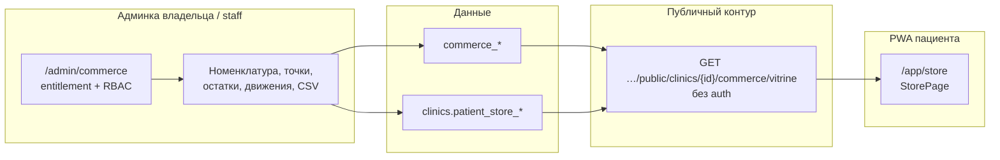

# Архитектурный план: Commerce (магазин) и витрина в PWA пациента

> **Роль:** единая точка входа @LEAD / @ARCH для модуля **Commerce** (Фаза 4) и **пациентской витрины** без дублирования разрозненных заметок.  
> **Версия:** 2026-04-11 · **Bounded context и ворота:** [ADR-013](../../adr/ADR-013-commerce-store-bounded-context-scope.md) · **Домен (факты по коду):** [commerce_bounded_context.md](./commerce_bounded_context.md)

## 1. Решение уровня ADR (рядом со всеми ADR)

Индекс всех ADR репозитория: [`docs/adr/README.md`](../../adr/README.md). Для магазина достаточно **одного** ADR:

| ADR | Тема | Статус (документ) |
|-----|------|-------------------|
| **ADR-013** | Bounded context Commerce: префикс `commerce_*`, мультитенантность `organization_id` / `clinic_id`, read-models по сети, entitlement `commerce.store_network`, ворота до миграций | Proposed (см. шапку файла) |

Отдельного ADR для «витрины в PWA» **не вводилось**: публичный read-only эндпоинт — расширение того же контекста (номенклатура клиники + флаги клиники), зафиксировано в **дополнении к ADR-013** в теле ADR и в §2–3 этого плана.

## 2. Логическая модель (слои)

- **Запись и учёт:** только админские маршруты под `commerce.store_network` и существующими правами инвентаря (см. код роутеров `admin_commerce`, `admin_commerce_network`).
- **Пациентская витрина:** только **чтение**; включение — **`clinic.patient_store_visible`**; содержимое карточек — **активная** номенклатура клиники (`CommerceNomenclatureItem.is_active`, лимит ответа в коде).

## 3. Что есть в коде (as-built, кратко)

| Область | Путь / артефакт |
|---------|-----------------|
| Миграция флагов витрины | `alembic/versions/20260429_clinic_patient_storefront_flags.py` — `patient_store_visible`, `patient_store_title`, `patient_store_subtitle` |
| Сущность / DTO клиники | `src/domain/entities/clinic.py`, `src/application/dto/clinic_dto.py` |
| Публичный API | `src/api/v1/routers/public_commerce.py` — `GET /api/v1/public/clinics/{clinic_id}/commerce/vitrine` |
| Регистрация роутера | `src/api/v1/router.py` (`public_commerce`) |
| Тесты витрины | `tests/api/test_public_commerce_vitrine.py` |
| Админ: настройка витрины + превью карточек | `frontend/src/admin/pages/AdminCommercePage.tsx` |
| PWA: страница и навигация | `frontend/src/app/pages/StorePage.tsx`, `frontend/src/app/layouts/AppLayout.tsx`, `frontend/src/routePaths.ts`, `frontend/src/App.tsx` |
| Типы фронта | `frontend/src/api/types.ts` (`patient_store_*` на клинике) |

**Вне объёма текущей витрины (явно):** корзина, оформление заказа, цены и остатки в ответе публичного API, онлайн-оплата товаров — отдельные эпики и, при появлении денежного контура, отдельный SEC/ADR-обзор.

## 4. Корпус `.md`: где что сказано (де-факто)

Ниже — не дублирование текста, а **навигация**: какой файл за что отвечает.

| Файл | Содержание по магазину |
|------|-------------------------|
| [`docs/adr/README.md`](../../adr/README.md) | Индекс ADR; строка **ADR-013** |
| [`docs/adr/ADR-013-commerce-store-bounded-context-scope.md`](../../adr/ADR-013-commerce-store-bounded-context-scope.md) | Решение по границам Commerce + дополнение про публичную витрину |
| [`docs/architecture/domains/commerce_bounded_context.md`](./commerce_bounded_context.md) | Резерв имён таблиц/API, ворота, длинный абзац «факт кода» (миграции 4-F1–F5, роутеры) |
| **Этот файл** | План: слои, as-built таблица, корпус ссылок, бэклог |
| [`docs/architecture/arch_plan/09_PHASE_4_OPTIONAL_COMMERCE.md`](../arch_plan/09_PHASE_4_OPTIONAL_COMMERCE.md) | Фаза 4: цель, итерации 4-F1…, статус @DEV |
| [`docs/architecture/INDEX.md`](../INDEX.md) | Пункт 10b → `commerce_bounded_context.md`; при необходимости ссылка сюда |
| [`docs/architecture/SAAS_STRENGTHENING_MASTER_PLAN.md`](../SAAS_STRENGTHENING_MASTER_PLAN.md) | §26 магазин, §4 ключ `commerce.store_network`, mermaid `optional_late_Commerce` |
| [`docs/architecture/backend/domain_layer.md`](../backend/domain_layer.md) | Упоминание Commerce и ссылки на доменный документ |
| [`docs/architecture/ENTITLEMENT_KEYS_PHASE0_ALIGNMENT.md`](../ENTITLEMENT_KEYS_PHASE0_ALIGNMENT.md) | Ключ `commerce.store_network` |
| [`docs/product_state/COMMERCIAL_VALUE_FROM_CODE.md`](../../product_state/COMMERCIAL_VALUE_FROM_CODE.md) | Краткий блок Commerce (admin + сущности) |
| [`docs/product_state/BACKEND_PASSPORT.md`](../../product_state/BACKEND_PASSPORT.md) | Перечень роутеров / сервисов, миграции |
| [`docs/product_state/FRONTEND_PASSPORT.md`](../../product_state/FRONTEND_PASSPORT.md) | Сегмент `commerce` → `AdminCommercePage` |
| [`docs/architecture/frontend/app_patient_domain.md`](../frontend/app_patient_domain.md) | Зона `/app`, в т.ч. витрина |

Артефакты в `docs/artifacts/*`, упоминающие Commerce в контексте всего SaaS-плана, см. поиск по репозиторию: `commerce`, `ADR-013`, `§26`.

## 5. Продуктовые инварианты (BIZ / LEAD)

- Витрина в PWA **выключена по умолчанию**; включение — осознанное действие владельца в разделе Commerce.
- Публичный эндпоинт не раскрывает данные других клиник: фильтр по `clinic_id` в пути и в запросе номенклатуры; при выключенном флаге — пустой список и `enabled: false` без ошибки 404 на существующей клинике (см. тесты).
- Полноценный «интернет-магазин» с оплатой требует отдельного скоупа, НДС/касса (см. «Не входит» в ADR-013).

## 6. Бэклог архитектуры (коротко)

1. **ADR-013:** формальный переход в **Accepted** после записи @LEAD и ссылки на ревизии Alembic (уже есть миграции `commerce_*`; ворота исторически ориентированы на «первую» миграцию — зафиксировать в минутке приёмки).
2. **Наблюдаемость / abuse:** Redis rate limit на `GET …/vitrine` по IP (`rate_public_commerce_vitrine_*`, trusted proxy как у каталога) — **в коде**; при аномалиях — опционально второй счётчик по `clinic_id` + метрика.
3. **Публичный периметр GET /clinics:** черновики `patient_store_title` / `subtitle` не отдаются в списке без витрины (`clinic_read_scrub_public_pii`) — **в коде**; тест `tests/core/test_clinic_read_public_scrub.py`.
4. **OpenAPI:** явная схема ответа витрины в экспортируемой спецификации (если публичный каталог для интеграторов).
5. **Контент карточки:** опционально поля описания / изображения SKU в `CommerceNomenclatureItem` и прокидывание в vitrine (без изменения границ ADR).

---

**Связанные документы:** [09_PHASE_4_OPTIONAL_COMMERCE.md](../arch_plan/09_PHASE_4_OPTIONAL_COMMERCE.md) · [ENTITLEMENT_ROUTER_INVENTORY.md](../ENTITLEMENT_ROUTER_INVENTORY.md) · [modules/data_migration_import_connectors.md](../modules/data_migration_import_connectors.md) (связь с §25 / 1С).
