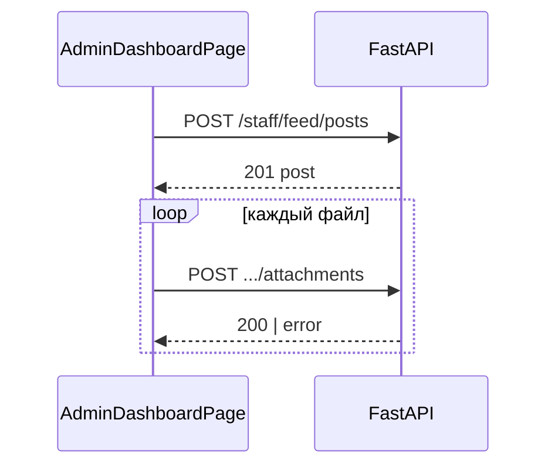

# Лента персонала (staff feed) на дашборде — доработки после UX-итерации

> **Статус:** план и трассировка к коду (2026-04-10).  
> **Связанные якоря:** `frontend/src/admin/pages/AdminDashboardPage.tsx`, `frontend/src/hooks/useStaffCollab.ts` (`useCreateStaffFeedPost`, `useStaffFeedPosts`).

## Назначение

Зафиксировать оставшиеся риски после двухколоночного layout ленты и согласовать продуктовые/технические шаги (ARCH → DEV → QA_ARCH).

## Точки входа

| Слой | Путь |
|------|------|
| UI | `frontend/src/admin/pages/AdminDashboardPage.tsx` |
| Мутация поста | `useCreateStaffFeedPost` в `frontend/src/hooks/useStaffCollab.ts` |
| API | `POST /api/v1/admin/staff/feed/posts`, `POST .../posts/{id}/attachments` (см. backend router staff feed) |

## Поток (публикация с вложениями)

При ошибке вложения пост уже существует: откат транзакции на клиенте невозможен без удаления поста (отдельный DELETE или компенсирующий сценарий на бэкенде).

## Открытые доработки (приоритет)

| # | Тема | Риск | Решение по слою | Статус |
|---|------|------|-----------------|--------|
| 1 | Вложения после успешного POST | Средний: «немой» сбой загрузки файла | **Продукт + UI:** явное предупреждение пользователю со списком файлов; опционально позже — DELETE поста или повтор загрузки из редактора | **UI:** предупреждение после публикации (DEV) |
| 2 | Дублирование инвалидации React Query | Низкий: лишний refetch | Оставить одну инвалидацию в `useCreateStaffFeedPost.onSuccess`; убрать дубль из колбэка страницы | **DEV:** убрано дублирование |
| 3 | E2E лента + drawer + публикация | Средний: регресс layout/формы без теста | Playwright с моками API (как `frontend/e2e/admin-omni-chat.spec.ts`) | **DEV:** сценарий добавлен |
| 4 | Длинная лента | Средний: память/DOM | Виртуализация списка (`@tanstack/react-virtual` или аналог), отдельная задача | **Отложено** (только план) |

## Соответствие фактам

- Поведение инвалидации проверено по коду `useCreateStaffFeedPost` и страницы дашборда.
- E2E не требует живого backend при маршрутизации `page.route` (проверено паттерном существующих e2e).

## Enterprise-аудит (кратко)

- **Критические:** нет (контур внутри админки, tenant из JWT).
- **Средние:** частичный фейл вложений без уведомления — снижен за счёт UI-предупреждения; полный откат — продуктовое решение.
- **Рекомендация:** при появлении очереди вложений — outbox/повтор на бэкенде (вне этого документа).
