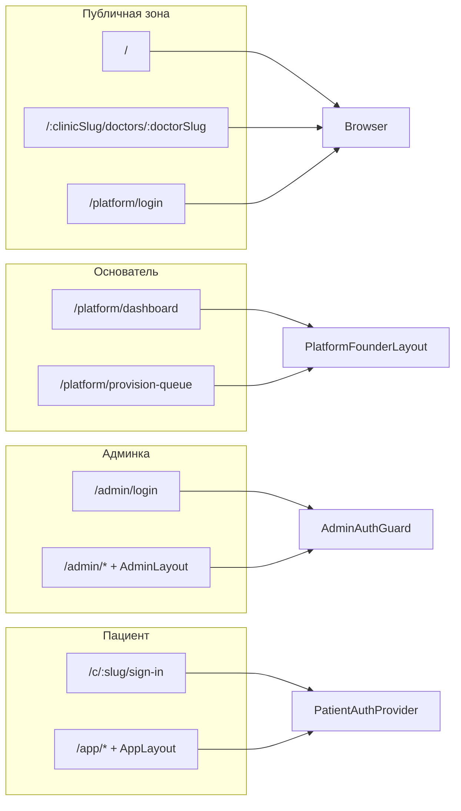

# Маршрутизация и оболочки SPA

## Назначение

Три основные зоны URL: маркетинг (`/`), кабинет Основателя платформы (`/platform/*`, JWT `platform_founder`, отдельно от клиники), админка (`/admin/*`), пациентское приложение (`/app/*`). Канон путей — `frontend/src/routePaths.ts` (`ROUTE_PATHS.platform`, `ROUTE_PATHS.marketing`); дерево `createBrowserRouter` — `frontend/src/App.tsx`.

## Как это работает (навигация и доступ)

1. **Единый роутер:** в `App.tsx` собирается объект маршрутов через `createBrowserRouter` / `createRoutesFromElements`. Сегменты админского shell (`ADMIN_SHELL_ROUTE_SEGMENTS`) сопоставляются с компонентами через словарь `ADMIN_SHELL_PAGE_BY_SEGMENT` — если ключ и маршрут разъедутся, падает тест `frontend/src/__tests__/routePaths.test.ts`.
2. **Админка:** ветка `/admin/login` без общего layout с дашбордом; остальные пути под `AdminLayout` оборачиваются в `AdminAuthGuard` и `AdminClinicProvider`: до загрузки токена/клиники дети не монтируются как положено (детали — в коде guard).
3. **Пациент:** зона `/app` и зеркало `/c/:clinicSlug/app/*` используют `PatientAuthProvider` и `AppLayout`; вход по slug — `/c/:clinicSlug/sign-in`; legacy `/sign-in` → `LegacySignInRedirect`; `/login` → редирект на лендинг с query (см. `App.tsx`).
4. **Edition Box:** перед рендером пункта меню или сегмента вызывается `isAdminSegmentBlockedInBox` — часть enterprise-функций скрывается на UI, даже если бэкенд отдельно режет через `require_crm_enterprise_edition`.
5. **Публичный маркетинг:** лендинг (`/`), `/pricing`, `/signup`, юридические страницы и профиль врача (`PublicDoctorProfilePage`) — вне `/admin` и `/app`, в том же бандле.
6. **Основатель (`/platform`):** `/platform/login` публично; `/platform/dashboard` и `/platform/provision-queue` под `PlatformFounderLayout` (редирект на login без JWT в `localStorage`). См. `frontend/src/marketing/layouts/PlatformFounderLayout.tsx`.

## Точки входа

- `frontend/src/App.tsx` — импорт страниц, `ADMIN_SHELL_PAGE_BY_SEGMENT`, guard’ы `AdminAuthGuard`, `PatientAuthProvider`, layout’ы `AdminLayout`, `AppLayout`, `PlatformFounderLayout`, edition-фильтр `isAdminSegmentBlockedInBox` из `frontend/src/config/edition.ts`.
- `frontend/src/routePaths.ts` — `ROUTE_PATHS`, `ADMIN_SHELL_ROUTE_SEGMENTS`, `PATIENT_APP_ROUTE_SEGMENTS`, производные пути.

## Поток

## Зависимости

- `@mantine/core` для разметки публичных страниц в `App.tsx`.
- React Router v6 (`createBrowserRouter`, `RouterProvider`).

## Статус

| Аспект | Статус |
|--------|--------|
| Сегменты shell vs `routePaths` | Реализовано; тест `frontend/src/__tests__/routePaths.test.ts` |
| Box-ограничения сегментов | Реализовано через `edition` |

## Непонятное

Полное совпадение каждого редиректа с бэкенд-разрешениями без прогона e2e не фиксируется здесь.

### Enterprise-аудит (честная оценка)

- **Критические риски:** JWT Основателя в `localStorage` — та же поверхность XSS, что у админки; для жёстких требований — BFF/httpOnly (см. `api_state.md`). Устаревшие ссылки на «platform-operator» без `/platform` в коде не использовать.
- **Средние риски:** скрытие сегментов в Box не заменяет серверный RBAC; XSS/CSRF — оценивать отдельно (не в этом файле).
- **Формально / недоделано:** e2e браузерные сценарии не закреплены в активном CI (см. `08_tests_matrix.md`).
- **Рекомендуемые доработки:** явный route guard matrix в тестах для чувствительных путей.

### Соответствие фактам (проверка)

- `App.tsx`, `routePaths.ts`, `edition.ts` — статическое чтение.

### Углубление (PRINCIPLE — фундаментальный обзор)

- **Сильные логические риски:** UI не может компенсировать отсутствие server-side RBAC; скрытие маршрута в Box не отменяет прямой вызов API.
- **Что усилить:** матрица e2e на критичные admin-пути (см. [08_tests_matrix.md](../08_tests_matrix.md)).
- **С нуля:** отдельный shell для platform-operator при появлении продукта.
- **БД:** не слой маршрутизации.
- **Полный разбор:** [FUNDAMENTAL_CODE_REVIEW_PRINCIPLE.md](../FUNDAMENTAL_CODE_REVIEW_PRINCIPLE.md).
