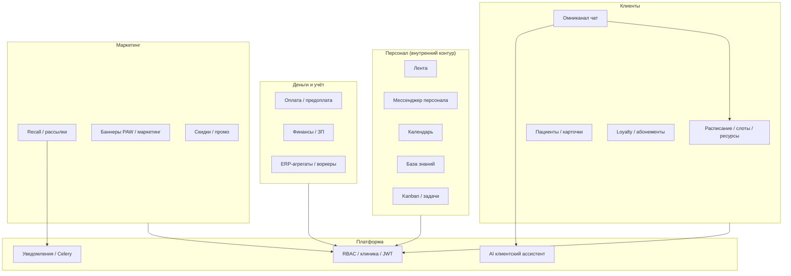

# ARCHITECTURE_ATLAS_2026 — атлас системы (границы модулей)

> **Назначение:** одна страница **прорисовки**: как крупные части связаны, куда смотреть в коде и в старых `ARCH_*` артефактах. **Не** дублирует детальные TASKS — ссылается на них.  
> **Канон продуктовых требований:** S-01…S-03 (`MASTER_*`, `PRODUCT_IA_*`, `PRODUCT_PASSPORT_*`).

---

## 1. Диаграмма контуров (логическая)

---

## 2. Таблица модулей (граница ответственности)

| Модуль | Ответственность (кратко) | Типичные пакеты / зоны кода |
|--------|-------------------------|-----------------------------|
| **Identity / RBAC** | Роли, права, `clinic_id`, запрет утечек | `src/.../auth`, permissions, admin guards |
| **Booking / Schedule** | Слоты, ресурсы, статусы визита, двойное бронирование | booking services, schedule cache redis |
| **Patients / CRM-lite** | Карточка, история, атрибуция | patient, visits |
| **Omni / Channels** | Диалоги, провайдеры TG/WA/… | omni*, webhooks |
| **Loyalty** | Баллы, абонементы, промо | loyalty* |
| **Finance / ERP** | Кассы, проводки, витрины (частично async) | finance*, celery |
| **Marketing** | Recall, кампании, баннеры | recall*, marketing* |
| **AI (клиент)** | Подсказки/автоответ, лимиты, fallback | `SafeAiClient`, omni AI settings |
| **Notifications** | Push/SMS/email очереди | tasks, templates |

Детальные gap-листы по подсистемам по-прежнему в существующих `docs/artifacts/ARCH_DEV_*`, `BACKEND_GAPS_*` — **не удаляются**; атлас задаёт **куда класть** новую задачу.

---

## 3. Разделение Box / Enterprise (архитектурно)

- **Один backend**, переключение возможностей: **RBAC + feature flags / конфиг клиники** (профиль `BOX`).
- **Enterprise-only** маршруты/UI: например `/admin/retention`, расширенная CRM-аналитика — скрываются в Box, код остаётся.

---

## 4. RAG (ограничение)

- **В коробке и ближайшем Enterprise:** RAG **только** для **контекста чата с клиентом** (FAQ, прайс, политики), не для аналитических дашбордов — см. S-01 § AI.

---

## 5. История

| Дата | Изменение |
|------|-----------|
| 2026-03-24 | Первая версия атласа |
