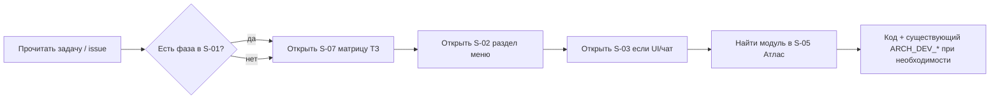

# DEV_EXECUTION_PLAYBOOK_2026 — сценарий работы @DEV

> **Цель:** не раздувать текст, а дать **порядок действий** и **где смотреть**. Детали экранов — в S-02, S-03; фазы — в S-01.

---

## 1. Порядок фаз в коде (от базы к Enterprise)

Иерархия в **`MASTER_PRODUCT_ROADMAP_2026.md`** и **`ARCH_INDEX_PHASES_2026.md`** рассчитана так: **сначала фундамент и продуктовые слои, затем коробка, затем Enterprise.**

| Порядок | Фаза | Смысл |
|---------|------|--------|
| 1 | **P0** Foundation | CI, секреты, backup/restore, RBAC-аудит, tenant — **без этого всё остальное хрупко** |
| 2 | **P1** Staff Core | Лента, чат персонала, календарь, Kanban, база знаний |
| 3 | **P2** Clients & Schedule | Расписание, пациенты, абонементы/лояльность (вкладки на `/admin/loyalty`) |
| 4 | **P3** Omni-Chat | Чат с клиентом как рабочее место |
| 4.1 | **P3.1** Hardening / Gate closure | Закрыть критичные “контрактные” дыры P0–P3: стабилизировать request-context, AI sanitizer (не ломать токены), RBAC permission inventory, аварийную устойчивость узлов (legacy fallback без падений) |
| 5 | **P4** Marketing Box | Рассылки, скидки, баннеры и т.д. |
| 6 | **P5** Analytics & Finance Box | Дашборды, финансы без LTV/ROI |
| 7 | **P6** Owner & RBAC | Политики, подготовка издания Box |
| — | **Gate «коробка»** | Приёмка по `SME_BOX_NFR_CHECKLIST.md`, профиль Box |
| 8 | **P7** Enterprise resume | Лиды, полная лояльность, Retention ROI, тяжёлая аналитика — **после** стабильной коробки |

**Правила:**

- Внутри волны разработки **по умолчанию идти по возрастанию P0 → P6**, не «прыгать» на P7 ради красоты.
- Если QA_ARCH/гейты P0–P3 показывают критичные gaps (контракты/изоляция/PII/ошибки RBAC), делаем wave `P3.1` (hardening / gate closure) и только потом продолжаем до `P4` и дальше.
- **Допустим параллельно:** эпик **i18n-каркас** (A-01) — отдельной веткой/PR, он сквозной и не отменяет P0.
- **Не начинать** зависимый функционал раньше основания: например тяжёлый омниканал (P3) опирается на пациентов/запись (P2) — детали в карточке фазы **P3** в индексе.

Если задача **не попадает** в текущую фазу — уточнить у @LEAD, а не расширять scope молча.

---

## 2. Перед началом задачи (2–5 минут)

| Шаг | Артефакт (ID) | Вопрос |
|-----|----------------|--------|
| 1 | [S-01](./MASTER_PRODUCT_ROADMAP_2026.md) | В какой фазе фича? Есть зависимость от NFR? |
| 2 | [ARCH_INDEX_PHASES_2026.md](./ARCH_INDEX_PHASES_2026.md) | Архитектура фазы P0–P7 |
| 3 | [ARCH_CROSS_CUTTING_UI_I18N_2026.md](./ARCH_CROSS_CUTTING_UI_I18N_2026.md) | Модалки по центру, RU / i18n |
| 4 | [S-07](./TZ_COVERAGE_MATRIX_2026.md) | Какие пункты ТЗ закрывает? |
| 5 | [S-02](./PRODUCT_IA_RBAC_NAVIGATION_2026.md) | Роуты, роли — что запрещено? |
| 6 | [S-03](./PRODUCT_PASSPORT_UX_DESIGN_BACKEND_2026.md) | UX-инварианты (чат, цвета, звуки)? |
| 7 | [S-05](./ARCHITECTURE_ATLAS_2026.md) | Граница модуля — куда не лезть без согласования? |

---

## 3. Definition of Done (минимум)

| Критерий | Когда обязательно |
|----------|-------------------|
| Роут защищён RBAC как в S-02 | Любой `/admin/*` |
| Нет «голого» UUID в UI без резолва имени | По `.cursorrules` |
| Ошибки API — единый контракт | Новые эндпоинты |
| Тест или объяснение в PR почему нет | Логика денег / брони / прав |
| Обновлён NFR/метрика/runbook | Если менялись алерты или критичный поток |

---

## 4. Типовые типы задач → куда смотреть

| Тип | Первый ориентир в коде | Документ |
|-----|------------------------|----------|
| Новый экран админки | `frontend/src/admin/`, `routePaths` | S-02, S-03 |
| Омниканал | `AdminOmniChatPage`, hooks omni | S-03 |
| Расписание | schedule services, redis cache | S-05, Атлас |
| Права | `rbac_matrix`, guards | S-02 |
| Фоновые задачи | Celery tasks | S-05, NFR |

---

## 5. Нужны ли отдельные «супер-подробные» инструкции для @DEV?

| Ситуация | Достаточно |
|----------|------------|
| Опытный разработчик, знает репозиторий | **S-01, карточка фазы P0…P7, S-05, S-06 (этот файл), A-01** — обычно **хватает**, чтобы «сам всё понял» |
| Задача на 1–3 дня в известном модуле | Issue + ссылка на раздел S-02/S-03 + фаза |
| Большой эпик (недели), новый модуль, онбординг | Имеет смысл **`DEV_PROMPTS_*.md`** или **`ARCH_DEV_*_TASKS.md`** по шаблону репозитория: пошаговые to-dos, критерии приёмки, ссылки на файлы |
| Новичок в проекте | Playbook + один **менторский** проход по `ARTIFACT_MAP` и первой фазе в коде |

**Вывод:** отдельные простыни для каждой мелочи **не обязательны**, если @DEV пользуется индексом артефактов. **Подробный промпт** добавляют, когда объём или риск требуют явного чеклиста — это нормальная практика, а не дублирование S-01.

---

## 6. Что не делать без @ARCH / LEAD

- Новый публичный контракт API / ломка инварианта БД «втихую».
- Смешение контура персонала и клиента в одном чате без явной модели.

---

## 8. P0 Foundation и SME «коробка» (фиксация на 2026-03)

По репозиторию закрыты пункты SME, которые **кодируются в CI и артефактах** (без внешнего staging): backup-скрипт и cron-пример, restore drill в Actions (`restore-drill.yml`), Trivy FS (`security-trivy.yml`), PII-маскирование логов, инвентаризация tenant-колонок (`audit_tenant_columns.py` + `TENANT_TABLE_INVENTORY.md`), теги образов по SHA в `docker-images.yml`, чеклисты `DEPLOY_SMOKE.md` / `DR_DRILL_LOG.md`.

Остаётся на стороне **@LEAD / ops**: фактическое расписание backup в проде, при необходимости строка staging drill в `DR_DRILL_LOG.md`, prod-smoke после выката, скан слоёв образа в реестре (дополнение к Trivy FS в CI). **Что сделать при первом прогоне** (пошагово): [`docs/operations/LEAD_FIRST_RUN_OPS.md`](../operations/LEAD_FIRST_RUN_OPS.md). **Бэклог NFR** (после P0): [`docs/operations/BACKLOG_NFR.md`](../operations/BACKLOG_NFR.md).

Подробный чеклист: `SME_BOX_NFR_CHECKLIST.md` (§4 — первый прогон и ссылка на бэклог).

**Локальный pytest:** если ошибка `database "dental_booking_test" does not exist`, настройте тестовую БД и миграции по [`docs/development/TEST_DATABASE.md`](../development/TEST_DATABASE.md) (переменная `DATABASE_URL_TEST` в `.env`, не отдельный `.env.test`).

---

## 9. История

| Дата | Изменение |
|------|-----------|
| 2026-03-24 | Добавлен `docs/development/TEST_DATABASE.md` (pytest + `dental_booking_test`); ссылки в `RUN_SERVICES.md`, `README` артефактов, `DEV_EXECUTION_PLAYBOOK` §8, `tests/conftest.py`, комментарий в `.env.example` |
| 2026-03-24 | P1 Staff Core: в `ARCH_PHASE_01_STAFF_CORE_2026.md` добавлен **§10** (ссылки на код); `MASTER` §4.2 — ссылка на §10; консолидация ленты и статус — `MASTER` §4.1, `ARCH_PHASE_01` §9 |
| 2026-03-24 | §8: ссылка на `BACKLOG_NFR.md` |
| 2026-03-24 | §8: ссылка на `LEAD_FIRST_RUN_OPS.md` (первый прогон @LEAD) |
| 2026-03-24 | §8: закрытие P0/SME в репозитории vs ops |
| 2026-03-24 | Раздел: порядок фаз P0→P7; когда нужны DEV_PROMPTS |
| 2026-03-24 | Первая версия playbook |
