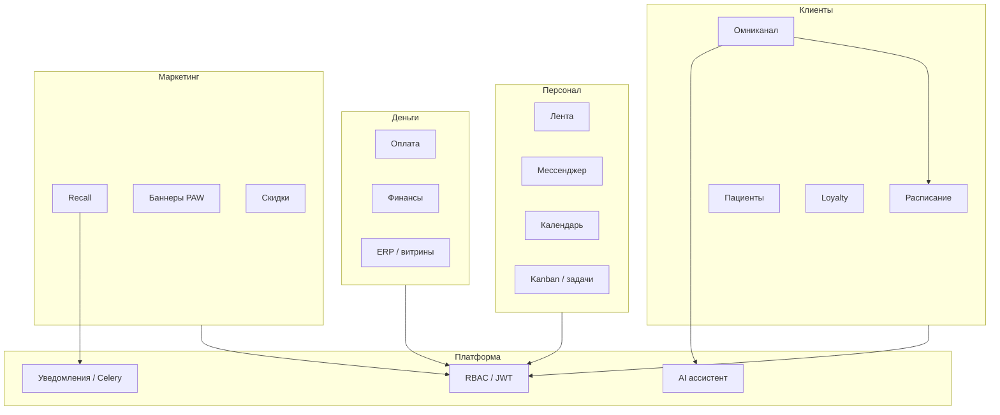

# SAAS_ARCHITECTURE_SPINE_2026 — единый каркас архитектуры

> **Версия:** 2026-04-02  
> **Слой:** W (рабочий канон для @ARCH / @DEV; факты поведения — **код**, **миграции Alembic**, при появлении — `docs/product_state/openapi.json`).  
> **RAG:** усиливает ответы «как устроено» без сотен `ARCH_DEV_*`; **не** подменяет чтение исходников при споре.

---

## 1. Источники правды (порядок)

1. Репозиторий (`src/`, `frontend/src/`, `tests/`, `alembic/versions/`).  
2. Этот файл — границы модулей, фазы, мультитенантность, сквозные правила.  
3. `docs/DOMAIN_STANDARDS.md`, `docs/ARCHITECTURE_EXCELLENCE_PASSPORT.md`, `docs/STACK_SELECTION.md` — норма качества.  
4. `docs/artifacts/BUSINESS_ROUTES.md` — карта HTTP/SPA (проверять с `router.py` / `App.tsx`).

Новые крупные решения: дописывать **секцию** сюда или один файл `ARCH_MODULE_<NAME>_2026.md` — не восстанавливать сетку `ARCH_DEV_*` / `*_TASKS`.

---

## 2. Мультитенантность и данные

| Принцип | Реализация |
|---------|------------|
| Граница tenant | `clinic_id` (или эквивалент) на бизнес-строках; RBAC не заменяет фильтр в сервисе |
| Запросы | Read/write по домену с фильтром tenant |
| Супер-роль | Только явные маршруты «все клиники» + аудит |
| Схема БД | Только Alembic; индексы со `clinic_id` для списков/отчётов |
| Бэкапы / DR | `docs/operations/DR_RUNBOOK.md`, `docs/operations/BACKUP_SCHEDULE.md`, SME §1 в `SME_BOX_NFR_CHECKLIST.md` |
| PII / секреты | `docs/operations/PII_LOGGING.md`; секреты не в git |

Внутренний чат персонала (изоляция комнат): `docs/architecture/STAFF_CHAT_MULTITENANCY.md`.

---

## 3. Контракт API и ошибок

- Формат ошибки: `{"detail": "...", "code": "SNAKE_CASE"}`; 500 без структуры — дефект (см. `.cursorrules`).  
- Публичные контракты новых эндпоинтов — OpenAPI / схемы Pydantic в коде; по возможности экспорт в `docs/product_state/openapi.json`.

---

## 4. Контуры системы (логика)

---

## 5. Модули и зоны кода

| Модуль | Зона | Примечание |
|--------|------|------------|
| Identity / RBAC | auth, permissions | Tenant в токене/контексте |
| Booking / Schedule | schedule, bookings, кэш слотов | Инварианты двойной записи в коде |
| Patients / CRM | patients, visits | |
| Omni / Channels | omni*, webhooks, integrations | |
| Loyalty | loyalty* | Box vs Enterprise — флаги/RBAC |
| Finance / ERP | finance*, celery | |
| Marketing | recall*, marketing* | |
| AI (клиент) | ai_agent, SafeAiClient, настройки клиники | |
| Notifications | tasks, шаблоны | |

---

## 6. Фазы продукта (P0–P7)

| Код | Содержание |
|-----|------------|
| P0 | Foundation: CI, backup/DR runbook, базовый RBAC |
| P1 | Staff Core: лента, мессенджер, календарь, kanban |
| P2 | Clients & Schedule: расписание, пациенты |
| P3 | Omni-Chat PWA: рабочее место админа в чате |
| P3.1 | Hardening закрытия P0–P3 |
| P4 | Marketing Box: рассылки, скидки, баннеры |
| P5 | Analytics & Finance Box |
| P6 | Owner & RBAC Builder |
| P7 | Post-Box Enterprise: лиды, retention, расширенная аналитика |

Детализация продуктовых принципов и меню: `docs/artifacts/PRODUCT_OPERATING_CORPUS_2026.md`, `docs/artifacts/BUSINESS_ROUTES.md`.

---

## 7. Сквозной UI

- Модалки — по центру; основной язык UI — русский (кроме техтерминов).  
- EmptyState для пользовательских списков (см. `.cursorrules`).

---

## 8. Наблюдаемость

- Дашборды в репозитории: `deploy/grafana/dashboards/*.json`.  
- Метрики: `docs/METRICS_PROTOCOL.md`, `docs/artifacts/METRICS_REGISTRY.md`.

---

Reference: `docs/ENGINEERING_PLAN.md` §5 · `docs/product_state/README.md` · `docs/artifacts/BUSINESS_ROUTES.md`
