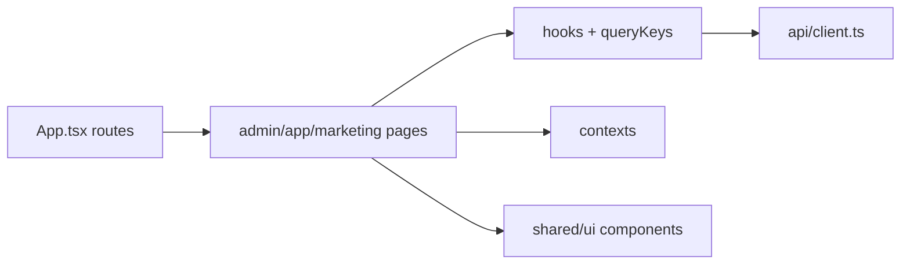

# Инженерные соглашения фронтенда (трассируемость)

> **Версия:** 2026-04-10  
> **Назначение:** зеркало духа [`../architecture/CONVENTIONS_AND_TRACEABILITY.md`](../architecture/CONVENTIONS_AND_TRACEABILITY.md) для SPA: слои, проверяемость утверждений в документации, минимальный чеклист при изменениях.  
> **Навигация:** зоны продукта и стиль — [`FRONTEND_ARCHITECTURE_CANON.md`](./FRONTEND_ARCHITECTURE_CANON.md). **Мастер-план фаз и скрипт паспортов** — [`MASTER_FRONTEND_EXECUTION_PLAN.md`](./MASTER_FRONTEND_EXECUTION_PLAN.md).

## 1. Слои SPA (границы ответственности)

Поток данных и UI по умолчанию:

| Слой | Каталог | Ответственность |
|------|---------|-----------------|
| Маршрутизация | `frontend/src/App.tsx`, `routePaths.ts` | Соответствие URL ↔ компонент; тест `__tests__/routePaths.test.ts` |
| Страница | `admin/pages/*`, `app/pages/*`, `marketing/pages/*` | Композиция layout, локальный UI state, вызов хуков |
| Данные | `frontend/src/hooks/*`, `queryKeys.ts` | React Query: ключи, `enabled`, мутации, `invalidateQueries` |
| HTTP | `frontend/src/api/client.ts` | Базовый URL, Bearer, разбор ошибок, ключи `localStorage` |
| Контекст | `frontend/src/contexts/*` | Сессия админа/пациента, выбранная клиника |
| Общий UI | `frontend/src/shared/ui/*`, `shared/*` | `AdminDrawer`, `GlassModal`, `ContextBar`, семантика `SEMANTIC` |

**Не смешивать:** тяжёлую бизнес-логику с побочными эффектами в `shared/ui` — держать в хуках или на сервере.

## 2. Проверяемость (как у бэкенд-доков)

Каждое утверждение в паспорте экрана или в архитектурной прозе про фронт должно быть:

- со **ссылкой на путь** в репозитории (`frontend/src/...`), или
- помечено как **гипотеза / не проверено**, или
- вынесено в [`../architecture/UNRESOLVED_AND_CONFUSION_LOG.md`](../architecture/UNRESOLVED_AND_CONFUSION_LOG.md).

Запрещено без пометки: SLA, «всегда быстро», «Enterprise-готово» без якоря в коде или рубрике.

## 3. Обязательные элементы паспорта экрана (минимум)

См. [`PAGE_PASSPORT_CRITERIA.md`](./PAGE_PASSPORT_CRITERIA.md) и шаблон [`pages/README.md`](./pages/README.md). Дополнительно для экранов с overlay:

- **Инвентарь поверхностей:** каждый `AdminDrawer`, `GlassModal`, значимый `Menu` / `Modal`, шаги `Stepper`, критичные `Alert` — триггер, мутация, loading/error (**fact** или **gap**).
- Для админ-shell: overlay не должен глушить navbar (`lockScroll` на `body` запрещён для штатных Modal/Drawer — см. `ADMIN_NAV_SAFE_MODAL_PROPS`).

## 4. Чеклист при изменении маршрута или экрана

**Якорь списка страниц для паспортов:** перечень экранов SPA берётся из `buildDerivedPublicAppPaths()` / `ALL_PUBLIC_APP_PATHS` в `frontend/src/routePaths.ts` и из шаблонов с параметрами в `frontend/src/App.tsx` (`/admin/tasks/:taskId`, `/:clinicSlug/doctors/:doctorSlug`, цепочка `/c/:clinicSlug/...`). Не использовать бэкенд `src/api/v1/router.py` как источник React-маршрутов.

- [ ] `frontend/src/App.tsx` и при необходимости `routePaths.ts` — согласованы с `ADMIN_SHELL_PAGE_BY_SEGMENT` / `PATIENT_APP_PAGE_BY_SEGMENT`.
- [ ] `npm test` / `vitest` для `routePaths` и затронутых модулей.
- [ ] Новая правая панель в админке — только [`AdminDrawer`](../../frontend/src/shared/ui/AdminDrawer.tsx), не `Drawer` из Mantine (`adminNoRawMantineDrawer`).
- [ ] Новые запросы — ключи в [`queryKeys.ts`](../../frontend/src/queryKeys.ts) или согласованный префикс в хуке; после мутации — явная инвалидация.
- [ ] Обновить [`../product_state/FRONTEND_PASSPORT.md`](../product_state/FRONTEND_PASSPORT.md) при смене дерева маршрутов.
- [ ] Паспорта: `python scripts/gen_frontend_page_passport_stubs.py generate` и **`verify`** (все ожидаемые slug из кода имеют `docs/frontend/pages/<slug>.md`); при добавлении маршрута — новая строка в матрице [`pages/README.md`](./pages/README.md) (без групповых waiver на обязательные path).
- [ ] Приёмка LEAD: в [`pages/README.md`](./pages/README.md) нет групповых waiver на обязательные маршруты; выборочно — паспорта с заполненной осью H (без оставшихся «не заполнено» в инвентаре поверхностей) по [`PAGE_PASSPORT_CRITERIA.md`](./PAGE_PASSPORT_CRITERIA.md); прогресс v2 по зонам — [`pages/V2_ZONE_TRACKER.md`](./pages/V2_ZONE_TRACKER.md).

## 5. Ошибки и устойчивость

- Корень SPA: [`ErrorBoundary`](../../frontend/src/shared/ErrorBoundary.tsx) в `App.tsx` (см. код).
- Сообщения об ошибках загрузки: паттерны `QueryErrorAlert`, `EmptyState`, `PageSkeleton` из `@/shared/ui` где принято на странице.

## 6. Дизайн ↔ код

Визуальные токены и карта файлов: [`../design/DESIGN_CODE_MAP.md`](../design/DESIGN_CODE_MAP.md), [`../design/DESIGN_COMPONENT_MAPPING.md`](../design/DESIGN_COMPONENT_MAPPING.md). Изменение палитры — `theme.ts`, `index.css`, при премиум-слое — сверка с `DESIGN_TOKENS_85_PLUS.json` по процессу в design README.

## 7. Связанные документы

- [`../architecture/CONVENTIONS_AND_TRACEABILITY.md`](../architecture/CONVENTIONS_AND_TRACEABILITY.md) § фронтенд  
- [`ENTERPRISE_SAAS_FRONTEND_RUBRIC_AND_ITERATIONS.md`](../architecture/ENTERPRISE_SAAS_FRONTEND_RUBRIC_AND_ITERATIONS.md)  
- [`TECH_PASSPORT_FRONTEND_UI_LOGIC.md`](../TECH_PASSPORT_FRONTEND_UI_LOGIC.md)  
- Паспорта страниц: [`pages/README.md`](./pages/README.md), [`pages/V2_ZONE_TRACKER.md`](./pages/V2_ZONE_TRACKER.md); проверка в релизном preflight: `python scripts/phase0_governance_preflight.py frontend-page-passports`.
