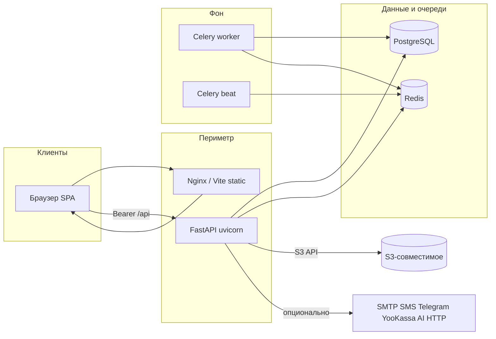
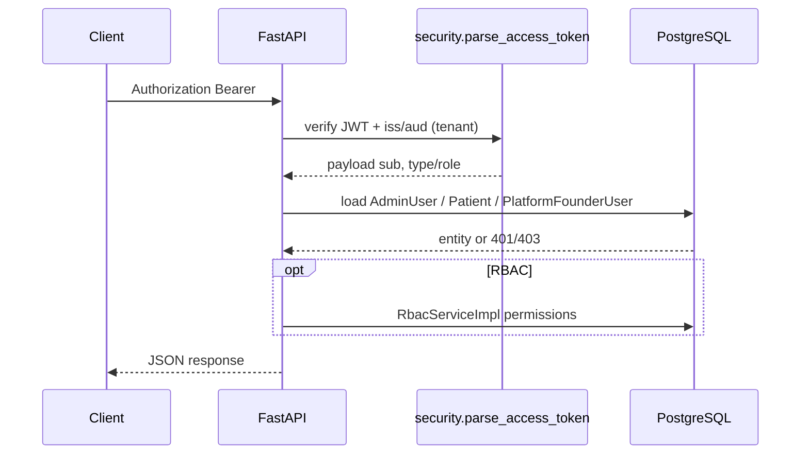
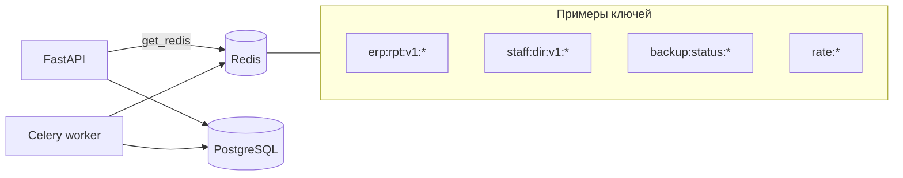
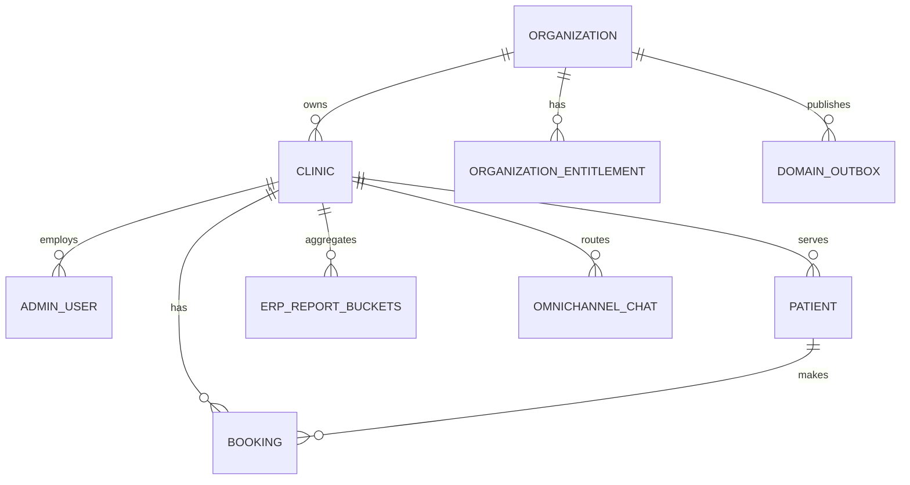

# Архитектура проекта (выведена из кода)

> **Версия:** 2026-04-10 (фаза 3 @QA_ARCH: auth, Redis, БД/replica, backup, outbox, scaling)  
> **Метод:** связи между `src/main.py`, слоями `src/`, `frontend/src/App.tsx`, `docker-compose.yml`, Celery, event bus — без ссылок на внешние архитектурные чертежи.  
> **Навигация слоя S:** [`RAG_NAVIGATION_S_LAYER.md`](./RAG_NAVIGATION_S_LAYER.md).

**Детализация по подсистемам и слоям (файлы кода, Alembic, Redis/Celery, метрики, тесты):** [../architecture/INDEX.md](../architecture/INDEX.md).  
**Единый обзор архитектуры + выводы SaaS (агрегат модульных docs):** [../architecture/ARCHITECTURE_SAAS_MASTER_OVERVIEW.md](../architecture/ARCHITECTURE_SAAS_MASTER_OVERVIEW.md).  
**Рубрика Enterprise SaaS и честные пробелы продукта:** [../architecture/ENTERPRISE_SAAS_RUBRIC.md](../architecture/ENTERPRISE_SAAS_RUBRIC.md).  
**Пример цепочки booking → события:** [../architecture/domains/booking_event_chain.md](../architecture/domains/booking_event_chain.md).  
**Фундаментальный обзор логики и БД (PRINCIPLE):** [../architecture/FUNDAMENTAL_CODE_REVIEW_PRINCIPLE.md](../architecture/FUNDAMENTAL_CODE_REVIEW_PRINCIPLE.md).  
**Приёмка LEAD и бэклог недоработок:** [../architecture/LEAD_ACCEPTANCE_CRITIQUE_AND_GAPS.md](../architecture/LEAD_ACCEPTANCE_CRITIQUE_AND_GAPS.md).  
**Эталон platform SaaS:** [../architecture/TARGET_PLATFORM_MULTITENANCY_REFERENCE.md](../architecture/TARGET_PLATFORM_MULTITENANCY_REFERENCE.md). **ADR:** [../adr/README.md](../adr/README.md). **Сводка @QA_ARCH / 1a-E2:** [../artifacts/IMPLEMENTATION_REPORT_1A_E2_PLATFORM_FOUNDER_2026-04-06.md](../artifacts/IMPLEMENTATION_REPORT_1A_E2_PLATFORM_FOUNDER_2026-04-06.md). **Контур B (платформенный биллинг / 1b):** [../artifacts/QA_REPORT_1b_E3b_webhook_contract.md](../artifacts/QA_REPORT_1b_E3b_webhook_contract.md).

---

## 1. Общая схема системы

- **SPA** обращается к backend по HTTP с префиксом `/api` (клиент: `frontend/src/api/client.ts`); в dev это обычно проксируется Vite на процесс API.
- **Backend** — единый процесс ASGI + отдельные процессы Celery worker/beat (см. `docker-compose.yml`).

---

## 2. Слой backend (вертикальная декомпозиция)

| Слой | Роль | Типичный поток |
|------|------|----------------|
| **API** (`src/api/v1/routers/*.py`) | Маршруты, зависимости FastAPI, HTTP-коды | Request → dependencies → service → repo |
| **Application** (`application/services`, `dto`, `events`) | Бизнес-правила, оркестрация, публикация событий | Сервис вызывает репозитории и внешние адаптеры |
| **Domain** (`domain/entities`, `interfaces`) | Модели данных и контракты хранилищ | Сущности SQLAlchemy + Protocol/ABC репозиториев |
| **Infrastructure** (`infrastructure/database`, `storage`, `messaging`, `external_apis`, `realtime`) | Реализация доступа к БД, Redis, S3, очередям, внешним API | Имплементации репозиториев, Celery tasks, клиенты |

**Принцип:** зависимость направлена от API к application; application зависит от интерфейсов домена; infrastructure реализует интерфейсы (классический ports & adapters, частично смягчённый практикой FastAPI Depends).

---

## 3. Сквозная функциональность (cross-cutting)

| Concern | Где в коде |
|---------|------------|
| **Аутентификация JWT** | `src/core/security.py`, парсинг в `dependencies.py`, отдельные flow admin/patient |
| **RBAC** | `rbac_matrix.py`, `RbacServiceImpl`, `require_permissions`, миграции прав |
| **Трассировка** | `X-Trace-Id` middleware в `main.py`, прокидка в контекст |
| **Ошибки API** | Единый envelope в `main.py` |
| **Метрики** | `src/core/metrics.py`, middleware длительности, `/metrics` |
| **Редакция Box/Enterprise** | `src/core/edition.py` + зеркало `VITE_EDITION` на фронте |
| **Маскирование PII в логах** | `settings.log_mask_pii` в config |
| **Rate limiting** | Инфраструктурный rate limiter + числовые лимиты в settings |

---

## 4. Event-driven связи модулей

**Файлы:** `src/application/events/event_bus.py`, регистрация в `src/main.py` lifespan.

Обработчики регистрируются для цепочек:

- **Leads / CRM** — `lead_event_handlers`
- **ERP / отчёты** — `erp_event_handlers`
- **Loyalty** — `loyalty_event_handlers`
- **Tasks** — `tasks_event_handlers`
- **Marketing attribution** — `marketing_attribution_event_handlers`

Это **in-process** шина (не Kafka): асинхронность тяжёлых операций дополняется Celery.

---

## 5. Мультитенантность и изоляция

- Административный пользователь привязан к **клинике** (`clinic_id` в JWT и сущности); `RequestContext` несёт `clinic_id` и permissions.
- Пациентский контекст в `RequestContext` с `clinic_id=None` на уровне dependency (пациент идентифицируется по своей сущности); изоляция данных обеспечивается запросами в сервисах/репозиториях и тестами (`tests/api/test_tenant_isolation_admin_paths.py` и др.).
- **Owner-level** API (`owner_omni_*`) — отдельный контур для настроек владельца/каналов (см. соответствующие роутеры).

---

## 6. Архитектура frontend

| Элемент | Реализация |
|---------|------------|
| **Маршрутизация** | React Router 6, `createBrowserRouter` |
| **Состояние сервера** | TanStack Query |
| **Контекст клиники / auth** | `AdminClinicProvider`, `PatientAuthProvider` |
| **UI система** | Mantine + локальные токены/CSS variables (`theme.ts`, shared styles) |
| **Разделение зон** | Один бандл: лендинг, админка, пациент, публичный профиль врача |

Связь с backend: REST JSON под `/api`; отдельные хуки по доменам в `frontend/src/hooks/`.

---

## 7. Инфраструктура и наблюдаемость

- **Compose:** Postgres, Redis, migrations job, backend, celery, celery-beat, frontend; profile `e2e` для Playwright.
- **Health:** liveness приложения; опционально S3 и replica.
- **Grafana/Prometheus:** конфиги в `deploy/grafana/`, `deploy/prometheus/` (дашборды и алерты как код).

---

## 8. Границы подсистем (логические, по роутерам и страницам)

| Подсистема | Backend (роутеры-маркеры) | Frontend (зоны) |
|------------|---------------------------|-----------------|
| Запись и расписание | `schedule`, `bookings`, `admin_schedule`, … | `/app/booking`, `/admin/schedule`, … |
| Платежи | `payments`, `admin_payment_gateway`, … | `/admin/payment-gateway`, … |
| Омниканал | `admin_omni_*`, `owner_omni_*`, `integrations_gateway` | `/admin/omni-*`, channels, integrations |
| Внутренний staff chat | `admin_staff_collab` (и смежное) | `/admin/staff-chat` |
| CRM / sales | `admin_crm`, `admin_retention`, enterprise gate | `/admin/sales`, `/admin/retention` (скрыто в Box) |
| Задачи | `admin_tasks`, boards, streams, tags | `/admin/tasks` |
| ERP / финансы | `admin_finance`, `admin_reports*`, aggregates | `/admin/finance`, `/admin/reports` |
| Лояльность | `admin_loyalty`, `patient_loyalty` | `/admin/loyalty`, `/app/loyalty` |
| Формы | `admin_forms`, `patient_forms` | `/admin/forms`, `/app/forms` |
| AI | `ai_agent`, `admin_ai_*`, `admin_patient_ai` | соответствующие админ-страницы |
| RBAC | `admin_rbac_management` | `/admin/rights-policies` |

---

## 9. Явные технические долги архитектуры (только наблюдение)

- Дублирование mount API на два префикса при `api_v1_prefix != "/api/v1"` — совместимость клиентов, но двойная регистрация маршрутов (`src/main.py`).
- Celery stub при отсутствии пакета — см. `RAG_NECESSARY_IMPROVEMENTS.md`.
- In-process EventBus не заменяет межпроцессный обмен; горизонтальное масштабирование API без дисциплины outbox/очередей — риск (см. §15).

Подробнее про правки и документацию — `RAG_NECESSARY_IMPROVEMENTS.md`.

---

## 10. Аутентификация: контуры JWT (факты из кода)

**Реализация:** `src/core/security.py` (PyJWT, HS256, опциональные `iss`/`aud` для тенантных токенов), `src/api/v1/dependencies.py`, `src/api/v1/routers/admin_auth.py` (`get_current_admin` для строгого админ-контекста), `platform_founder_auth` / `platform_internal` для контура Основателя.

| Контур | Поля в токене (типично) | Audience (settings) | Загрузка сущности |
|--------|-------------------------|---------------------|-------------------|
| Админ клиники | `type=admin`, `sub` → UUID | `jwt_audience_admin` | `AdminUser`, проверка `employment_status`; опционально блокировка org при `platform_billing` revoked |
| Пациент | `role=patient`, `sub` | `jwt_audience_patient` | `Patient` |
| Основатель платформы | отдельный тип/ключ | `jwt_issuer_platform` + audience founder | `PlatformFounderUser`; отдельный секрет `PLATFORM_FOUNDER_JWT_SECRET` в prod |

**Rate limiting (Redis):** примеры — `require_platform_founder_login_ip_rate_limit` (`dependencies.py`), публичные лимиты webhook/checkout — `src/infrastructure/rate_limiter.py` + поля `RATE_*` в `config.py`.

---

## 11. Redis: роли в системе

**Клиент:** `src/infrastructure/database/redis_client.py` (`get_redis`, `close_redis` в lifespan `main.py`).

| Роль | Где в коде | Префиксы / паттерны (примеры) |
|------|------------|-------------------------------|
| Кэш тяжёлых отчётов админки | `src/application/services/erp_report_cache.py` | `erp:rpt:v1:{clinic_id}:dashboard:…`, `owner_dashboard:…`; TTL `erp_dashboard_cache_ttl_seconds` |
| Кэш справочника staff | `src/application/services/staff_directory_cache.py` | `staff:dir:v1:pc:{clinic_id}` |
| OTP / OAuth state | `auth_service.py`, `routers/auth.py` | ключи через `setex` (SMS-коды, OAuth state) |
| Статус логического backup | `backup_tasks.py`, `admin_vault.py` | `backup:status:{task_id}` |
| Rate limit buckets | `RateLimiter` | `rate:…` (см. конкретные ключи в `dependencies.py`, публичных роутерах) |
| Pub/sub omni (операционно) | `admin_omni_chat.py` | `pubsub()` на Redis |

При недоступности Redis часть функций **fail-open** или логирует warning (например dedup уведомлений в `omnichannel_ai_orchestrator.py`).

---

## 12. PostgreSQL: пулы, reporting, миграции

**Primary DSN:** `settings.database_url` → `create_async_engine` в `src/infrastructure/database/base.py`: `pool_size`, `max_overflow`, `pool_pre_ping=True`; в `TESTING` — `NullPool`.

**Reporting / replica:** если задан `database_replica_url`, отдельный engine `engine_reporting` и `get_db_reporting()` для read-only GET с таймаутом (`get_reporting_session` в dependencies). Иначе reporting = primary. Lag и standby — `GET /health/replica` + gauge `db_replica_lag_observed_seconds` (`src/main.py`, `metrics.py`).

**Миграции:** каталог `alembic/versions/` — десятки ревизий (эволюция CRM, ERP vitrines, RBAC, omni, tasks, commerce, platform billing, embed, RAG KB и т.д.). Точное число файлов — по репозиторию; ориентир порядка **90+** файлов `.py` на весну 2026.

**Логическая модель данных:** ≈160 модулей сущностей в `src/domain/entities/` (не дублировать полный ER здесь). Кластеры: `Organization` / `Clinic` / `AdminUser` / `Patient`; booking & schedule; ERP aggregates & vitrines; omni chat & leads; tasks/kanban; loyalty; forms; commerce; platform signup & billing; embed & RAG KB; domain_outbox.

---

## 13. Резервное копирование (что делает код приложения)

**В приложении:** админский **логический экспорт JSON по клинике** через Celery — `src/infrastructure/messaging/tasks/backup_tasks.py` (`run_full_backup`), статус в Redis, файлы под `BACKUP_STORAGE_PATH` (по умолчанию `data/backups`), выдача через `admin_vault` (`POST …/backup/request`, `GET …/backup/status`, `GET …/backup/download/{task_id}`). Метрики: `backup_logical_export_*` в `metrics.py`. Плановая очистка старых файлов — `export_tasks.cleanup_old_exports_and_backups` (beat).

**Это не замена** физического `pg_dump`/снимков тома БД: для DR и RPO/RTO — операционные процедуры (см. `docs/operations/DR_RUNBOOK.md`, ADR-008 в дереве `docs/adr/`).

---

## 14. Transactional outbox и фоновая обработка

**Таблица/сущность:** `domain_outbox` (`src/domain/entities/domain_outbox.py`), сервис `domain_outbox_service.py`.

**Флаги в settings:** `domain_outbox_payment_webhook_enabled`, `domain_outbox_platform_billing_provision_enabled`, `domain_outbox_booking_events_enabled` (и лимиты batch для dispatch) — см. `.env.example`.

**HTTP-поток:** специализированные сессии `get_session_payment_webhook`, `get_session_booking_domain_outbox` — `commit` затем `dispatch_domain_outbox_batch()`; при ошибке пост-диспатча счётчик `domain_outbox_post_commit_dispatch_failures_total`, лог с отсылкой к Celery retry.

**Метрики на `/metrics`:** gauges pending/age outbox, счётчики dispatch (см. `metrics.py`). На scrape вызывается `refresh_domain_outbox_gauges` из `main.py` (маршрут metrics).

**Celery:** задачи в `src/infrastructure/messaging/tasks/` (notifications, ERP, backup, export, domain_outbox dispatch и др.) — расписание в `celery_app.py`.

---

## 15. Масштабирование и нагрузка (честное ограничение текущей реализации)

| Возможность | Факт в коде | Ограничение / следствие |
|-------------|-------------|-------------------------|
| Несколько процессов API | Uvicorn workers не заданы в Dockerfile одной строкой — типично **один** процесс на контейнер unless OPS масштабирует реплики | In-process EventBus видит события только внутри процесса |
| Горизонтальные реплики API | Возможны за балансировщиком | Нужна общая Redis/Celery/БД; кэш ERP в Redis shared — ок; outbox dispatch не должен дублироваться без идемпотентности |
| БД | Один primary + опциональная replica для reporting GET | Запись всегда в primary |
| Фон | Celery workers потребляют очередь Redis | Длительные задачи не блокируют HTTP при корректной постановке |
| Метрики | Prometheus histogram по шаблонам путей | Дашборды в `deploy/grafana/` |

Цифры RPS «до X» в коде **не зафиксированы** — для презентации нагрузки нужны профилирование и нагрузочные тесты; здесь только архитектурная основа.

---

## 16. Схема данных (логический контур)

Диаграмма **иллюстративная**: реальные FK и имена таблиц — в Alembic и SQLAlchemy-моделях. Не использовать этот рисунок как полную схему миграций.

---

**Reference:** `src/main.py`, `src/api/v1/router.py`, `src/api/v1/dependencies.py`, `src/core/security.py`, `src/infrastructure/database/base.py`, `src/application/services/erp_report_cache.py`, `src/infrastructure/messaging/tasks/backup_tasks.py`, `src/application/services/domain_outbox_service.py`, `docker-compose.yml`, `frontend/src/App.tsx`.
