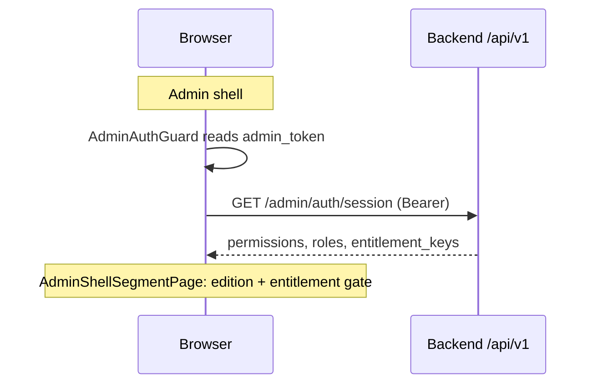

# Frontend-паспорт (только факты из кода)

> **Версия:** 2026-04-10 (@QA_ARCH: уровень «техпрезентации» — auth, кэш на клиенте, entitlements, деплой)  
> **Источник истины:** `frontend/package.json`, `frontend/vite.config.ts`, `frontend/src/main.tsx`, `frontend/src/App.tsx`, `frontend/src/routePaths.ts`, `frontend/src/config/edition.ts`, `frontend/src/api/client.ts`, дерево `frontend/src/`.  
> **Корреляция с backend:** JWT-контуры и инфраструктура — [`ARCHITECTURE_FROM_CODE.md`](./ARCHITECTURE_FROM_CODE.md) §10–11 · навигация S: [`RAG_NAVIGATION_S_LAYER.md`](./RAG_NAVIGATION_S_LAYER.md).  
> **Рубрика приёмки Enterprise UI:** [../architecture/ENTERPRISE_SAAS_FRONTEND_RUBRIC_AND_ITERATIONS.md](../architecture/ENTERPRISE_SAAS_FRONTEND_RUBRIC_AND_ITERATIONS.md).

---

## 1. Стек и сборка

| Компонент | Версия / выбор в репозитории |
|-----------|------------------------------|
| Runtime | React 18.3, react-dom 18.3 |
| Язык | TypeScript ~5.6 |
| Сборка / dev | Vite ^6.4, `@vitejs/plugin-react` |
| UI | Mantine 7 (`@mantine/core`, `hooks`, `spotlight`) |
| Иконки | `@tabler/icons-react` |
| Шрифт | `@fontsource/inter` |
| Данные | `@tanstack/react-query` ^5 |
| Виртуализация списков | `@tanstack/react-virtual` |
| Маршрутизация | `react-router-dom` ^7 (data router: `createBrowserRouter` + `RouterProvider`) |
| DnD | `@dnd-kit/core`, `@dnd-kit/utilities` |
| Emoji | `@emoji-mart/react`, `@emoji-mart/data`, скрипт синхронизации apple sheet |
| PWA | `vite-plugin-pwa` ^0.21 |
| Unit / component tests | Vitest ^3, Testing Library, jsdom |
| E2E | Playwright (`@playwright/test` ^1.62) |

**Скрипты npm:** `dev`, `build` (`tsc -b && vite build`), `preview`, `test`, `test:e2e`, `lint`, `security:audit` (`npm audit --omit=dev --audit-level=high`), `security:audit:all`; перед dev/build — `sync-emoji-apple-sheet.mjs`. Сборка: Node ≥ 20 (см. `frontend/package.json` `engines` и `frontend/Dockerfile`). CI `critical-path-gate` после `npm ci` гоняет `security:audit`, затем `build`.

---

## 2. Точка входа и провайдеры

**Точка входа:** `frontend/index.html` → `/src/main.tsx`.

**Файл:** `frontend/src/App.tsx`

- Корень: `ErrorBoundary` → `RouterProvider` с `createBrowserRouter` / `createRoutesFromElements`.
- Зоны маршрутизации (несколько продуктов в одном SPA):
  1. **Маркетинг:** `/` → `LandingPage`; `/pricing`, `/signup`, юридические страницы — компоненты из `marketing/pages/*`.
  2. **Платформа (основатель):** `/platform/login`, `/platform/login/mfa`; под `/platform` — `PlatformFounderLayout`, `dashboard`, `provision-queue` (см. `ROUTE_PATHS.platform` в `routePaths.ts`).
  3. **Публичный профиль врача:** `/:clinicSlug/doctors/:doctorSlug` → `PublicDoctorProfilePage`.
  4. **Админка:** вложенные маршруты под `ROUTE_PATHS.admin.dashboard` (`/admin`): `AdminAuthGuard`, вложенный `login` → `ClinicSignInPage`, оболочка `AdminClinicProvider` + `AdminLayout`, index → `AdminDashboardPage`, `tasks/:taskId` → `AdminTaskDetailsPage`, сегменты `ADMIN_SHELL_ROUTE_SEGMENTS` → `AdminShellSegmentPage` (edition + entitlement gate внутри).
  5. **Пациент:** `ROUTE_PATHS.other.login` (`/login`) → редирект на лендинг с query `patientEntry=need-clinic`; `/sign-in` → `LegacySignInRedirect`; `/oauth/result` → `OAuthResultPage` с `PatientAuthProvider`; зона `/app` — `PatientAuthProvider` + `AppLayout`, index `HomePage`, сегменты `PATIENT_APP_ROUTE_SEGMENTS`. Параллельно цепочка `/c/:clinicSlug` (`PatientEntryBoundary`): index → редирект на `sign-in`, `sign-in` → `PatientSignInPage`, вложенное `app/*` — тот же набор страниц, что и под `/app/*`.
  6. **Успех записи:** `/booking/success` → `BookingSuccessPage` (вне `/app` в дереве маршрутов). Редирект с `/c/sign-in` (без slug) на лендинг с подсказкой — см. комментарий в `App.tsx`.

---

## 3. Канон URL

**Файл:** `frontend/src/routePaths.ts`

- Объект `ROUTE_PATHS` с зонами `marketing`, `admin`, `patient`, `other` и отдельным объектом **`platform`** (кабинет основателя: login, MFA, dashboard, provision-queue).
- Массив `ADMIN_SHELL_ROUTE_SEGMENTS` — **45** элементов (порядок = ключи `ADMIN_SHELL_PAGE_BY_SEGMENT` в `App.tsx`; проверка: длина массива в `routePaths.ts`).
- Массив `PATIENT_APP_ROUTE_SEGMENTS` — **7** сегментов: `feed`, `booking`, `history`, `loyalty`, `forms`, `chat`, `profile`.
- Функция `buildDerivedPublicAppPaths()` / константа `ALL_PUBLIC_APP_PATHS` — регрессионные тесты уникальности путей (`frontend/src/__tests__/routePaths.test.ts`).

---

## 4. Соответствие сегмент → страница админки

**Файл:** `frontend/src/App.tsx` — `ADMIN_SHELL_PAGE_BY_SEGMENT`

| Сегмент URL (`/admin/<seg>`) | Компонент страницы |
|------------------------------|-------------------|
| staff-chat | AdminStaffChatPage |
| me | AdminStaffCabinetPage |
| calendar | AdminStaffCalendarPage |
| knowledge | AdminKnowledgePage |
| clinics | AdminClinicsPage |
| services | AdminServicesPage |
| schedule | SchedulePage |
| tasks | AdminTasksPage |
| leads-log | AdminLeadsLogPage |
| bookings | AdminBookingsPage |
| prepayment | AdminPrepaymentPage |
| waitlist | AdminWaitlistPage |
| recall | AdminRecallPage |
| marketing | AdminMarketingPage |
| retention | AdminRetentionPage |
| sales | AdminSalesPipelinePage |
| attention | AdminEmergencyNotificationsPage |
| reports | AdminReportsPage |
| finance | AdminFinancePage |
| commerce | AdminCommercePage |
| loyalty | AdminLoyaltyPage |
| forms | AdminFormsPage |
| doctors | AdminDoctorsPage |
| doctor-schedule | AdminDoctorSchedulePage |
| patients | AdminPatientsPage |
| omni-chat | AdminOmniChatPage |
| omni-channels | AdminOmniChannelsPage |
| omni-ai-settings | AdminOmniAiSettingsPage |
| channels | AdminChannelsPage |
| integrations | AdminIntegrationsPage |
| embed | AdminEmbedPage |
| rag-kb | AdminRagKbPage |
| data-export | AdminDataExportPage |
| omni-vault | AdminOmniVaultPage |
| styling | AdminStylingPage |
| stickers | AdminStickersPage |
| settings | AdminSettingsPage |
| subscription | AdminSubscriptionPage |
| administrators | AdminAdministratorsPage |
| payment-gateway | AdminPaymentGatewayPage |
| client-reference | AdminClientReferencePage |
| discounts | AdminDiscountsPage |
| notification-policy | AdminNotificationPolicyPage |
| agreements | AdminAgreementsPage |
| rights-policies | AdminRightsPoliciesPage |

---

## 5. Пациентское приложение: сегмент → страница

**Файл:** `frontend/src/App.tsx` — `PATIENT_APP_PAGE_BY_SEGMENT`

| Сегмент (`/app/<seg>`) | Компонент |
|------------------------|-----------|
| feed | FeedPage |
| booking | BookingWizardPage |
| history | HistoryPage |
| loyalty | LoyaltyPage |
| forms | FormsPage |
| chat | ChatPage |
| profile | ProfilePage |

Корень `/app` — `HomePage` (index route).

---

## 6. Редакция продукта (Box vs Enterprise) на UI

**Файл:** `frontend/src/config/edition.ts`

- `isBoxEdition()` — true, если `import.meta.env.VITE_EDITION` равен `basic` или `box` (без учёта регистра).
- В Box недоступны сегменты `retention` и `sales`: `isAdminSegmentBlockedInBox` возвращает true → в `AdminShellSegmentPage` выполняется `<Navigate to={dashboard} replace />`.
- `BOX_HIDDEN_ADMIN_PATHS` строится как `/admin/retention`, `/admin/sales`.

Согласованность с API: на бэкенде CRM gate — `EDITION` env (`src/core/edition.py`); расхождение `VITE_EDITION` и `EDITION` даёт расхождение UI и 403.

---

## 6b. SaaS entitlements на навигации админки

**Файлы:** `frontend/src/shared/adminEntitlementNav.ts`, `frontend/src/App.tsx` (`AdminShellSegmentPage`).

- Карта `SEGMENT_ENTITLEMENT`: сегменты `tasks`, `recall`, `marketing`, `retention`, `sales`, `embed`, `rag-kb`, `commerce` требуют соответствующий ключ в `entitlement_keys`, если в сессии `entitlement_enforced === true`.
- Источник снимка: `useAdminSession` → `GET /api/v1/admin/auth/session` (поля `entitlement_enforced`, `entitlement_keys`).
- Прямой заход на `/admin/:seg` без права: редирект на dashboard (логика в `AdminShellSegmentPage` после загрузки сессии).
- Согласование с backend: комментарий в `adminEntitlementNav.ts` отсылает к инвентарю роутеров с `require_entitlement` (в репозитории ведётся как markdown-артефакт слоя W, не в прикладном коде).

---

## 7. API-клиент

**Файл:** `frontend/src/api/client.ts`

- Базовый префикс HTTP: `API_BASE = "/api"` (прокси в Vite должен согласовываться с деплоем).
- Ключи `localStorage`: `dental_booking_patient_token`, `dental_booking_patient_id`, `dental_booking_admin_token`, `dental_booking_admin_id`, `dental_booking_admin_clinic_id` (константы в `API_STORAGE_KEYS`).
- Исходящий идентификатор запроса: `crypto.randomUUID()` при наличии.
- Bearer для админа/пациента; логика очистки сессии при 401 для пациента — `shouldClearPatientSessionOn401` и обработчики в том же файле.
- Заголовок исходящих запросов: `X-Request-Id` через `newOutboundRequestId()` (корреляция с логами API).

---

## 7b. Аутентификация на клиенте (три контура токенов)

| Контур | Хранилище | Где задаётся / проверяется | Backend-якорь (см. паспорт BE) |
|--------|-----------|----------------------------|--------------------------------|
| Админ клиники | `localStorage` ключи `API_STORAGE_KEYS` (`admin_token`, `admin_id`, `admin_clinic_id`) | `AdminAuthGuard`: без токена — редирект на `/admin/login` с `returnTo`; после логина токен пишется из формы входа | JWT `type=admin`, audience admin |
| Пациент | `localStorage` `patient_token`, `patient_id` | `PatientAuthProvider` + страницы входа; OAuth finish — `/oauth/result` | JWT patient audience |
| Основатель платформы | `localStorage` `dental_booking_platform_founder_token` (`platformFounderSession.ts`) | `PlatformFounderLayout`: без токена — редирект на `/platform/login`; MFA — отдельный маршрут `/platform/login/mfa` | JWT `platform_founder`, отдельный секрет в prod |

**Сессия админа для RBAC на UI:** `useAdminSession` (React Query) дергает `/v1/admin/auth/session` только при наличии admin token; после смены клиники/логина ключ `queryKeys.adminSession()` инвалидируется из кода логина (см. хуки/страницы auth).

---

## 7c. Кэш и офлайн-поведение (клиент)

**React Query (данные API):** `frontend/src/main.tsx` — `QueryClient` с `defaultOptions.queries.staleTime: 60_000` мс, `retry: 1`. Точечные `staleTime` / инвалидации задаются в доменных хуках (`hooks/useAdmin*.ts`, и т.д.).

**PWA / Service Worker (`vite-plugin-pwa` в `vite.config.ts`):**

- `navigateFallback: "/index.html"` для SPA.
- `navigateFallbackDenylist`: не перехватывать `/api/*`, `/health`.
- `runtimeCaching`: статика `assets|icons` — `StaleWhileRevalidate`; **`/api/v1/*` — `NetworkOnly`** (ответы API не кэшируются SW).

Итого: «кэш» на фронте — это в основном **память вкладки + React Query**, а не дубль серверного Redis; согласованность с сервером при перезагрузке страницы определяется повторным fetch.

---

## 8. Структура каталогов `frontend/src/` (логическая)

| Каталог | Содержание |
|---------|------------|
| `admin/` | Layout, guards, страницы админки, RBAC-копирайт, компоненты сущностей |
| `app/` | Layout и страницы пациентского приложения |
| `marketing/` | Лендинг, тарифы, signup, юридические страницы, кабинет основателя (`Platform*`), публичный профиль врача |
| `api/` | Клиент, типы, тесты клиента |
| `hooks/` | React Query и доменные хуки (`useAdmin*`, `usePatient*`, …) |
| `contexts/` | `AdminClinicContext`, `PatientAuthContext`, barrel `index.ts` |
| `shared/` | Общие UI-компоненты, чат, emoji, семантика статусов, стили shell |
| `config/` | `edition.ts` |
| `pwa/` | Регистрация PWA |
| `__tests__/` | Структурные и инвариантные тесты (маршруты, API shell, Mantine) |

**Объём:** **276** файлов `.ts` / `.tsx` под `frontend/src/` (инвентарь по дереву на 2026-04; включая тесты).

---

## 8b. Dev-сервер и прокси

**Файл:** `frontend/vite.config.ts` (единственный конфиг Vite; `vite.config.js` удалён — на Windows Vite предпочитает `.js` и иначе игнорирует `.ts`). `server.port` **5175**, `preview.port` **4173**, `host: true`.

Прокси `/api` и `/health` выбирает живой API:

1. `VITE_API_PROXY_TARGET`, если задан;
2. иначе `GET /health` → **200** на `127.0.0.1:8000` (host uvicorn), затем `:8010` (Compose);
3. иначе TCP на тех же портах (процесс ещё поднимает `/health`);
4. иначе fallback `:8010`.

Цель прокси **мутируется** каждые 4 с в `dev`/`preview` (не на `vite build`): объект `apiProxy` передаётся в Vite **по ссылке** (без spread), потому что Vite/http-proxy читает `target` с этого объекта на каждый запрос. Опция `router` из http-proxy-middleware в Vite **не** работает.

CORS для `:5175`, `:4173`, `:3010` (и `127.0.0.1`) — в `CORS_ORIGINS`.

Прод-сборка: статика за nginx/образом фронта; префикс `/api` должен проксироваться на тот же хост API, что и в `API_BASE` клиента.

---

## 9. PWA

**Файл:** `frontend/vite.config.ts`

- Плагин `VitePWA`: `registerType: "autoUpdate"`, manifest (имя «Dental Booking — приложение пациента», `start_url: "/app"`, иконки, скриншоты, theme/background), список `includeAssets` (иконки, emoji sheets).

---

## 10. Docker frontend

**Файл:** `docker-compose.yml` — сервис `frontend`: build из `./frontend/Dockerfile`, порт `3010:80`, опционально `frontend/.env`.

---

## 10b. Масштабирование и ограничения (честно по коду)

- **Один SPA** на все зоны (маркетинг, admin, patient, platform): масштабирование горизонтально = реплики **статики** + общий backend; **нет SSR** и нет edge-рендера в репозитории.
- **Состояние авторизации** в `localStorage`: типичные ограничения XSS/общих устройств; hardening — политика CSP, защита от XSS, SameSite cookies при будущей смене модели (в текущем коде — Bearer из storage).
- **Долгие списки:** `@tanstack/react-virtual` в отдельных экранах; не везде — узкие места определяются профилированием, не документом.
- **Согласование с нагрузкой API:** лимиты и кэш на сервере описаны в [`BACKEND_PASSPORT.md`](./BACKEND_PASSPORT.md) / [`ARCHITECTURE_FROM_CODE.md`](./ARCHITECTURE_FROM_CODE.md); фронт не дублирует rate limit, кроме UX-дебаунса на формах.

---

## 11. Ошибки и сообщения пользователю

- Тексты ошибок API для пациентов и справочник для админки: **`src/core/patient_messages.py`** (`REFERENCE_FOR_CLIENT` и константы).
- Сообщения об ошибках загрузки клиник / дашборда: **`frontend/src/admin/layouts/AdminLayout.tsx`**, **`AdminDashboardPage.tsx`** (строки для оператора).
- Норма репозитория: в **прикладном коде** не вставлять пути к файлам документации — ориентиры для людей в корневом README и в каталоге `docs/`; политика зафиксирована в корне репозитория (DOCUMENTATION_POLICY).

---

## 12. Линтинг и ограничения UI

- **`frontend/eslint-restricted-ui-imports.mjs`** — запрет второго UI-kit рядом с Mantine и использования «голого» Mantine `Drawer` вместо `AdminDrawer` (см. `no-restricted-imports` в конфиге ESLint проекта).
- **Админ-shell и модалки (факт кода):** `GlassModal` / `AdminDrawer` по умолчанию `lockScroll={false}`; оверлей сдвинут на `--app-shell-navbar-offset`. Иначе remove-scroll вешает `pointer-events: none` на `body` и пункты меню/переключатель клиники не кликаются (регресс `/admin/calendar`). Токены z-index: `--z-admin-navbar`, `--z-admin-header` в `frontend/src/index.css`. На узком viewport бургер живёт в `AppShell.Header` (z-index выше modal), а не в `Main` под оверлеем.

---

**Якорные файлы:** `frontend/src/App.tsx`, `frontend/src/routePaths.ts`, `frontend/src/main.tsx`, `frontend/src/api/client.ts`, `frontend/src/config/edition.ts`, `frontend/src/shared/adminEntitlementNav.ts`, `frontend/src/admin/AdminAuthGuard.tsx`, `frontend/src/contexts/PatientAuthContext.tsx`, `frontend/src/marketing/platformFounderSession.ts`, `frontend/vite.config.ts`.
