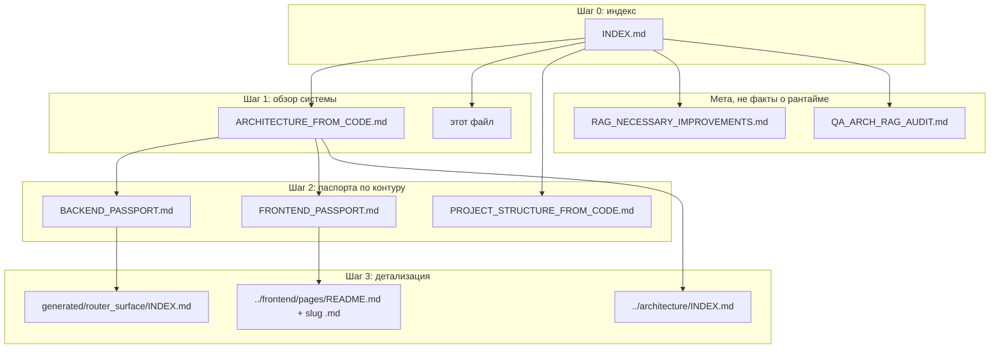

# Навигация слоя S для RAG и людей (@QA_ARCH фаза 3)

> **Версия:** 2026-04-10  
> **Назначение:** единая **схема порядка чтения** документов `docs/product_state/`, согласованная с [`../RAG_CANON.md`](../RAG_CANON.md) и [`../DOC_TOPOLOGY.md`](../DOC_TOPOLOGY.md).  
> **Истина:** код (`src/`, `frontend/src/`, `tests/`) выше любого markdown; слой S — выжимка и карты, не замена репозитория.

---

## 1. Граф слоя S (что за чем открывать)

---

## 2. Таблица: тип вопроса → документ(ы)

| Тип вопроса | Первичный документ | Уточнение в коде |
|-------------|-------------------|------------------|
| Общая картина, auth, Redis, БД, backup, outbox, scaling | [`ARCHITECTURE_FROM_CODE.md`](./ARCHITECTURE_FROM_CODE.md) §10–16 | `src/main.py`, `dependencies.py`, `base.py` |
| Состав API v1, роутеры, middleware | [`BACKEND_PASSPORT.md`](./BACKEND_PASSPORT.md) | `src/api/v1/router.py` |
| Поверхность методов/префиксов (автоген) | [`generated/router_surface/INDEX.md`](./generated/router_surface/INDEX.md) | `scripts/generate_router_surface_docs.py` |
| SPA: маршруты, auth (3 контура), React Query, PWA SW, entitlements UI | [`FRONTEND_PASSPORT.md`](./FRONTEND_PASSPORT.md) | `App.tsx`, `routePaths.ts`, `main.tsx`, `client.ts`, `adminEntitlementNav.ts` |
| Один экран SPA | [`../frontend/pages/README.md`](../frontend/pages/README.md) → `*.md` | страница `.tsx`, хуки |
| Дерево каталогов репо | [`PROJECT_STRUCTURE_FROM_CODE.md`](./PROJECT_STRUCTURE_FROM_CODE.md) | фактический listing |
| Коммерческий смысл реализованного | [`COMMERCIAL_VALUE_FROM_CODE.md`](./COMMERCIAL_VALUE_FROM_CODE.md) | только как интерпретация кода |
| Все `.md` в репозитории | [`FILE_MAP_MARKDOWN.md`](./FILE_MAP_MARKDOWN.md) | — |
| Пробелы и долг (не утверждения о проде) | [`RAG_NECESSARY_IMPROVEMENTS.md`](./RAG_NECESSARY_IMPROVEMENTS.md) | — |
| Сверка паспортов с кодом (регрессия чисел) | [`PRODUCT_STATE_VERIFICATION.md`](./PRODUCT_STATE_VERIFICATION.md) | grep / glob из таблицы файла |

---

## 3. Связь с глобальным каноном

| Документ | Роль |
|----------|------|
| [`../RAG_CANON.md`](../RAG_CANON.md) | Приоритет слоёв S / P / W при конфликте |
| [`../DOC_TOPOLOGY.md`](../DOC_TOPOLOGY.md) | Куда класть новые файлы под `docs/` |
| [`../../DOCUMENTATION_POLICY.md`](../../DOCUMENTATION_POLICY.md) | Контуры `docs/` vs `documentation/` |

---

## 4. Индексация RAG (рекомендация)

1. Высокий приоритет: `INDEX.md`, `ARCHITECTURE_FROM_CODE.md`, `BACKEND_PASSPORT.md`, `FRONTEND_PASSPORT.md`, `PROJECT_STRUCTURE_FROM_CODE.md`, `PRODUCT_STATE_VERIFICATION.md` (регрессия чисел), этот файл.  
2. Средний: `COMMERCIAL_VALUE_FROM_CODE.md`, `CLIENT_STRUCTURE_AND_VALUE.md`, `FILE_MAP_MARKDOWN.md`.  
3. Низкий / выборочно: `generated/router_surface/*` (длинные списки), `baselines/*`.  
4. Не смешивать с фактами рантайма: `RAG_NECESSARY_IMPROVEMENTS.md` (явно помечен как gap-лог).

---

**Reference:** [`INDEX.md`](./INDEX.md) · [`README.md`](./README.md) · `.cursorrules` (PROJECT MEMORY)
